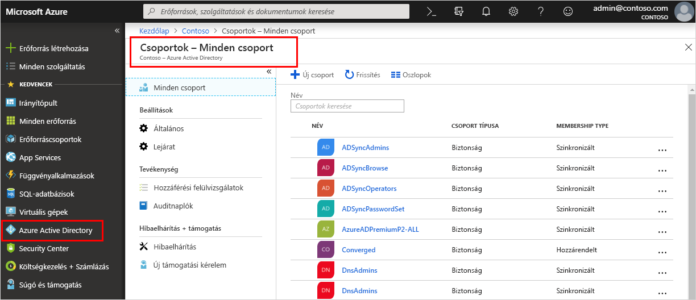

<!--As a brand-new Azure AD administrator, I need to view my organization’s groups along with the assigned members, so I can manage permissions to apps and services for people in my organization-->

# Rövid útmutató: A vállalat csoportjainak és csoporttagjainak megtekintése az Azure Active Directoryban
Megtekintheti a vállalat meglévő csoportjait és csoporttagjait az Azure Portalon. A csoportok az olyan felhasználók (tagok) kezelésére szolgálnak, akiknek azonos hozzáférés és azonos engedélyek szükségesek potenciálisan korlátozott alkalmazásokhoz és szolgáltatásokhoz.

Ebben a rövid útmutatóban megtekinti a vállalat összes meglévő csoportját és az azokhoz rendelt tagokat.

Ha nem rendelkezik Azure-előfizetéssel, a Kezdés előtt hozzon létre egy [ingyenes fiókot](https://azure.microsoft.com/free/) . 

## Előfeltételek
A kezdéshez a következőket kell tennie:

- Azure Active Directory-bérlő létrehozása. További információkat [az Azure Active Directory portálhoz való hozzáférést és új bérlő létrehozását ismertető](active-directory-access-create-new-tenant.md) cikkben olvashat.

## Jelentkezzen be az Azure Portalra
A címtár eléréséhez globális rendszergazdai fiókkal kell bejelentkezni az [Azure Portalra](https://portal.azure.com/).

## Új csoport létrehozása 
Hozzon létre egy _MDM policy – West_ nevű új csoportot. Csoportok létrehozásával kapcsolatos további információkért lásd: [Alapszintű csoport létrehozása és tagok hozzáadása](active-directory-groups-create-azure-portal.md).

1. Válassza az **Azure Active Directory** a **Csoportok**, majd az **Új csoport** lehetőséget.

2. Töltse ki a **Csoport** lapot:
    
    - **Csoport típusa:** válassza a **Biztonság** lehetőséget.
    
    - **Csoport neve:** írja be a következőt: _MDM policy – West_
    
    - **Tagság típusa:** válassza a **Hozzárendelt** lehetőséget.

3. Válassza a **Létrehozás** lehetőséget.

## Új felhasználó létrehozása
Hozzon létre egy _Alain Charon_ nevű új felhasználót. A felhasználóknak már létezniük kell, hogy hozzáadhatóak legyenek csoporttagként. Az "egyéni tartománynevek" lapon először tekintse meg a hitelesített tartománynevet, amelyben a felhasználókat létre szeretné hozni. Felhasználók létrehozásával kapcsolatos további információkért tekintse meg a [felhasználók hozzáadását és törlését](add-users-azure-active-directory.md) ismertető cikket.

1. Válassza az **Azure Active Directory**, a **Felhasználók**, majd az **Új felhasználó** lehetőséget.

2. Töltse ki a **Felhasználó** lapot:

    - **Név:** írja be a következőt: _Alain Charon_.

    - **Felhasználónév:** Írja be az *alain \@ contoso.com*.

3. Másolja a **Jelszó** mezőben szereplő, automatikusan előállított jelszót, majd válassza a **Létrehozás** lehetőséget.

## Csoporttag hozzáadása
Most, hogy már rendelkezik egy csoporttal és egy felhasználóval, hozzáadhatja _Alain Charont_ az _MDM policy – West_ csoport tagjaként. Csoporttagok hozzáadásával kapcsolatos további információkért lásd: [Csoporttagok hozzáadása vagy eltávolítása](active-directory-groups-members-azure-portal.md).

1. Válassza ki **Azure Active Directory**  >  **csoportokat**.

2. A **Csoportok – Minden csoport** lapon keresse meg és válassza ki az **MDM policy – West** csoportot.

3. Az **MDM policy – West áttekintési** lapján válassza a **Tagok** lehetőséget a **Kezelés** területen.

4. Válassza a **Tagok hozzáadása** lehetőséget, majd keresse meg és válassza az **Alain Charon** elemet.

5. Válassza a **Kiválasztás** lehetőséget

## Az összes csoport megtekintése
A vállalat összes csoportját megtekintheti az Azure Portal **Csoportok – Minden csoport** lapján.

- Válassza az Azure **Active Directory**  >  **csoportok** lehetőséget.

    A **Csoportok – Minden csoport** lap megjelenik, és mutatja az összes aktív csoportot.

    

## Csoport keresése
A **Csoportok – Minden csoport** lapon keresse meg az **MDM policy – West** csoportot.

1. A **Csoportok – Minden csoport** lapon írja be az _MDM_ karakterláncot a **keresőmezőbe**.

    A keresési eredmények a **keresőmező** alatt jelennek meg, és tartalmazzák az _MDM policy – West_ csoportot.

    

3. Válassza ki az **MDM policy – West** csoportot.

4. Az **MDM policy – West áttekintési** lapján megtekintheti a csoport információit, például azt, hogy hány tagja van az adott csoportnak.

    

## Csoporttagok megtekintése
Most, hogy megtalálta a csoportot, megtekintheti a csoporthoz rendelt tagokat.

- Válassza a **Tagok** elemet a **Kezelés** területen, majd tekintse át az adott csoporthoz rendelt tagok neveinek teljes listáját, köztük _Alain Charont_.

    

## Az erőforrások eltávolítása
Ezt a csoportot több útmutatóban is használjuk, amelyek a dokumentáció **Útmutatók** szakaszában érhetőek el. Ha inkább mégsem használná ezt a csoportot, az alábbi lépésekkel törölheti a hozzárendelt tagjaival együtt:

1. A **Csoportok – Minden csoport** lapon keresse meg az **MDM policy – West** csoportot.

2.  Válassza ki az **MDM policy – West** csoportot.

    Megjelenik az **MDM policy – West áttekintési** oldala.

3. Válassza a **Törlés** elemet.

    Ekkor a csoport és a társított tagok törlődnek.

    

    >[!Important]
    >Ez nem törli Alain Charon felhasználót, csak a tagságát a törölt csoportban.

## Következő lépések
A következő cikk azt ismerteti, hogyan társíthat egy előfizetést az Azure AD-címtárhoz.

> [!div class="nextstepaction"]
> [Azure-előfizetés társítása](active-directory-how-subscriptions-associated-directory.md)
