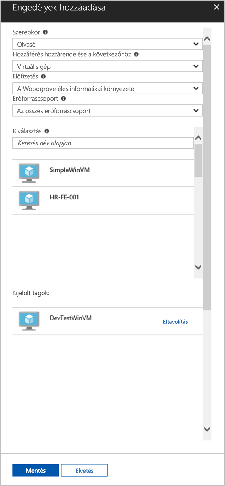

# <a name="use-a-windows-vm-system-assigned-managed-identity-to-access-resource-manager"></a>Hozzáférés a Resource Managerhez egy Windows VM-beli, rendszer által hozzárendelt felügyelt identitással

[!INCLUDE [preview-notice](../../../includes/active-directory-msi-preview-notice.md)]

Ez a rövid útmutató bemutatja, hogyan érhető el az Azure Resource Manager API egy Windows rendszerű virtuális géppel, amelyen engedélyezve van a rendszer által hozzárendelt felügyelt identitás. Az Azure-erőforrások felügyelt identitásainak kezelését automatikusan az Azure végzi, és lehetővé teszi a hitelesítést az Azure AD-hitelesítést támogató szolgáltatásokban anélkül, hogy be kellene szúrnia a hitelesítő adatokat a kódba. Az alábbiak végrehajtásának módját ismerheti meg:

> [!div class="checklist"] 
> * Hozzáférés engedélyezése virtuális gép számára az Azure Resource Managerben lévő erőforráscsoporthoz 
> * Hozzáférési jogkivonat lekérése a VM identitásával, majd az Azure Resource Manager meghívása a használatával

## <a name="prerequisites"></a>Előfeltételek

[!INCLUDE [msi-tut-prereqs](../../../includes/active-directory-msi-tut-prereqs.md)]

## <a name="grant-your-vm-access-to-a-resource-group-in-resource-manager"></a>Hozzáférés biztosítása a VM számára a Resource Managerben lévő erőforráscsoporthoz
Az Azure-erőforrások felügyelt identitásainak segítségével a kód hozzáférési jogkivonatokat kérhet le az olyan erőforrások felé történő hitelesítéshez, amelyek támogatják az Azure AD-hitelesítést.  Az Azure Resource Manager támogatja az Azure AD-hitelesítést.  Először hozzáférést kell adnunk a VM rendszer által hozzárendelt felügyelt identitásának egy erőforráshoz a Resource Managerben, ebben az esetben ahhoz az erőforráscsoporthoz, amelyben a VM található.  

1.  Navigáljon az **Erőforráscsoportok** lapra. 
2.  Válassza ki a **Windows VM** számára létrehozott **erőforráscsoportot**. 
3.  Lépjen a **Hozzáférés-vezérlés (IAM)** részre a bal oldali panelen. 
4.  Ezután **adja hozzá a szerepkör-hozzárendelést** a **Windows rendszerű virtuális géphez**tartozó új szerepkör-hozzárendeléshez.  A **Szerepkör** beállításhoz válassza ki az **Olvasó** értéket. 
5.  A következő legördülő menüben a **Hozzáférés hozzárendelése** beállítás számára válassza ki a **Virtuális gép** értéket. 
6.  Ezután ellenőrizze, hogy a megfelelő előfizetés szerepel-e az **Előfizetés** legördülő menüben. Az **Erőforráscsoport** esetében válassza a **Minden erőforráscsoport** lehetőséget. 
7.  Végül a **Kiválasztás** mezőben válassza ki a Windows VM-et a legördülő menüben, majd kattintson a **Mentés** gombra.

    

## <a name="get-an-access-token-using-the-vms-system-assigned-managed-identity-and-use-it-to-call-azure-resource-manager"></a>Hozzáférési jogkivonat lekérése a virtuális gép rendszer által hozzárendelt felügyelt identitásának használatával, majd az Azure Resource Manager meghívása a jogkivonat használatával 

Ebben a részben a **PowerShellt** kell használnia.  Ha a **PowerShell** nincs telepítve, [innen](https://docs.microsoft.com/powershell/azure/overview) letöltheti. 

1.  A portálon lépjen a **Virtuális gépek** lapra, lépjen a Windows VM-hez, és az **Áttekintés** területen kattintson a **Csatlakozás** elemre. 
2.  A **Felhasználónév** és a **Jelszó** mezőbe azt a felhasználónevet és jelszót írja be, amelyet a Windows VM létrehozásakor adott meg. 
3.  Most, hogy létrehozott egy **távoli asztali kapcsolatot** a virtuális géppel, nyissa meg a **PowerShellt** a távoli munkamenetben. 
4.  A meghívó-webkérés parancsmag használatával kérje meg az Azure-erőforrások végpontjának helyi felügyelt identitását, hogy Azure Resource Manager hozzáférési jogkivonatot kapjon.

    ```powershell
       $response = Invoke-WebRequest -Uri 'http://169.254.169.254/metadata/identity/oauth2/token?api-version=2018-02-01&resource=https://management.azure.com/' -Method GET -Headers @{Metadata="true"}
    ```
    
    > [!NOTE]
    > A „resource” paraméter értékének pontosan egyeznie kell az Azure AD által várt értékkel. Az Azure Resource Manager erőforrás-azonosítójának használatakor a záró perjelet is szerepeltetni kell az URI-ban.
    
    Ezután nyerje ki a teljes választ, amelyet egy JavaScript Object Notation (JSON) formátumú sztringként tárol a $response objektum. 
    
    ```powershell
    $content = $response.Content | ConvertFrom-Json
    ```
    Ezután nyerje ki a hozzáférési jogkivonatot a válaszból.
    
    ```powershell
    $ArmToken = $content.access_token
    ```
    
    Végül hívja meg az Azure Resource Managert a hozzáférési jogkivonattal. Ebben a példában a meghívó-webkérés parancsmagot használjuk a Azure Resource Manager meghívásához, és a hozzáférési token belefoglalásához is az engedélyezési fejlécben.
    
    ```powershell
    (Invoke-WebRequest -Uri https://management.azure.com/subscriptions/<SUBSCRIPTION ID>/resourceGroups/<RESOURCE GROUP>?api-version=2016-06-01 -Method GET -ContentType "application/json" -Headers @{ Authorization ="Bearer $ArmToken"}).content
    ```
    > [!NOTE] 
    > Az URL megkülönbözteti a kis- és nagybetűket, ezért ellenőrizze, hogy pontosan ugyanúgy írja be a kis- és nagybetűket, mint az erőforráscsoport elnevezésekor, illetve hogy a „resourceGroups” kifejezésben nagy legyen a „G” betű.
        
    A következő parancs adja vissza az erőforráscsoport adatait:

    ```powershell
    {"id":"/subscriptions/98f51385-2edc-4b79-bed9-7718de4cb861/resourceGroups/DevTest","name":"DevTest","location":"westus","properties":{"provisioningState":"Succeeded"}}
    ```

## <a name="next-steps"></a>Következő lépések

Ennek a rövid útmutatónak a segítségével megtanulta, hogyan használható a rendszer által hozzárendelt felügyelt identitás az Azure Resource Manager API-hoz való hozzáféréshez.  További információ az Azure Resource Managerről:

> [!div class="nextstepaction"]
>[Azure Resource Manager](/azure/azure-resource-manager/resource-group-overview)

