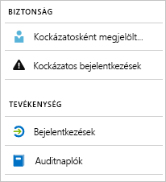

# Mi az Azure Active Directory-jelentés?

Az Azure Active Directory (Azure AD) jelentései átfogó képet nyújtanak a környezetében végzett tevékenységekről. A megadott adatokkal a következőket teheti:

- Meghatározhatja, hogy a felhasználók hogyan használják az alkalmazásokat és szolgáltatásokat
- Észlelheti a környezet állapotát befolyásoló lehetséges kockázatokat
- Elháríthatja azokat a hibákat, amelyek megakadályozzák a felhasználók munkavégzését  

A jelentéskészítési architektúra két alappillérre támaszkodik:

- [Biztonsági jelentések](#security-reports)
- [Tevékenységjelentések](#activity-reports)

## Biztonsági jelentések

A biztonsági jelentések segítenek a szervezet identitásának védelmében. A biztonsági jelentéseknek két típusa van:

- **Kockázatosként megjelölt felhasználók** – A [kockázatosként megjelölt felhasználók biztonsági jelentésben](concept-user-at-risk.md) azon felhasználói fiókok áttekintését találja, amelyek biztonsága esetleg sérült.

- **Kockázatos bejelentkezések** – A [kockázatos bejelentkezés biztonsági jelentés](concept-risky-sign-ins.md) olyan bejelentkezési kísérleteket jelöl, amelyeket elképzelhető, hogy olyan személy hajtott végre, aki nem a felhasználói fiókok jogos tulajdonosa. 

### Milyen Azure AD-licencre van szükség a biztonsági jelentések eléréséhez?  

Az Azure AD összes kiadása kockázati és kockázatos bejelentkezési jelentésekhez megjelölt felhasználókat biztosít. A jelentések részletességi szintje azonban különbözik a kiadások között: 

- Az **Azure Active Directory ingyenes és alapszintű kiadásaiban**a kockázatos bejelentkezések számára megjelölt felhasználók listája jelenik meg. 

- Az **Azure Active Directory Premium 1-es** kiadás kiterjeszti ezt a modellt azáltal, hogy lehetővé teszi az egyes jelentéseknél észlelt, mögöttes kockázatészlelések vizsgálatát is. 

- Az **Azure Active Directory Premium 2-kiadás** a legrészletesebb információkat nyújt az alapul szolgáló kockázatészlelésekről, és lehetővé teszi a biztonsági házirendek konfigurálását is, amelyek automatikusan reagálnak a konfigurált kockázati szintekre.

## Tevékenységjelentések

A tevékenységjelentések segítenek megérteni a szervezet felhasználóinak viselkedését. Az Azure AD-ben kétféle tevékenységjelentés létezik:

- **Naplók** – A [naplók tevékenységjelentés](concept-audit-logs.md) hozzáférést nyújt a bérlőn elvégzett összes feladat előzményeihez.

- **Bejelentkezések** – A [bejelentkezések tevékenységjelentéssel](concept-sign-ins.md) meghatározhatja, hogy ki hajtotta végre a naplók jelentés által jelentett feladatokat.

### Naplók jelentés 

A [naplók jelentés](concept-audit-logs.md) a rendszertevékenységek rekordjait tartalmazza megfelelőségi célokból. Ezek az adatok lehetővé teszik például a következő gyakori helyzetek kezelését:

- A bérlőmben valaki hozzáfért egy rendszergazdai csoporthoz. Ki biztosított neki hozzáférést? 

- Tudni szeretném az egy adott alkalmazásba bejelentkező felhasználók listáját, mert nemrég helyeztem üzembe az alkalmazást, és látni szeretném, hogy jól működik-e

- Tudni szeretném, hogy hány jelszó-visszaállítás történik a bérlőmön

#### Milyen Azure AD-licencre van szükség a naplójelentéshez való hozzáféréshez?  

A naplójelentés olyan szolgáltatásokhoz érhető el, amelyekhez licenccel rendelkezik. Ha rendelkezik licenccel egy adott szolgáltatáshoz, annak naplóinformációihoz is hozzáfér. További információt az Azure Active Directory szolgáltatásaiés képességei című [témakörben talál.](https://www.microsoft.com/cloud-platform/azure-active-directory-features)   

### Bejelentkezési jelentés

A [bejelentkezések jelentés](concept-sign-ins.md) lehetővé teszi, hogy megtalálja a választ a kérdésekre, mint például:

- Milyen egy adott felhasználó bejelentkezési mintázata?
- Hány felhasználó jelentkezett be egy adott héten?
- Milyen állapotúak ezek a bejelentkezések?

#### Milyen Azure AD-licencre van szükség a bejelentkezési tevékenységjelentéshez való hozzáféréshez?  

A bejelentkezési tevékenységjelentés eléréséhez a bérlőnek prémium szintű Azure AD-licenccel kell rendelkeznie.

## Szoftveres hozzáférés

A felhasználói felület mellett az Azure AD is biztosít [programozott hozzáférést](concept-reporting-api.md) biztosít a jelentések adataihoz egy sor REST-alapú API-k. Különböző programnyelvekkel és eszközökkel hívhatja ezeket az API-kat. 

## További lépések

- [Kockázatos bejelentkezési jelentések](concept-risky-sign-ins.md)
- [Naplók jelentés](concept-audit-logs.md)
- [Bejelentkezési naplók jelentés](concept-sign-ins.md)
