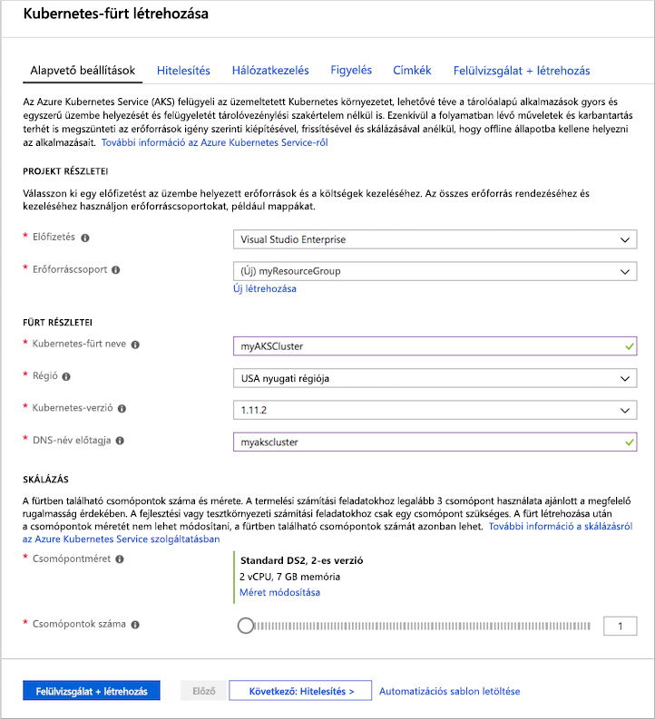
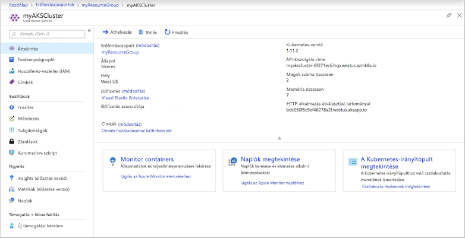
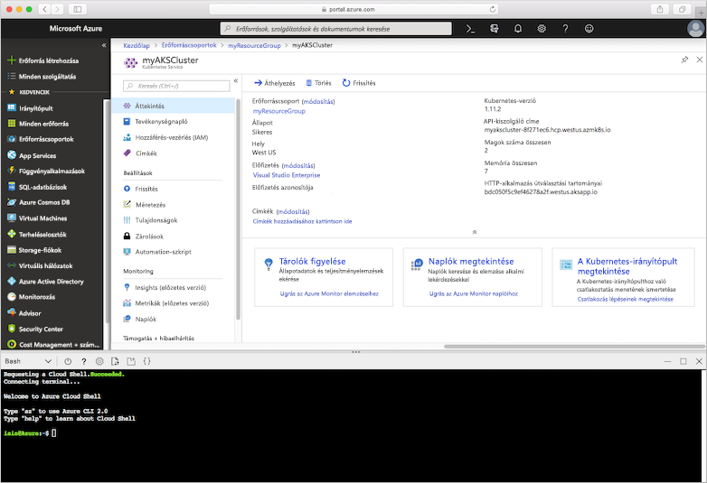
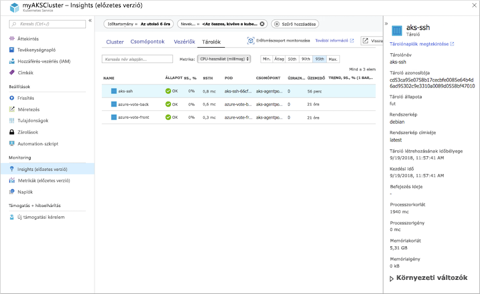
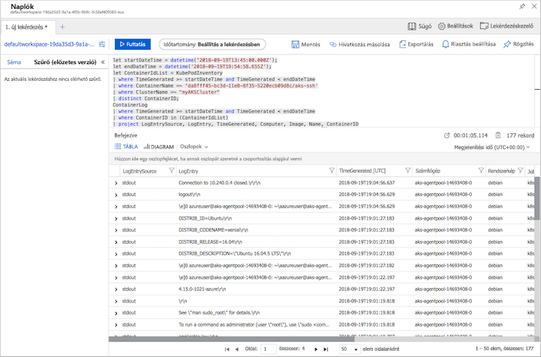

# <a name="quickstart-deploy-an-azure-kubernetes-service-aks-cluster-using-the-azure-portal"></a>Rövid útmutató: Azure Kubernetes Service -fürt üzembe helyezése a Azure Portal

Azure Kubernetes Service (AKS) egy felügyelt Kubernetes-szolgáltatás, amely lehetővé teszi a fürtök gyors üzembe helyezését és kezelését. Ebben a rövid útmutatóban a következőt fogja:
* AKS-fürt üzembe helyezése a Azure Portal. 
* Többtárolós alkalmazás futtatása egy webes előfeltűn és egy Redis-példánysal a fürtben. 
* Figyelje az alkalmazást futtató fürt és podok állapotát.


A rövid útmutató feltételezi, hogy rendelkezik a Kubernetes használatára vonatkozó alapvető ismeretekkel. További információ: [A Kubernetes alapfogalmai Azure Kubernetes Service (AKS).][kubernetes-concepts]

Ha még nincs Azure-előfizetése, kezdés előtt hozzon létre egy [ingyenes fiókot](https://azure.microsoft.com/free/?WT.mc_id=A261C142F).

## <a name="prerequisites"></a>Előfeltételek

Jelentkezzen be az Azure Portalra a [https://portal.azure.com](https://portal.azure.com) webhelyen.

## <a name="create-an-aks-cluster"></a>AKS-fürt létrehozása

1. Az Azure Portal menüjében vagy a **Kezdőlapon** válassza az **Erőforrás létrehozása** elemet.

2. Válassza a **Tárolók** > **Kubernetes Service** lehetőséget.

3. Az **Alapvető beállítások** lapon konfigurálja az alábbiakat:
    - **Projekt részletei:** 
        * Válasszon ki egy **Azure-előfizetést**.
        * Válasszon ki vagy hozzon létre egy **Azure-erőforráscsoportot,** például *myResourceGroup.*
    - **Fürt részletei:** 
        * Adja meg a **Kubernetes-fürt nevét**, például *myAKSCluster*. 
        * Válasszon ki **egy régiót** és **egy Kubernetes-verziót** az AKS-fürthöz.
    - **Elsődleges csomópontkészlet:** 
        * Az AKS-csomópontokhoz válasszon egy VM-**csomópontméretet**. A virtuálisgép-méret az AKS-fürt telepítését követően *nem* módosítható.
        * Adja meg a fürtre telepítendő csomópontok számát. Ehhez a rövid útmutatóhoz a **Csomópontok száma** beállítás értékeként adjon meg *1*-et. A csomópontok száma a fürt telepítése után is *módosítható*.
    
    

4. Ha elkészült, válassza a **Tovább: Csomópontkészletek** lehetőséget.

5. Tartsa meg a **Csomópontkészletek alapértelmezett** beállításait. A képernyő alján kattintson a **Tovább: Hitelesítés elemre.**
    > [!CAUTION]
    > Az újonnan létrehozott Azure AD-szolgáltatásnév propagálása és elérhetővé válása több percig is eltarthat, ami "a szolgáltatásnév nem található" és az érvényesítési hibákat okozza a Azure Portal. Ha elüti ezt a rögzét, tekintse meg [hibaelhárítási cikkünket a](troubleshooting.md#received-an-error-saying-my-service-principal-wasnt-found-or-is-invalid-when-i-try-to-create-a-new-cluster) probléma elhárításához.

6. A **Hitelesítés** lapon konfigurálja az alábbiakat:
    - Hozzon létre egy új fürtidentitást a következővel:
        * A Hitelesítés **mezőben** hagyja meg a **Rendszer által felügyelt felügyelt identitást,** vagy
        * Szolgáltatásnév **kiválasztása** szolgáltatásnév használatára. 
            * Alapértelmezett *szolgáltatásnév létrehozásához* válassza az (új) alapértelmezett szolgáltatásnév lehetőséget, vagy
            * Válassza *a Szolgáltatásnév konfigurálása* lehetőséget egy meglévő használatára. Meg kell adnia a meglévő egyszerű szolgáltatásnév ügyfél-azonosítóját és titkos kódját.
    - Engedélyezze a Kubernetes szerepköralapú hozzáférés-vezérlés (Kubernetes RBAC) beállítását, hogy pontosabban szabályozható legyen az AKS-fürtben üzembe helyezett Kubernetes-erőforrásokhoz való hozzáférés.

    Alapértelmezés szerint *alapszintű* hálózatépítést használ, Azure Monitor tárolókhoz való hozzáférés engedélyezve van. 

7. Ha az ellenőrzés véget ért, kattintson az **Áttekintés és létrehozás**, majd a **Létrehozás** lehetőségre. 


8. Az AKS-fürt létrehozása eltarthat néhány percig. Ha az üzembe helyezés befejeződött, navigáljon az erőforráshoz a következő két lépéssel:
    * Kattintson **az Ugrás az erőforrásra elemre,** vagy
    * Tallózással válassza ki az AKS-fürt erőforráscsoportját. 
        * Az alábbi példafürt irányítópultján: a *myResourceGroup tallózása és* a *myAKSCluster erőforrás kiválasztása.*

        

## <a name="connect-to-the-cluster"></a>Csatlakozás a fürthöz

Kubernetes-fürt kezeléséhez használja a Kubernetes kubectl parancssori [ügyfelét.][kubectl] `kubectl` A már telepítve van, ha a Azure Cloud Shell. 

1. Nyissa Cloud Shell `>_` gombra kattintva a Azure Portal.

    

    > [!NOTE]
    > A műveletek végrehajtása helyi rendszerhéj-telepítésben:
    > 1. Ellenőrizze, hogy az Azure CLI telepítve van-e.
    > 2. Csatlakozzon az Azure-hoz az `az login` paranccsal.

2. Konfigurálja úgy a parancsot, hogy az `kubectl` [az aks get-credentials][az-aks-get-credentials] paranccsal csatlakozzon a Kubernetes-fürthöz. A következő parancs letölti a hitelesítő adatokat, és konfigurálja a Kubernetes parancssori felületét azok használatára.

    ```azurecli
    az aks get-credentials --resource-group myResourceGroup --name myAKSCluster
    ```

3. Ellenőrizze a fürthöz való csatlakozást a használatával `kubectl get` a fürtcsomópontok listájának visszaadása érdekében.

    ```console
    kubectl get nodes
    ```

    A kimenet az előző lépésekben létrehozott egyetlen csomópontot jeleníti meg. Győződjön meg arról, hogy a csomópont Állapota *Kész:*

    ```output
    NAME                       STATUS    ROLES     AGE       VERSION
    aks-agentpool-14693408-0   Ready     agent     15m       v1.11.5
    ```

## <a name="run-the-application"></a>Az alkalmazás futtatása

A Kubernetes-jegyzékfájl határozza meg a fürt célállapotát, például a futtatni kívánt tárolólemezképeket. 

Ebben a rövid útmutatóban egy jegyzékfájlt fog használni az Azure Vote alkalmazás futtatásához szükséges összes objektum létrehozásához. Ez a jegyzék két Kubernetes-üzemelő példányból áll:
* Az Azure Vote Python-mintaalkalmazások.
* Egy Redis-példány. 

Két Kubernetes-szolgáltatás is létrejön:
* A Redis-példány belső szolgáltatása.
* Egy külső szolgáltatás, amely az internetről fér hozzá az Azure Vote alkalmazáshoz.

1. A Cloud Shell szerkesztővel hozzon létre egy nevű `azure-vote.yaml` fájlt, például:
    * `code azure-vote.yaml`
    * `nano azure-vote.yaml` vagy  
    * `vi azure-vote.yaml`. 

1. Másolja be a következő YAML-definíciót:

    ```yaml
    apiVersion: apps/v1
    kind: Deployment
    metadata:
      name: azure-vote-back
    spec:
      replicas: 1
      selector:
        matchLabels:
          app: azure-vote-back
      template:
        metadata:
          labels:
            app: azure-vote-back
        spec:
          nodeSelector:
            "beta.kubernetes.io/os": linux
          containers:
          - name: azure-vote-back
            image: mcr.microsoft.com/oss/bitnami/redis:6.0.8
            env:
            - name: ALLOW_EMPTY_PASSWORD
              value: "yes"
            resources:
              requests:
                cpu: 100m
                memory: 128Mi
              limits:
                cpu: 250m
                memory: 256Mi
            ports:
            - containerPort: 6379
              name: redis
    ---
    apiVersion: v1
    kind: Service
    metadata:
      name: azure-vote-back
    spec:
      ports:
      - port: 6379
      selector:
        app: azure-vote-back
    ---
    apiVersion: apps/v1
    kind: Deployment
    metadata:
      name: azure-vote-front
    spec:
      replicas: 1
      selector:
        matchLabels:
          app: azure-vote-front
      template:
        metadata:
          labels:
            app: azure-vote-front
        spec:
          nodeSelector:
            "beta.kubernetes.io/os": linux
          containers:
          - name: azure-vote-front
            image: mcr.microsoft.com/azuredocs/azure-vote-front:v1
            resources:
              requests:
                cpu: 100m
                memory: 128Mi
              limits:
                cpu: 250m
                memory: 256Mi
            ports:
            - containerPort: 80
            env:
            - name: REDIS
              value: "azure-vote-back"
    ---
    apiVersion: v1
    kind: Service
    metadata:
      name: azure-vote-front
    spec:
      type: LoadBalancer
      ports:
      - port: 80
      selector:
        app: azure-vote-front
    ```

1. Telepítse az alkalmazást a `kubectl apply` paranccsal, és adja meg a YAML-jegyzékfájl nevét:

    ```console
    kubectl apply -f azure-vote.yaml
    ```

    A kimenet a sikeresen létrehozott üzemelő példányokat és szolgáltatásokat jeleníti meg:

    ```output
    deployment "azure-vote-back" created
    service "azure-vote-back" created
    deployment "azure-vote-front" created
    service "azure-vote-front" created
    ```

## <a name="test-the-application"></a>Az alkalmazás tesztelése

Az alkalmazás futtatásakor egy Kubernetes-szolgáltatás teszi elérhetővé az alkalmazás előtere számára az internetet. A folyamat eltarthat pár percig.

A folyamat figyelése érdekében használja `kubectl get service` a parancsot a `--watch` argumentummal.

```console
kubectl get service azure-vote-front --watch
```

A **szolgáltatás EXTERNAL-IP** kimenete `azure-vote-front` kezdetben függőben *lévőként fog mutatni.*

```output
NAME               TYPE           CLUSTER-IP   EXTERNAL-IP   PORT(S)        AGE
azure-vote-front   LoadBalancer   10.0.37.27   <pending>     80:30572/TCP   6s
```

Miután **az EXTERNAL-IP**  cím függőben értékről tényleges nyilvános IP-címre változik, a használatával állítsa le `CTRL-C` a `kubectl` figyelés folyamatát. Az alábbi példakimenet egy érvényes, a szolgáltatáshoz rendelt nyilvános IP-címet mutat be:


```output
azure-vote-front   LoadBalancer   10.0.37.27   52.179.23.131   80:30572/TCP   2m
```

Az Azure Vote alkalmazás használatban való megnyitásához nyisson meg egy webböngészőt a szolgáltatás külső IP-címére.


## <a name="monitor-health-and-logs"></a>Állapot és naplók monitorozása

A fürt létrehozásakor a Azure Monitor tárolókhoz engedélyezve lett. Azure Monitor tárolókhoz való alkalmazás állapotmetrikákat biztosít mind az AKS-fürt, mind a fürtön futó podok számára.

A metrikaadatok feltöltése a Azure Portal. Az Azure Vote-podok aktuális állapotának, üzemidejének és erőforrás-használatának megtekintése:

1. Lépjen vissza az AKS-erőforráshoz a Azure Portal.
1. A **bal oldali Figyelés** alatt válassza az Elemzések **lehetőséget.**
1. A felső sarokban válassza a **+ Szűrő hozzáadása lehetőséget.**
1. Válassza **a Névtér** tulajdonságot, majd válassza a *\<All but kube-system\>* lehetőséget.
1. A **tárolók megtekintéséhez** válassza a Tárolók lehetőséget.

A `azure-vote-back` és `azure-vote-front` a tárolók jelennek meg az alábbi példában látható módon:



A pod naplóinak megtekintéséhez válassza a Tárolónaplók megtekintése lehetőséget a `azure-vote-front` tárolók listájának legördülő  listájában. Ezek a naplók tartalmazzák a tárolóból származó *stdout* és *stderr* streameket.



## <a name="delete-cluster"></a>Fürt törlése

Az Azure-díjak elkerülése érdekében felesleges erőforrásokat kell megtisztítani. Válassza a **Törlés gombot** az AKS-fürt irányítópultján. Használhatja az [az aks delete][az-aks-delete] parancsot is a Cloud Shell:

```azurecli
az aks delete --resource-group myResourceGroup --name myAKSCluster --no-wait
```
> [!NOTE]
> A fürt törlésekor az AKS-fürt által használt Azure Active Directory-szolgáltatásnév nem lesz eltávolítva. A szolgáltatásnév eltávolításának lépéseiért lásd [az AKS-szolgáltatásnevekre vonatkozó szempontokat és a szolgáltatásnevek törlését][sp-delete] ismertető cikket.
> 
> Ha felügyelt identitást használt, az identitást a platform kezeli, és nem igényel eltávolítást.

## <a name="get-the-code"></a>A kód letöltése

Ebben a rövid útmutatóban egy már meglévő tároló rendszerképeket használtunk egy Kubernetes-példány létrehozásához. A kapcsolódó alkalmazáskód, Docker-fájl és Kubernetes-jegyzékfájl elérhető [a GitHubon.][azure-vote-app]

## <a name="next-steps"></a>Következő lépések

Ebben a rövid útmutatóban üzembe helyezett egy Kubernetes-fürtöt, majd egy többtárolós alkalmazást. Az AKS-fürt Kubernetes webes irányítópultjának elérése.


Ha többet szeretne megtudni az AKS-ről egy teljes példa alapján, például egy alkalmazás fejlesztésével, az Azure Container Registry-ről való üzembe helyezéssel, egy futó alkalmazás frissítésével, valamint a fürt méretezésével és frissítésével, folytassa a Kubernetes-fürt oktatóanyagával.

> [!div class="nextstepaction"]
> [AKS-oktatóanyag][aks-tutorial]

<!-- LINKS - external -->
[azure-vote-app]: https://github.com/Azure-Samples/azure-voting-app-redis.git
[kubectl]: https://kubernetes.io/docs/user-guide/kubectl/
[kubectl-apply]: https://kubernetes.io/docs/reference/generated/kubectl/kubectl-commands#apply
[kubectl-get]: https://kubernetes.io/docs/reference/generated/kubectl/kubectl-commands#get
[kubernetes-documentation]: https://kubernetes.io/docs/home/

<!-- LINKS - internal -->
[kubernetes-concepts]: concepts-clusters-workloads.md
[az-aks-get-credentials]: /cli/azure/aks#az_aks_get_credentials
[az-aks-delete]: /cli/azure/aks#az_aks_delete
[aks-monitor]: ../azure-monitor/containers/container-insights-overview.md
[aks-network]: ./concepts-network.md
[aks-tutorial]: ./tutorial-kubernetes-prepare-app.md
[http-routing]: ./http-application-routing.md
[sp-delete]: kubernetes-service-principal.md#additional-considerations