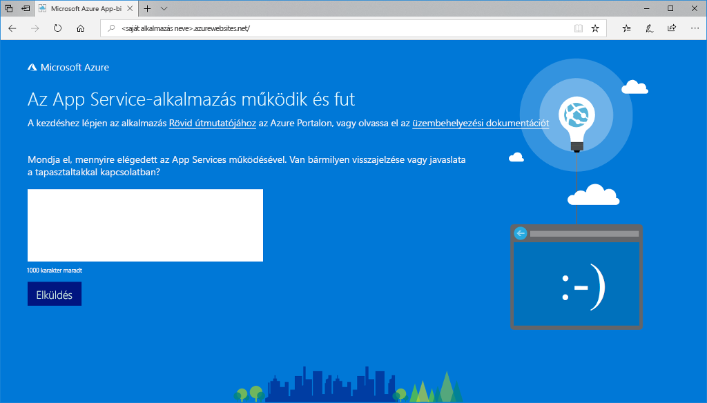

# <a name="create-a-nodejs-web-app-in-azure"></a>Node.js-webalkalmazás létrehozása az Azure-ban

> [!NOTE]
> Ebben a cikkben egy alkalmazást helyezünk üzembe a Windowson futó App Service-ben. A _Linuxon_ futó App Service-ben való üzembe helyezéssel kapcsolatban lásd: [Node.js-webalkalmazás létrehozása a Linuxon futó Azure App Service-ben](./containers/quickstart-nodejs.md).
>

Az [Azure App Service](overview.md) egy hatékonyan méretezhető, önjavító webes üzemeltetési szolgáltatás.  Ez a rövid útmutató bemutatja, hogyan helyezhet üzembe egy Node. js-alkalmazást a Azure App Service. A webalkalmazást a [Cloud Shell](https://docs.microsoft.com/azure/cloud-shell/overview)használatával hozza létre, de ezeket a parancsokat helyileg is futtathatja az [Azure CLI](/cli/azure/install-azure-cli)-vel. A Node. js-kódot a webalkalmazásba az az [WebApp Deployment Source config-zip](/cli/azure/webapp/deployment/source?view=azure-cli-latest#az-webapp-deployment-source-config-zip) parancs használatával helyezheti üzembe.  


Ezeket a lépéseket Mac, Windows vagy Linux rendszert futtató gépen is követheti. A lépések végrehajtása körülbelül három percet vesz igénybe.

[!INCLUDE [quickstarts-free-trial-note](../../includes/quickstarts-free-trial-note.md)]

[!INCLUDE [cloud-shell-try-it.md](../../includes/cloud-shell-try-it.md)]

## <a name="download-the-sample"></a>A minta letöltése

A Cloud Shellben hozzon létre egy quickstart könyvtárat, és lépjen a könyvtárba.

```console
mkdir quickstart

cd $HOME/quickstart
```

Ezután futtassa a következő parancsot a mintaalkalmazás-adattár a quickstart könyvtárba való klónozásához.

```console
git clone https://github.com/Azure-Samples/nodejs-docs-hello-world
```

Futtatás közben a parancs a következő példához hasonló információkat jelenít meg:

```output
Cloning into 'nodejs-docs-hello-world'...
remote: Counting objects: 40, done.
remote: Total 40 (delta 0), reused 0 (delta 0), pack-reused 40
Unpacking objects: 100% (40/40), done.
Checking connectivity... done.
```

> [!NOTE]
> A minta index. js beállítja a figyelési portot, hogy dolgozza fel a. env. PORT. Ezt a környezeti változót App Service rendeli hozzá.
>

[!INCLUDE [Create resource group](../../includes/app-service-web-create-resource-group-scus.md)]

[!INCLUDE [Create app service plan](../../includes/app-service-web-create-app-service-plan-scus.md)]

## <a name="create-a-web-app"></a>Webalkalmazás létrehozása

A Cloud Shellben az [](/cli/azure/webapp?view=azure-cli-latest#az-webapp-create) paranccsal hozzon létre egy webalkalmazást`az webapp create` a `myAppServicePlan` App Service-csomagban.

A következő példában cserélje ki az `<app_name>` nevet egy globálisan egyedi névre (érvényes karakterek: `a-z`, `0-9` és `-`).

```azurecli-interactive
# Bash and Powershell
az webapp create --resource-group myResourceGroup --plan myAppServicePlan --name <app_name>
```

A webalkalmazás létrehozása után az Azure CLI az alábbi példához hasonló eredményeket jelenít meg:

<pre>
{
  "availabilityState": "Normal",
  "clientAffinityEnabled": true,
  "clientCertEnabled": false,
  "cloningInfo": null,
  "containerSize": 0,
  "dailyMemoryTimeQuota": 0,
  "defaultHostName": "&lt;app_name&gt;.azurewebsites.net",
  "enabled": true,
  &lt; JSON data removed for brevity. &gt;
}
</pre>

### <a name="set-nodejs-runtime"></a>Node.js-futtatókörnyezet beállítása

Állítsa a csomópont futtatókörnyezetét 10.14.1 értékre. Az összes támogatott futtatókörnyezet megtekintéséhez futtassa a parancsot [`az webapp list-runtimes`](/cli/azure/webapp?view=azure-cli-latest#az-webapp-list-runtimes).

```azurecli-interactive
# Bash and Powershell
az webapp config appsettings set --resource-group myResourceGroup --name <app_name> --settings WEBSITE_NODE_DEFAULT_VERSION=10.14.1
```

Tallózással keresse meg az újonnan létrehozott webalkalmazást. Cserélje `<app_name>` le egy egyedi alkalmazás nevére.

```http
http://<app_name>.azurewebsites.net
```

Az új webalkalmazásnak így kell kinéznie: 

## <a name="deploy-zip-file"></a>ZIP-fájl telepítése

A Cloud Shell navigáljon az alkalmazás gyökérkönyvtárához, hozzon létre egy új ZIP-fájlt a mintául szolgáló projekthez.

```console
cd nodejs-docs-hello-world  

zip -r myUpdatedAppFiles.zip *.*
```

Telepítse a ZIP-fájlt a webalkalmazásba az az [WebApp Deployment Source config-zip](/cli/azure/webapp/deployment/source?view=azure-cli-latest#az-webapp-deployment-source-config-zip) parancs használatával.  

```azurecli-interactive
az webapp deployment source config-zip --resource-group myResourceGroup --name <app_name> --src myUpdatedAppFiles.zip
```

Ez a parancs üzembe helyezi a ZIP-fájlban szereplő fájlokat és könyvtárakat az alapértelmezett App Service-alkalmazásmappában (`\home\site\wwwroot`), majd újraindítja az alkalmazást. Ha további egyéni kiépítési folyamatok vannak megadva, azokat is futtatja. További információ: kudu- [dokumentáció](https://github.com/projectkudu/kudu/wiki/Deploying-from-a-zip-file).

## <a name="browse-to-the-app"></a>Az alkalmazás megkeresése tallózással

Tallózással keresse meg az üzembe helyezett alkalmazást a webböngésző használatával.

```http
http://<app_name>.azurewebsites.net
```

A Node.js mintakód az Azure App Service webalkalmazásban fut.


> [!NOTE]
> Az Azure App Service-ben az alkalmazás IIS-ben, [iisnode](https://github.com/Azure/iisnode) használatával fut. Az alkalmazás iisnode-dal való futtatásának engedélyezéséhez az alkalmazás gyökérmappája tartalmaz egy web.config fájlt. A fájl IIS-sel olvasható és az iisnode-hoz kapcsolódó beállítások [az iisnode GitHub-adattárban](https://github.com/Azure/iisnode/blob/master/src/samples/configuration/web.config) vannak dokumentálva.

**Gratulálok!** Elvégezte az első Node.js-app üzembe helyezését az App Service-ben.

## <a name="update-and-redeploy-the-code"></a>A kód frissítése és ismételt üzembe helyezése

A Cloud Shell a Cloud Shell szerkesztő `code index.js` megnyitásához írja be a következőt:.


Végezzen el egy kis módosítást a `response.end` hívásának szövegében:

```javascript
response.end("Hello Azure!");
```

Mentse a módosításokat, és zárja be a szerkesztőt. A mentéshez a `^S`, a kilépéshez a `^Q` parancsot használja.

Hozzon létre egy ZIP-fájlt, és telepítse azt az az [WebApp Deployment Source config-zip](/cli/azure/webapp/deployment/source?view=azure-cli-latest#az-webapp-deployment-source-config-zip) parancs használatával.  

```azurecli-interactive
# Bash
zip -r myUpdatedAppFiles.zip *.*

az webapp deployment source config-zip --resource-group myResourceGroup --name <app_name> --src myUpdatedAppFiles.zip
```

Váltson vissza **Az alkalmazás megkeresése tallózással** lépésben megnyitott böngészőablakra, és frissítse az oldalt.


## <a name="manage-your-new-azure-app"></a>Az új Azure-alkalmazás kezelése

A létrehozott webalkalmazás felügyeletéhez ugorjon az <a href="https://portal.azure.com" target="_blank">Azure Portalra</a>.

A bal oldali menüben kattintson a **app Services**elemre, majd kattintson az Azure-alkalmazás nevére.


Megtekintheti a webalkalmazás Áttekintés oldalát. Itt elvégezhet olyan alapszintű felügyeleti feladatokat, mint a tallózás, leállítás, elindítás, újraindítás és törlés.


A bal oldali menü az alkalmazás konfigurálásához biztosít különböző oldalakat.

[!INCLUDE [cli-samples-clean-up](../../includes/cli-samples-clean-up.md)]

## <a name="next-steps"></a>További lépések

> [!div class="nextstepaction"]
> [Node.js és MongoDB](app-service-web-tutorial-nodejs-mongodb-app.md)
