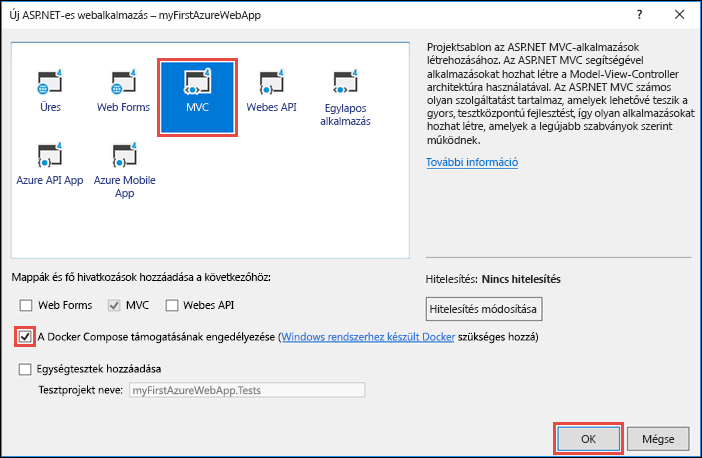
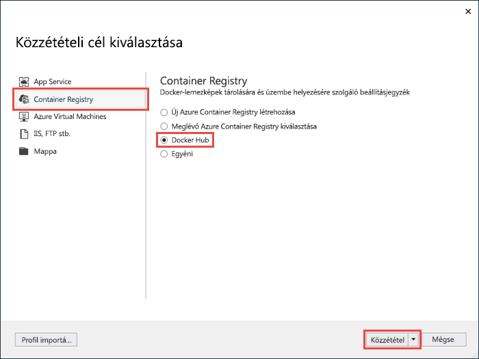
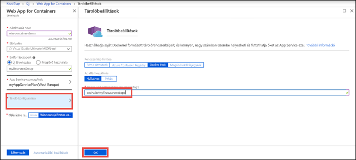

# <a name="run-a-custom-windows-container-in-azure-preview"></a>Egyéni Windows-tároló futtatása az Azure-ban (előzetes verzió)

Az [Azure App Service](overview.md) előre meghatározott, IIS-en futó alkalmazáscsoportokat biztosít Windows rendszeren, például az ASP.NET-et vagy a Node.js-t. Az előre konfigurált Windows-környezet letiltja az operációs rendszeren például a rendszergazdai hozzáférést, a szoftvertelepítést vagy a globális szerelvény-gyorsítótár módosítását (lásd [az operációs rendszer Azure App Service-funkcionalitásával foglalkozó részt](operating-system-functionality.md)). Ha az alkalmazás az előre konfigurált környezet által engedélyezettnél nagyobb mértékű hozzáférést igényel, üzembe helyezhet egy egyéni Windows-tárolót. Ez a rövid útmutató azt ismerteti, hogyan helyezhet üzembe egy Windows-rendszerképben lévő ASP.NET-alkalmazást egy [Docker Hubba](https://hub.docker.com/) a Visual Studióból, és hogy hogyan futtathatja azt egy egyéni tárolóban az Azure App Service-ben.


## <a name="prerequisites"></a>Előfeltételek

Az oktatóanyag elvégzéséhez:

- <a href="https://hub.docker.com/" target="_blank">Regisztráció Docker Hub-fiókra</a>
- <a href="https://docs.docker.com/docker-for-windows/install/" target="_blank">Windows rendszerhez készült Docker telepítése</a>.
- <a href="https://docs.microsoft.com/virtualization/windowscontainers/quick-start/quick-start-windows-10" target="_blank">A Docker átváltása Windows-tárolók futtatására</a>.
- <a href="https://www.visualstudio.com/downloads/" target="_blank">Visual Studio 2017 telepítése</a> az **ASP.NET- és webfejlesztési**, valamint az **Azure-fejlesztési** számítási feladatokkal. Ha már telepítette a Visual Studio 2017-et:
    - Telepítse a legújabb frissítéseket a Visual Studióban a **Help** > **Check for Updates** (Súgó > Frissítések keresése) lehetőségre kattintva.
    - Adja hozzá a számítási feladatokat a Visual Studióban a **Tools** (Eszközök) >  **Get Tools and Features** (Eszközök és funkciók beszerzése) elemre kattintva.

## <a name="create-an-aspnet-web-app"></a>ASP.NET-webapp létrehozása

Hozzon létre egy projektet a Visual Studióban a **File > New > Project** (Fájl > Új > Projekt) lehetőség kiválasztásával. 

A **New Project** (Új projekt) párbeszédpanelen válassza a **Visual C# > Web > ASP.NET Web Application (.NET Framework)** (ASP.NET-webalkalmazás (.NET-keretrendszer)) elemet.

Nevezze el az alkalmazást _myFirstAzureWebApp_ néven, majd kattintson az **OK** gombra.
   


Bármilyen ASP.NET-webappot üzembe helyezhet az Azure-ban. Ennél a gyorsútmutatónál válassza az **MVC** sablont, és ügyeljen arra, hogy a hitelesítés beállítása **No Authentication** (Nincs hitelesítés) legyen.

Válassza a **Docker Compose-támogatás engedélyezése** lehetőséget.

Kattintson az **OK** gombra.



Ha a _Dockerfile_ fájl nem nyílik meg automatikusan, nyissa meg a **Solution Explorer** (Megoldáskezelő) lapról.

Egy [támogatott szülőrendszerképet](#use-a-different-parent-image) kell használnia. Módosítsa a szülőrendszerképet a `FROM` sor a következő kódra való lecserélésével, majd mentse a fájlt:

```Dockerfile
FROM mcr.microsoft.com/dotnet/framework/aspnet:4.7.2-windowsservercore-ltsc2019
```

A menüből válassza a **Debug > Start without Debugging** (Hibakeresés > Indítás hibakeresés nélkül) lehetőséget a webalkalmazás helyi futtatásához.


## <a name="publish-to-docker-hub"></a>Közzététel a Docker Hubon

A **Solution Explorer** (Megoldáskezelő) lapon kattintson a jobb gombbal a **myFirstAzureWebApp** projektre, és válassza a **Publish** (Közzététel) elemet.


A közzétételi varázsló automatikusan elindul. Válassza a **Container Registry** > **Docker Hub** > **Közzététel** elemet.



Adja meg a Docker Hub-fiókja hitelesítő adatait, és kattintson a **Mentés** lehetőségre. 

Várjon, amíg az üzembe helyezés befejeződik. A **Közzététel** lap most azt az adattár nevét jeleníti meg, amelyet a későbbiekben az App Service-ben fog használni.


Másolja az adattár nevét későbbi felhasználásra.

## <a name="sign-in-to-azure"></a>Bejelentkezés az Azure-ba

Jelentkezzen be az Azure Portalra a https://portal.azure.com webhelyen.

## <a name="create-a-windows-container-app"></a>Tárolóalkalmazás létrehozása Windowshoz

1. Válassza az Azure Portal bal felső sarkában az **Erőforrás létrehozása** lehetőséget.

2. Az Azure Marketplace-erőforrások fölött lévő keresőmezőben keresse meg és válassza ki a **Web App for Containers** elemet.

3. Adja meg az alkalmazás nevét (például *win-container-demo*), fogadja el az alapértelmezett beállításokat egy új erőforráscsoport létrehozásához, majd kattintson a **Windows (előzetes verzió)** elemre az **Operációs rendszer** mezőben.

    

4. App Service-csomag létrehozásához kattintson az **App Service-csomag/Hely** > **Új létrehozása** elemre. Adja meg az új csomag nevét, fogadja el az alapértelmezett beállításokat, majd kattintson az **OK** gombra.

    

5. Kattintson a **Tároló konfigurálása** elemre. A **Rendszerkép és választható címke** mezőben azt az adattárnevet használja, amelyet a [Közzététel a Docker Hubon](#publish-to-docker-hub) szakaszban kimásolt, majd kattintson az **OK** gombra.

    

    Ha az egyéni lemezkép nem a webalkalmazásban, hanem például az [Azure Container Registryben](/azure/container-registry/) vagy bármely egyéb privát adattárban található, itt konfigurálhatja.

6. Kattintson a **Létrehozás** parancsra, majd várjon, amíg az Azure létrehozza a szükséges erőforrásokat.

## <a name="browse-to-the-container-app"></a>A tárolóalkalmazás megkeresése

Értesítés jelenik meg, ha az Azure befejezte a művelet végrehajtását.


1. Kattintson az **Erőforrás megnyitása** elemre.

2. Az alkalmazás oldalán kattintson az **URL-cím** mező alatti hivatkozásra.

Egy új böngészőlapon a következő oldal jelenik meg:


Várjon néhány percet, és próbálkozzon újra, amíg meg nem jelenik az ASP.NET alapértelmezett kezdőlapja:


**Gratulálunk!** Első egyéni Windows-tárolója immár fut az Azure App Service-ben.

## <a name="see-container-start-up-logs"></a>A tároló rendszerindítási naplóinak megtekintése

A Windows-tároló betöltése hosszabb időbe telhet. A folyamat előrehaladásának nyomon követéséhez nyissa meg az alábbi URL-címet úgy, hogy az *\<app_name>* sztringet az alkalmazás nevére cseréli.
```
https://<app_name>.scm.azurewebsites.net/api/logstream
```

A streamelt naplók a következőképpen néznek ki:

```
2018-07-27T12:03:11  Welcome, you are now connected to log-streaming service.
27/07/2018 12:04:10.978 INFO - Site: win-container-demo - Start container succeeded. Container: facbf6cb214de86e58557a6d073396f640bbe2fdec88f8368695c8d1331fc94b
27/07/2018 12:04:16.767 INFO - Site: win-container-demo - Container start complete
27/07/2018 12:05:05.017 INFO - Site: win-container-demo - Container start complete
27/07/2018 12:05:05.020 INFO - Site: win-container-demo - Container started successfully
```

## <a name="update-locally-and-redeploy"></a>Frissítés helyileg és ismételt üzembe helyezés

A **Solution Explorer** (Megoldáskezelő) lapon nyissa meg a következőt: _Views\Home\Index.cshtml_.

Keresse meg a `<div class="jumbotron">` HTML-címkét felül, és cserélje le az egész elemet az alábbi kódra:

```HTML
<div class="jumbotron">
    <h1>ASP.NET in Azure!</h1>
    <p class="lead">This is a simple app that we’ve built that demonstrates how to deploy a .NET app to Azure App Service.</p>
</div>
```

Az Azure-beli ismételt üzembe helyezéshez kattintson a jobb gombbal a **myFirstAzureWebApp** projektre a **Solution Explorer** (Megoldáskezelő) lapon, és válassza a **Publish** (Közzététel) elemet.

A közzétételi oldalon válassza a **Publish** (Közzététel) elemet, és várja meg, amíg a közzététel végbemegy.

Ahhoz, hogy az App Service-nek előírhassa az új rendszerkép a Docker Hubból történő lekérését, az alkalmazás újraindítása szükséges. A portál alkalmazáslapján kattintson az **Újraindítás** > **Igen** elemre.


[A tárolóalkalmazás megkeresése](#browse-to-the-container-app) ismét. A weboldal frissítésekor az alkalmazásnak először vissza kell térnie az „Indítás” lapra, majd pár perc elteltével ismét meg kell jelenítenie a frissített weboldalt.


## <a name="use-a-different-parent-image"></a>Másik szülőrendszerkép használata

Az alkalmazás futtatásához szabadon használhat bármilyen egyéni Docker-rendszerképet. Előbb ki kell azonban választania a kívánt keretrendszernek megfelelő [szülőrendszerképet](https://docs.docker.com/develop/develop-images/baseimages/): 

- A .NET-keretrendszerbeli alkalmazások telepítéséhez a Windows Server Core 2019 [hosszú távú karbantartási csatorna (LTSC)](https://docs.microsoft.com/windows-server/get-started-19/servicing-channels-19#long-term-servicing-channel-ltsc) kiadásán alapuló szülő lemezképet használjon. 
- A .NET Core-alkalmazások telepítéséhez a Windows Server Nano 1809 [féléves karbantartási csatorna (SAC)](https://docs.microsoft.com/windows-server/get-started-19/servicing-channels-19#semi-annual-channel) kiadásán alapuló szülő lemezképet használjon. 

Az alkalmazás indításakor a szülőrendszerkép letöltése hosszabb időbe telhet. Az indítási időt azonban lecsökkentheti az alábbi, az Azure App Service-ben már gyorsítótárazott szülőrendszerképek egyikének használatával:

- [mcr.microsoft.com/dotnet/framework/aspnet](https://hub.docker.com/_/microsoft-dotnet-framework-aspnet/):4.7.2-windowsservercore-ltsc2019
- [MCR.microsoft.com/Windows/nanoserver](https://hub.docker.com/_/microsoft-windows-nanoserver/): 1809 – ez a Microsoft [ASP.net Core](https://hub.docker.com/_microsoft-dotnet-cores-aspnet) Microsoft Windows Nano Server-lemezképekben használt alaptároló.

## <a name="next-steps"></a>További lépések

> [!div class="nextstepaction"]
> [Áttelepítés az Azure-ban található Windows-tárolókba](app-service-web-tutorial-windows-containers-custom-fonts.md)
