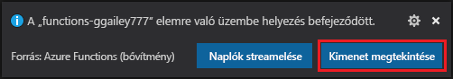

# Gyors útmutató: függvény létrehozása az Azure-ban a Python használatával a Visual Studio Code-ban

[!INCLUDE [functions-language-selector-quickstart-vs-code](../../includes/functions-language-selector-quickstart-vs-code.md)]

Ebben a cikkben a Visual Studio Code használatával hozzon létre egy Python-függvényt, amely válaszol a HTTP-kérelmekre. A kód helyi tesztelését követően a Azure Functions kiszolgáló nélküli környezetében helyezheti üzembe.

A rövid útmutató elvégzésével az Azure-fiókjában néhány USD értékű vagy annál kisebb költséggel jár.

Ennek a cikknek a [CLI-alapú verziója](create-first-function-cli-python.md) is létezik.

## A környezet konfigurálása

Mielőtt elkezdené, győződjön meg arról, hogy rendelkezik a következő követelményekkel:

+ Aktív előfizetéssel rendelkező Azure-fiók. [Hozzon létre egy fiókot ingyenesen](https://azure.microsoft.com/free/?ref=microsoft.com&utm_source=microsoft.com&utm_medium=docs&utm_campaign=visualstudio).

+ A [Azure functions Core Tools](functions-run-local.md#install-the-azure-functions-core-tools) 3. x verzió.

+ [A Azure Functions által támogatott Python-verziók](supported-languages.md#languages-by-runtime-version)

+ [Visual Studio Code](https://code.visualstudio.com/) az egyik [támogatott platformon](https://code.visualstudio.com/docs/supporting/requirements#_platforms).

+ A [Python-bővítmény](https://marketplace.visualstudio.com/items?itemName=ms-python.python) a Visual Studio Code-hoz.  

+ A Visual Code [Azure Functions-bővítménye](https://marketplace.visualstudio.com/items?itemName=ms-azuretools.vscode-azurefunctions).

## A helyi projekt létrehozása

Ebben a szakaszban a Visual Studio Code használatával hozzon létre egy helyi Azure Functions projektet a Pythonban. A cikk későbbi részében közzéteszi a függvény kódját az Azure-ban.

1. A műveleti sávban válassza ki az Azure ikont, majd az **Azure: Functions** területen válassza az **Új projekt létrehozása...** ikont.

    

1. Válasszon egy címtárbeli helyet a projekt munkaterületéhez, és kattintson a **Kiválasztás** lehetőségre.

    > [!NOTE]
    > Ezeket a lépéseket úgy tervezték, hogy a munkaterületen kívül is el lehessen végezni. Ebben az esetben ne válasszon olyan projektmappát, amely valamely munkaterület része.

1. Amikor a rendszer kéri, adja meg az alábbi információkat:

    + **Válasszon nyelvet a függvényprojekthez**: Válassza a `Python` elemet.

    + **Válasszon ki egy Python-aliast a virtuális környezet létrehozásához**: válassza ki a Python-tolmács helyét.  
    Ha a hely nem jelenik meg, írja be a Python bináris fájl teljes elérési útját.  

    + **Válasszon sablont a projekt első függvényéhez**: Válassza a `HTTP trigger` elemet.

    + **Adjon meg egy függvénynevet**: Gépelje be: `HttpExample`.

    + **Engedélyezési szint**: válassza `Anonymous` a lehetőséget, amely lehetővé teszi, hogy bárki meghívja a függvény végpontját. Az engedélyezési szint megismeréséhez tekintse meg az [engedélyezési kulcsok](functions-bindings-http-webhook-trigger.md#authorization-keys)című témakört.

    + **Válassza ki, hogyan szeretné megnyitni a projektet**: Válassza a `Add to workspace` elemet.

1. Ezen információk használatával a Visual Studio Code egy Azure Functions projektet hoz létre egy HTTP-triggerrel. A helyi projektfájlok a Explorerben tekinthetők meg. További információ a létrehozott fájlokról: [generált projektfájlok](functions-develop-vs-code.md#generated-project-files).

[!INCLUDE [functions-run-function-test-local-vs-code](../../includes/functions-run-function-test-local-vs-code.md)]

Miután meggyőződött róla, hogy a függvény megfelelően fut a helyi számítógépen, ideje, hogy a Visual Studio Code használatával tegye közzé a projektet közvetlenül az Azure-ban.

[!INCLUDE [functions-sign-in-vs-code](../../includes/functions-sign-in-vs-code.md)]

## A projekt közzététele az Azure-ban

Ebben a szakaszban egy Function-alkalmazást és egy kapcsolódó erőforrást hoz létre az Azure-előfizetésében, majd üzembe helyezi a kódot. 

> [!IMPORTANT]
> Meglévő függvényalkalmazásba való közzététel felülírja az adott alkalmazás tartalmát az Azure-ban. 

1. Válassza ki az Azure ikont a tevékenység sávjában, majd az **Azure: functions** területen válassza az **üzembe helyezés az alkalmazásban** ... gombot.

    

1. Amikor a rendszer kéri, adja meg az alábbi információkat:

    + **Mappa kiválasztása**: válasszon egy mappát a munkaterületről, vagy tallózással keresse meg a Function alkalmazást tartalmazó mappát.   
    Ez nem jelenik meg, ha már nyitva van egy érvényes Function alkalmazás.

    + **Előfizetés kiválasztása**: válassza ki a használni kívánt előfizetést.  
    Ez nem jelenik meg, ha csak egy előfizetéssel rendelkezik.

    + **Azure-beli Függvényalkalmazás kiválasztása**: Válassza a `+ Create new Function App` elemet.  
    (Ne válassza a `Advanced` lehetőséget, amely nem szerepel ebben a cikkben.)

    + **Adja meg a Function alkalmazás globálisan egyedi nevét**: írjon be egy URL-útvonalon érvényes nevet. A rendszer érvényesíti a beírt nevet, hogy a Azure Functions egyedi legyen. 

    + **Válasszon egy futtatókörnyezetet**: válassza ki, hogy a Python melyik verzióját helyileg futtatja. A `python --version` parancs segítségével megtekintheti a verziót.

    + **Válasszon egy helyet az új erőforrásokhoz**: a jobb teljesítmény érdekében válasszon egy Önhöz közeli [régiót](https://azure.microsoft.com/regions/) .

    A bővítmény megjeleníti az egyes erőforrások állapotát az értesítési terület Azure-ban való létrehozásakor.

    :::image type="content" source="../../includes/media/functions-publish-project-vscode/resource-notification.png" alt-text="Értesítés az Azure-erőforrások létrehozásáról":::

1. Ha elkészült, a következő Azure-erőforrások jönnek létre az előfizetésben, és neveket kell használni a Function app neve alapján:

    [!INCLUDE [functions-vs-code-created-resources](../../includes/functions-vs-code-created-resources.md)]

    A függvényalkalmazás létrehozása és a telepítőcsomag alkalmazása után megjelenik egy értesítés. 

    [!INCLUDE [functions-vs-code-create-tip](../../includes/functions-vs-code-create-tip.md)]

4. Válassza ki az értesítés **kimenetének megtekintése** lehetőséget a létrehozási és a telepítési eredmények megtekintéséhez, beleértve a létrehozott Azure-erőforrásokat is. Ha kihagyja az értesítést, válassza a jobb alsó sarokban található harang ikont az újbóli megjelenítéshez.

    

[!INCLUDE [functions-vs-code-run-remote](../../includes/functions-vs-code-run-remote.md)]

[!INCLUDE [functions-cleanup-resources-vs-code.md](../../includes/functions-cleanup-resources-vs-code.md)]

## Következő lépések

A [Visual Studio Code](functions-develop-vs-code.md?tabs=python) használatával egy egyszerű http-triggert használó függvényt hozhat létre. A következő cikkben az Azure Storage-hoz való csatlakozással bővítheti ezt a függvényt. További információ az egyéb Azure-szolgáltatásokhoz való csatlakozásról: [kötések hozzáadása meglévő függvényhez Azure functions](add-bindings-existing-function.md?tabs=python). 

> [!div class="nextstepaction"]
> [Kapcsolódás Azure Storage-várólistához](functions-add-output-binding-storage-queue-vs-code.md?pivots=programming-language-python)

[Problémák léptek fel? Tudassa velünk.](https://aka.ms/python-functions-qs-survey)

[Azure Functions Core Tools]: functions-run-local.md
[Azure Functions extension for Visual Studio Code]: https://marketplace.visualstudio.com/items?itemName=ms-azuretools.vscode-azurefunctions
