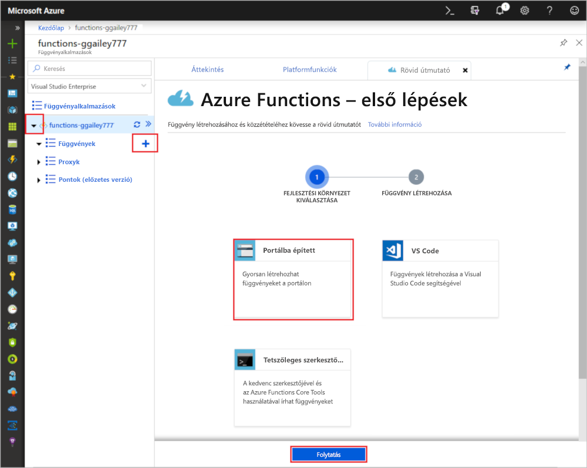

# Az első függvény létrehozása az Azure portálon

Az Azure Functions lehetővé teszi a kód [kiszolgáló nélküli](https://azure.microsoft.com/solutions/serverless/) környezetben történő végrehajtását anélkül, hogy először létre kellene hoznia egy virtuális gépet, vagy közzé kellene tennie egy webalkalmazást. Ebben a témakörben megismerheti, hogyan használhatja a Functions szolgáltatást egy „hello world” függvény létrehozására az Azure Portalon.

[!INCLUDE [quickstarts-free-trial-note](../../includes/quickstarts-free-trial-note.md)]

> [!NOTE]
> A C#-fejlesztők számára érdemes megfontolni, hogy [az első függvényt a Visual Studio 2017-ben](functions-create-your-first-function-visual-studio.md), és ne a portálon hozzák létre. 

## Jelentkezzen be az Azure-ba

Jelentkezzen be az Azure Portalra a <https://portal.azure.com> webhelyen az Azure-fiókjával.

## Függvényalkalmazás létrehozása

Rendelkeznie kell egy függvényalkalmazással a függvények végrehajtásának biztosításához. A függvényalkalmazás lehetővé teszi, hogy logikai egységbe csoportosítsa a függvényeket az erőforrások egyszerűbb felügyelete, telepítése és megosztása érdekében. 

[!INCLUDE [Create function app Azure portal](../../includes/functions-create-function-app-portal.md)]

Ezután létrehozhat egy függvényt az új függvényalkalmazásban.

## HTTP által aktivált függvény létrehozása

1. Bontsa ki az új függvényalkalmazást, majd kattintson a **Függvények** elem melletti **+** gombra, és válassza a **Portálba épített**, majd a **Folytatás** lehetőséget.

    

1. Válassza a **WebHook + API**, majd a **Létrehozás** lehetőséget.

    

A rendszer létrehoz egy függvényt egy HTTP által indított függvény nyelvspecifikus sablonjának használatával.

Mostantól egy HTTP-kérelem küldésével futtathatja az új függvényt.

## A függvény tesztelése

1. Az új függvényben kattintson a **</> Függvény URL-címének beolvasása** elemre a jobb felső sarokban, válassza a **default (Function key)** (alapértelmezett (funkcióbillentyű)) lehetőséget, majd kattintson a **Másolás** gombra. 

    

2. Illessze be a függvény URL-címét a böngésző címsorába. Az URL-cím végéhez adja hozzá a `&name=<yourname>` lekérdezési sztring értéket, majd nyomja le az `Enter` billentyűt a billentyűzeten a kérés végrehajtásához. Ekkor a függvény által visszaadott válasz jelenik meg a böngészőben.  

    Az alábbi példa a böngészőben visszaadott választ mutatja:

    

    A kérelem URL-címe alapértelmezés szerint tartalmazza a függvény HTTP protokollon keresztüli eléréséhez szükséges kulcsot.

3. A függvény futásakor a rendszer nyomkövetési adatok ír a naplókba. Az előző végrehajtás nyomkövetési adatainak megtekintéséhez térjen vissza a függvényhez a portálon, és kattintson a képernyő alján található nyílra a **Naplók** elem kibontásához.

   

## Az erőforrások eltávolítása

[!INCLUDE [Clean-up resources](../../includes/functions-quickstart-cleanup.md)]

## További lépések

Létrehozott egy függvényalkalmazást és egy HTTP által aktivált egyszerű függvényt.  

[!INCLUDE [Next steps note](../../includes/functions-quickstart-next-steps.md)]

További információt az [Azure Functions HTTP-kötéseit](functions-bindings-http-webhook.md) ismertető cikkben talál.
