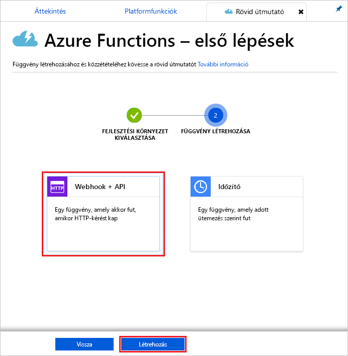
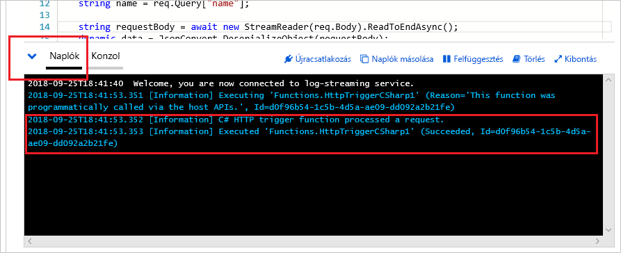

# Az első függvény létrehozása az Azure portálon

Azure Functions lehetővé teszi a kód kiszolgáló nélküli környezetben való futtatását anélkül, hogy először létre kellene hoznia egy virtuális gépet (VM), vagy közzé kellene tennie egy webalkalmazást. Ebből a cikkből megtudhatja, hogyan használhatja a Azure Functionst a "Hello World" HTTP által aktivált függvény létrehozásához a Azure Portalban.

[!INCLUDE [quickstarts-free-trial-note](../../includes/quickstarts-free-trial-note.md)]

Ha Ön C#-fejlesztő, érdemes [létrehoznia az első függvényt a Visual Studio 2019-ben](functions-create-your-first-function-visual-studio.md) a portál helyett. 

## Bejelentkezés az Azure-ba

Jelentkezzen be az [Azure Portalba](https://portal.azure.com) az Azure-fiókjával.

## Függvényalkalmazás létrehozása

Rendelkeznie kell egy függvényalkalmazással a függvények végrehajtásának biztosításához. A Function app lehetővé teszi, hogy logikai egységként csoportosítsa a függvényeket az erőforrások egyszerűbb felügyelete, üzembe helyezése, skálázása és megosztása érdekében.

[!INCLUDE [Create function app Azure portal](../../includes/functions-create-function-app-portal.md)]

Ezután hozzon létre egy függvényt az új függvény alkalmazásban.

## HTTP által aktivált függvény létrehozása

1. Bontsa ki az új Function alkalmazást, **+** kattintson a **függvények**elem melletti gombra, válassza a **portálon**, majd a **Folytatás**lehetőséget.

    

1. Válassza a **webhook + API**lehetőséget, majd válassza a **Létrehozás**lehetőséget.

    

   A rendszer létrehoz egy függvényt egy HTTP által indított függvény nyelvspecifikus sablonjának használatával.

Mostantól egy HTTP-kérelem küldésével futtathatja az új függvényt.

## A függvény tesztelése

1. Az új függvényben válassza a jobb felső sarokban található **</> a függvény URL-címének beolvasása** elemet. 

1. A **függvény URL-címének lekérése** párbeszédpanelen válassza az **alapértelmezett (funkcióbillentyű)** lehetőséget a legördülő listából, majd válassza a **Másolás**lehetőséget. 

    

1. Illessze be a függvény URL-címét a böngésző címsorába. Adja hozzá a lekérdezési `&name=<your_name>` karakterlánc értékét az URL végéhez, majd nyomja le az ENTER billentyűt a kérelem futtatásához. 

    Az alábbi példa a böngészőben visszaadott választ mutatja:

    

    A kérelem URL-címe alapértelmezés szerint tartalmazza a függvény HTTP protokollon keresztüli eléréséhez szükséges kulcsot.

1. A függvény futásakor a rendszer nyomkövetési adatok ír a naplókba. Az előző végrehajtás nyomkövetési kimenetének megtekintéséhez térjen vissza a függvényhez a portálon, és kattintson a képernyő alján található nyílra a **naplók**kibontásához.

   

## Az erőforrások eltávolítása

[!INCLUDE [Clean-up resources](../../includes/functions-quickstart-cleanup.md)]

## További lépések

[!INCLUDE [Next steps note](../../includes/functions-quickstart-next-steps.md)]

