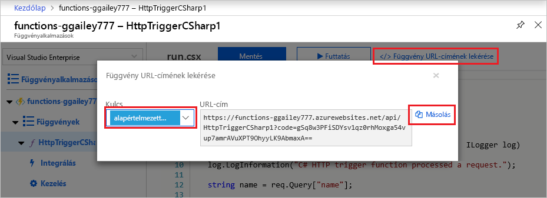

# Az első függvény létrehozása az Azure portálon

Azure Functions lehetővé teszi a kód kiszolgáló nélküli környezetben való futtatását anélkül, hogy először létre kell hoznia egy virtuális gépet (VM), vagy közzé kell tennie egy webalkalmazást. Ebből a cikkből megtudhatja, hogyan hozhat létre egy "hello world" HTTP Azure Functions függvényt a Azure Portal.

[!INCLUDE [functions-in-portal-editing-note](../../includes/functions-in-portal-editing-note.md)] 

Javasoljuk, hogy helyileg fejlessze a [függvényeket,](functions-develop-local.md) és tegye közzé őket egy Azure-beli függvényalkalmazásban.  
A választott helyi fejlesztési környezet és nyelv használatának elkezdéséhez használja az alábbi hivatkozások egyikét:

| Visual Studio Code | Terminál/parancssor | Visual Studio |
| --- | --- | --- |
|  &bull;&nbsp;[Első lépések a C-ben #](./create-first-function-vs-code-csharp.md) &bull;&nbsp;[A Java első lépések](./create-first-function-vs-code-java.md) &bull;&nbsp;[A JavaScript első lépések](./create-first-function-vs-code-node.md) &bull;&nbsp;[A PowerShell első lépések](./create-first-function-vs-code-powershell.md) &bull;&nbsp;[A Python első lépések](./create-first-function-vs-code-python.md) |&bull;&nbsp;[Első lépések a C-ben #](./create-first-function-cli-csharp.md) &bull;&nbsp;[A Java első lépések](./create-first-function-cli-java.md) &bull;&nbsp;[A JavaScript első lépések](./create-first-function-cli-node.md) &bull;&nbsp;[A PowerShell első lépések](./create-first-function-cli-powershell.md) &bull;&nbsp;[A Python első lépések](./create-first-function-cli-python.md) | [Első lépések a C-ben #](functions-create-your-first-function-visual-studio.md) |

[!INCLUDE [quickstarts-free-trial-note](../../includes/quickstarts-free-trial-note.md)]

## Bejelentkezés az Azure-ba

Jelentkezzen be az [Azure Portalra](https://portal.azure.com) az Azure-fiókjával.

## Függvényalkalmazás létrehozása

Rendelkeznie kell egy függvényalkalmazással a függvények végrehajtásának biztosításához. A függvényalkalmazásokkal logikai egységként csoportosíthatja a függvényeket az erőforrások egyszerűbb kezelése, üzembe helyezése, skálázása és megosztása érdekében.

[!INCLUDE [Create function app Azure portal](../../includes/functions-create-function-app-portal.md)]

Ezután hozzon létre egy függvényt az új függvényalkalmazásban.

## HTTP-eseményindító függvény létrehozása

1. A Függvények ablak bal oldali menüjében **válassza** a **Függvények** lehetőséget, majd a felső menü **hozzáadás** parancsát. 
 
1. A Függvény **hozzáadása ablakban** válassza a **HTTP-eseményindító sablont.**

    

1. A **Sablon részletei alatt** használja az Új függvény lehetőséget, válassza a Névtelen lehetőséget az Engedélyezési szint legördülő `HttpExample` listából, majd válassza a Hozzáadás **lehetőséget.**   ****

    Az Azure létrehozza a HTTP-eseményindító függvényt. Mostantól egy HTTP-kérelem küldésével futtathatja az új függvényt.

## A függvény tesztelése

1. Az új HTTP-eseményindító függvényben válassza a bal oldali **menü Code + Test** (Kód + tesztelés) parancsát, majd a függvény **URL-címének** be szereznie lehetőséget a felső menüben.

    

1. A **Függvény URL-címének**  beszúrása párbeszédpanelen válassza az alapértelmezett értéket a legördülő listából, majd válassza a Másolás **a vágólapra** ikont. 

    

1. Illessze be a függvény URL-címét a böngésző címsorába. Adja hozzá a lekérdezési sztring értékét az URL-cím végéhez, majd nyomja le az Enter billentyűt `?name=<your_name>` a kérés futtatásához. A böngészőnek egy válaszüzenetet kell megjelenítenie, amely megismétli a lekérdezési sztring értékét. 

    Ha a kérés URL-címe tartalmaz egy [hozzáférési kulcsot](functions-bindings-http-webhook-trigger.md#authorization-keys) ( ), akkor a függvény létrehozásakor a Névtelen hozzáférési szint helyett a Függvényt `?code=...` kell választania.   Ebben az esetben ehelyett a következőt kell hozzáfűzni: `&name=<your_name>` .

1. A függvény futásakor a rendszer nyomkövetési adatok ír a naplókba. A nyomkövetési kimenet megtekintéséhez térjen vissza a Portál Kód  **+ teszt** oldalára, és bontsa ki a lap alján található Naplók nyilat. Hívja meg újra a függvényt a naplókba írt nyomkövetési kimenet megtekintéséhez. 

    :::image type="content" source="media/functions-create-first-azure-function/function-view-logs.png" alt-text="Függvénynapló-megjelenítő a Azure Portal":::

## Az erőforrások eltávolítása

[!INCLUDE [Clean-up resources](../../includes/functions-quickstart-cleanup.md)]

## Következő lépések

[!INCLUDE [Next steps note](../../includes/functions-quickstart-next-steps.md)]
