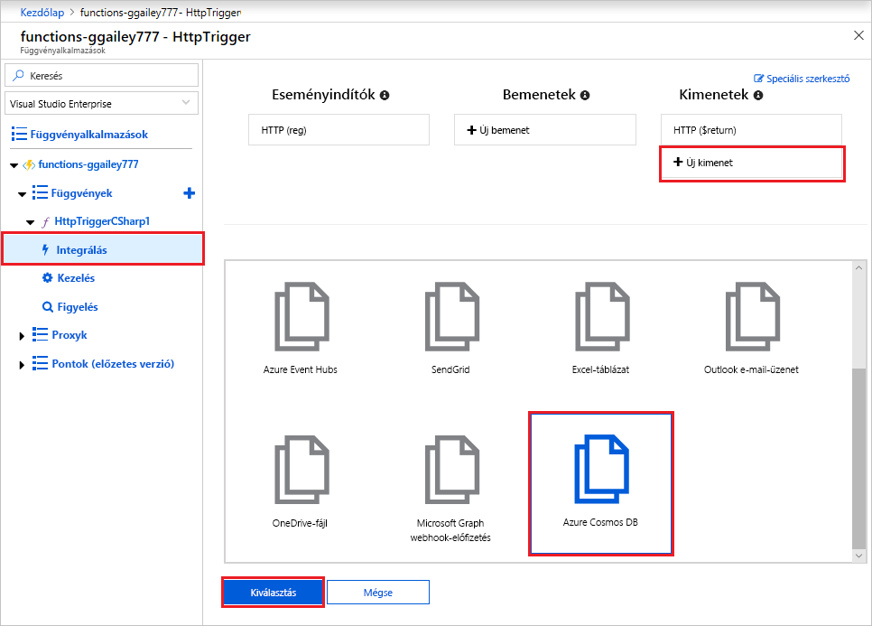
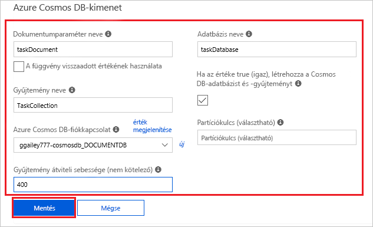
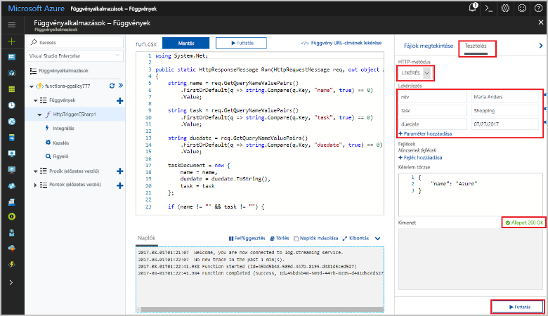
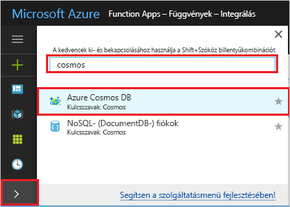
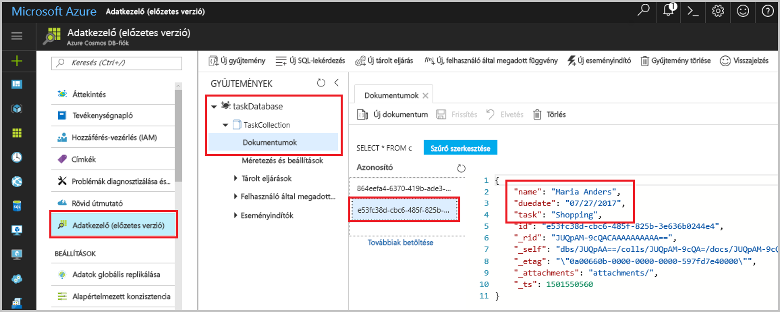

# <a name="store-unstructured-data-using-azure-functions-and-azure-cosmos-db"></a>Strukturálatlan adatok tárolása az Azure Functions és az Azure Cosmos DB használatával

Az [Azure Cosmos DB](https://azure.microsoft.com/services/cosmos-db/) kiválóan alkalmas strukturálatlan és JSON-adatok tárolására. A Cosmos DB, az Azure Functions szolgáltatással kombinálva felgyorsítja és megkönnyíti az adattárolást, hiszen lényegesen kevesebb kódot igényel, mint amennyi egy relációs adatbázisban történő adattároláshoz szükséges.

> [!NOTE]
> Az Azure Cosmos DB-eseményindító, illetve a bemeneti és a kimeneti kötések jelenleg csak az SQL API- és a Graph API-fiókokkal képesek együttműködni.

Az Azure Functions bemeneti és kimeneti kötései deklaratív módszert biztosítanak a külső szolgáltatások adataihoz a függvényből történő csatlakozásra. Ebben a cikkben megtudhatja, hogyan módosíthat egy meglévő függvényt egy kimeneti kötés hozzáadásához, amely strukturálatlan adatokat tárol egy Azure Cosmos DB-dokumentumban.


## <a name="prerequisites"></a>Előfeltételek

Az oktatóanyag elvégzéséhez:

[!INCLUDE [Previous quickstart note](../../includes/functions-quickstart-previous-topics.md)]

## <a name="create-an-azure-cosmos-db-account"></a>Azure Cosmos DB-fiók létrehozása

A kimeneti kötés létrehozásához rendelkeznie kell egy SQL API-t használó Azure Cosmos DB-fiókkal.

[!INCLUDE [cosmos-db-create-dbaccount](../../includes/cosmos-db-create-dbaccount.md)]

## <a name="add-an-output-binding"></a>Kimeneti kötés hozzáadása

1. A portálon belül lépjen a korábban létrehozott függvényalkalmazáshoz, és bontsa ki a függvényalkalmazást és a függvényt.

1. Válassza az oldal jobb felső sarkában található **Integráció** és **+ Új kimenet** elemeket. Válassza az **Azure Cosmos DB** elemet, majd kattintson a **Kiválasztás** lehetőségre.

    

1. Ha egy arra figyelmeztető üzenet jelenik meg, hogy **Nincsenek telepítve a bővítmények**, válassza a **Telepítés** lehetőséget az Azure Cosmos DB kötési bővítmény függvényalkalmazásban történő telepítéséhez. A telepítés egy-két percet vesz igénybe.

    

1. Használja a táblázatban megadott **Azure Cosmos DB kimeneti** beállításokat:

    

    | Beállítás      | Ajánlott érték  | Leírás                                |
    | ------------ | ---------------- | ------------------------------------------ |
    | **Dokumentumparaméter neve** | taskDocument | A Cosmos DB-objektumra utaló név a kódban. |
    | **Adatbázis neve** | taskDatabase | Adatbázis neve a dokumentumok mentéséhez. |
    | **Gyűjtemény neve** | TaskCollection | Az adatbázis-gyűjtemény neve. |
    | **Ha az értéke true, létrehozza a Cosmos DB-adatbázist és -gyűjteményt** | Bejelölve | A gyűjtemény még nem létezik, hozza létre. |
    | **Azure Cosmos DB-fiók kapcsolata** | Új beállítás | Válassza ki az **Új** gombot, majd válassza ki az **előfizetését**, a korábban létrehozott **adatbázisfiókot**, és a **Kiválasztás** lehetőséget. Ezzel létrehoz egy alkalmazásbeállítást a fiókkapcsolathoz. Ezt a beállítást használja a kötés, hogy kapcsolódjon az adatbázishoz. |
    | **Gyűjtemény átviteli sebessége** |400 kérelemegység| Később lehetősége lesz növelni az átviteli sebességet a késés csökkentése érdekében. |

1. A kötés létrehozásához válassza a **Mentés** lehetőséget.

## <a name="update-the-function-code"></a>A függvénykód módosítása

Cserélje le a meglévő függvénykódot a következő kódra a kiválasztott nyelven:

# <a name="ctabcsharp"></a>[C#](#tab/csharp)

Cserélje le a meglévő C#-függvényt a következő kódra:

```csharp
#r "Newtonsoft.Json"

using Microsoft.AspNetCore.Mvc;
using Microsoft.AspNetCore.Http;
using Microsoft.Extensions.Logging;

public static IActionResult Run(HttpRequest req, out object taskDocument, ILogger log)
{
    string name = req.Query["name"];
    string task = req.Query["task"];
    string duedate = req.Query["duedate"];

    // We need both name and task parameters.
    if (!string.IsNullOrEmpty(name) && !string.IsNullOrEmpty(task))
    {
        taskDocument = new
        {
            name,
            duedate,
            task
        };

        return (ActionResult)new OkResult();
    }
    else
    {
        taskDocument = null;
        return (ActionResult)new BadRequestResult();
    }
}
```

# <a name="javascripttabjavascript"></a>[JavaScript](#tab/javascript)

Cserélje le a meglévő JavaScript-függvényt a következő kódra:

```js
module.exports = async function (context, req) {

    // We need both name and task parameters.
    if (req.query.name && req.query.task) {

        // Set the output binding data from the query object.
        context.bindings.taskDocument = req.query;

        // Success.
        context.res = {
            status: 200
        };
    }
    else {
        context.res = {
            status: 400,
            body: "The query options 'name' and 'task' are required."
        };
    }
};
```
---

A mintakód beolvassa a HTTP-kérelem sztringjeit, és egy `taskDocument` objektum mezőihez rendeli azokat. A `taskDocument` kötés elküldi az ezen kötési paramétertől származó objektumadatokat a kötött dokumentum-adatbázisba tárolásra. Az adatbázis a függvény első futtatásakor jön létre.

## <a name="test-the-function-and-database"></a>A függvény és az adatbázis tesztelése

1. Bontsa ki a jobb oldali ablakot, és válassza a **Teszt** elemet. A **Lekérdezés** területen kattintson a **+ Paraméter hozzáadása** elemre, és adja hozzá a következő paramétereket a lekérdezési sztringhez:

    + `name`
    + `task`
    + `duedate`

1. Kattintson a **Futtatás** parancsra, és ellenőrizze, hogy a rendszer 200-as állapotüzenetet ad-e vissza.

    

1. Az Azure Portal bal oldali menüjében bontsa ki az ikonsort, gépelje be a `cosmos` szöveget a keresőmezőbe, és válassza az **Azure Cosmos DB** lehetőséget.

    

1. Válassza ki Azure Cosmos DB-fiókját, majd válassza az**Adatkezelő** lehetőséget.

1. Bontsa ki a **Gyűjtemények** csomópontokat, válassza ki az új dokumentumot, és győződjön meg arról, hogy a dokumentum tartalmazza a lekérdezési sztring értékeit, valamint további metaadatokat.

    

Sikeresen hozzáadott egy kötést a HTTP-triggerhez, hogy strukturálatlan adatokat tárolhasson az Azure Cosmos DB-ben.

[!INCLUDE [Clean-up section](../../includes/clean-up-section-portal.md)]

## <a name="next-steps"></a>További lépések

A Cosmos DB-adatbázisokhoz végzett kötésről további információt az [Azure Functions Cosmos DB-kötéseket](functions-bindings-cosmosdb.md) ismertető cikk tartalmaz.

[!INCLUDE [functions-quickstart-next-steps](../../includes/functions-quickstart-next-steps-2.md)]
