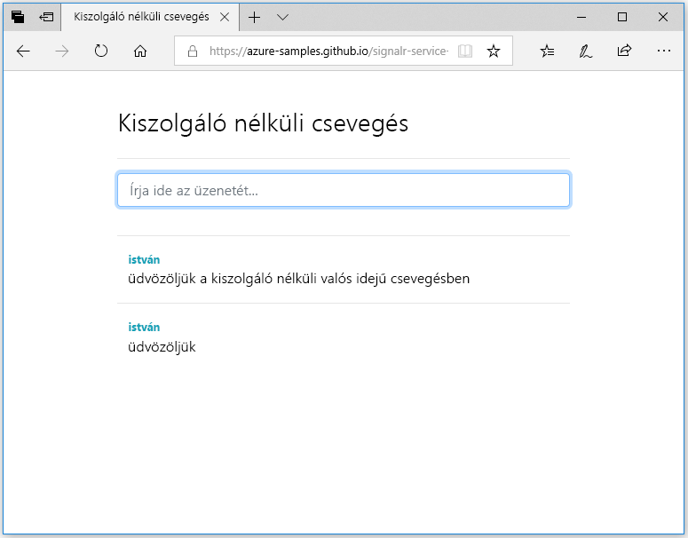

## A webalkalmazás futtatása

1. A folyamat megkönnyítése érdekében a GitHubon megtalálható egy egyoldalas, mintául szolgáló webalkalmazás. Nyissa meg a böngészőben a következő webhelyet: [https://azure-samples.github.io/signalr-service-quickstart-serverless-chat/demo/chat-v2/](https://azure-samples.github.io/signalr-service-quickstart-serverless-chat/demo/chat-v2/).

    > [!NOTE]
    > A forrás a HTML-fájl a következő helyen található [/docs/demo/chat-v2/index.html](https://github.com/Azure-Samples/signalr-service-quickstart-serverless-chat/blob/master/docs/demo/chat-v2/index.html).

1. Amikor a függvény alkalmazás alap URL-Címének megadását kéri, adja meg a `http://localhost:7071`.

1. Amikor a rendszer erre kéri, adja meg a felhasználónevet.

1. A webalkalmazás meghívja a *GetSignalRInfo* függvényt a függvényalkalmazásban az Azure SignalR Service-hez való kapcsolódáshoz szükséges kapcsolatadatok lekéréséhez. Ha a kapcsolat létrejött, megjelenik a csevegőüzenet beviteli mezője.

1. Írja be az üzenetet, és nyomja le az Enter billentyűt. Az alkalmazás elküldi az üzenetet a *SendMessage* függvénynek az Azure Functions-alkalmazásban, amely ezt követően SignalR kimeneti kötés használatával továbbítja az üzenetet az összes csatlakoztatott ügyfélnek. Ha minden megfelelően működik, akkor az üzenetnek meg kell jelennie az alkalmazásban.

    

1. Nyissa meg a webalkalmazás egy másik példányát egy másik böngészőablakban. Látni fogja, hogy az elküldött üzenet az alkalmazás összes példányában megjelenik.

> [!IMPORTANT]
> HTTPS-en keresztül a HTML-oldalt szolgál ki, de a helyi Azure Functions runtime használja a HTTP alapértelmezés szerint, mert (például a Firefox) böngészőjében léptethet vegyes tartalmú szabályzat, amely blokkolja az a funkciók a weblap érkező kérelmek. A probléma megszüntetéséhez használja egy böngészőben, amely nem rendelkezik ezzel a korlátozással vagy indítsa el például egy helyi HTTP-kiszolgálót [http-kiszolgáló](https://www.npmjs.com/package/http-server) a a */docs/demo/chat-v2* könyvtár. Győződjön meg arról, a forrás adnak hozzá a `CORS` beállításával *local.settings.json*.