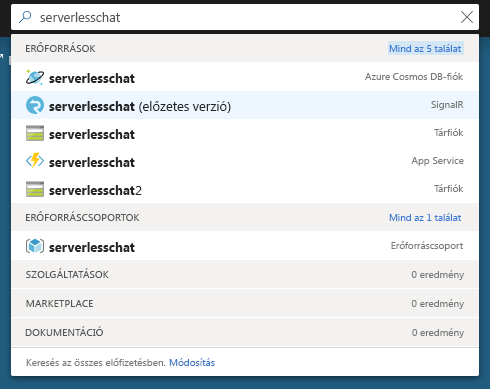
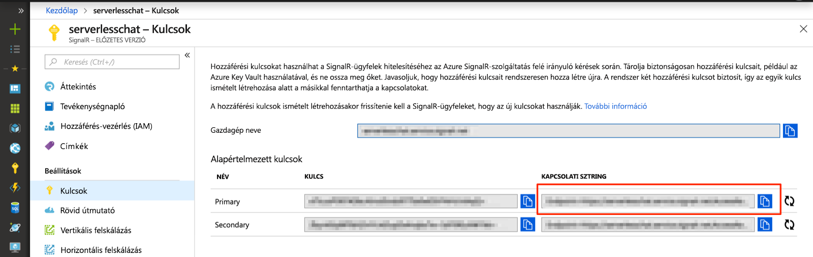

# <a name="quickstart-use-java-to-create-a-chat-room-with-azure-functions-and-signalr-service"></a>Rövid útmutató: Csevegőszoba létrehozása Javával Azure Functions és SignalR Service

Azure SignalR Service segítségével egyszerűen adhat hozzá valós idejű funkciókat az alkalmazásához, Azure Functions pedig egy kiszolgáló nélküli platform, amellyel infrastruktúra kezelése nélkül futtathatja a kódot. Ebben a rövid útmutatóban Java használatával hoz létre kiszolgáló nélküli, valós idejű csevegőalkalmazást a SignalR Service és a Functions használatával.

## <a name="prerequisites"></a>Előfeltételek

- Kódszerkesztő, például Visual Studio [Code](https://code.visualstudio.com/)
- Aktív előfizetéssel rendelkezik egy Azure-fiók. [Hozzon létre egy ingyenes fiókot.](https://azure.microsoft.com/free/?ref=microsoft.com&utm_source=microsoft.com&utm_medium=docs&utm_campaign=visualstudio)
- [Azure Functions Core Tools:](https://github.com/Azure/azure-functions-core-tools#installing). Azure-függvényalkalmazások helyi futtatására szolgál.

   > [!NOTE]
   > A szükséges SignalR Service kötések Csak az Azure Function Core Tools 2.4.419-es (2.0.12332-es gazdagépverzió) vagy újabb verzióiban támogatottak.

   > [!NOTE]
   > A bővítmények telepítéséhez Azure Functions Core Tools szükséges a [.NET Core SDK](https://dotnet.microsoft.com/download) telepítése. A JavaScript-alapú Azure-függvényalkalmazások létrehozásához azonban nem szükséges a .NET ismerete.

- A [Java Developer Kit](https://www.azul.com/downloads/zulu/) 8-as verziója
- Az [Apache Maven](https://maven.apache.org) 3.0-s vagy újabb verziója

> [!NOTE]
> Ez a rövid útmutató macOS, Windows vagy Linux rendszeren is futtatható.

Problémákat? Próbálja ki [a hibaelhárítási útmutatót,](signalr-howto-troubleshoot-guide.md) [vagy tudtossa velünk a következőt:](https://aka.ms/asrs/qsjava).

## <a name="log-in-to-azure"></a>Jelentkezzen be az Azure-ba

Jelentkezzen be az Azure Portalra a <https://portal.azure.com/> webhelyen az Azure-fiókjával.

Problémákat? Próbálja ki [a hibaelhárítási útmutatót,](signalr-howto-troubleshoot-guide.md) [vagy tudtossa velünk a következőt:](https://aka.ms/asrs/qsjava).

[!INCLUDE [Create instance](includes/signalr-quickstart-create-instance.md)]

Problémákat? Próbálja ki [a hibaelhárítási útmutatót,](signalr-howto-troubleshoot-guide.md) [vagy tudtossa velünk a következőt:](https://aka.ms/asrs/qsjava).

[!INCLUDE [Clone application](includes/signalr-quickstart-clone-application.md)]

Problémákat? Próbálja ki [a hibaelhárítási útmutatót,](signalr-howto-troubleshoot-guide.md) [vagy tudtossa velünk a következőt:](https://aka.ms/asrs/qsjava).

## <a name="configure-and-run-the-azure-function-app"></a>Az Azure-függvényalkalmazás konfigurálása és futtatása

1. A böngészőben, amelyben meg van nyitva az Azure Portal, a portál tetején levő keresőmezőben a példány nevére való kereséssel ellenőrizze, hogy a korábban üzembe helyezett SignalR-szolgáltatáspéldány sikeresen létrejött-e. A megnyitáshoz válassza ki a példányt.

    

1. Válassza a **Kulcsok** elemet a SignalR-szolgáltatáspéldány kapcsolati sztringjeinek megtekintéséhez.

1. Válassza ki és másolja a vágólapra az elsődleges kapcsolati sztring értékét.

    

1. A kódszerkesztőben nyissa meg az *src/chat/java* mappát a klónozott adattárban.

1. Nevezze át a *local.settings.sample.json* fájlt *local.settings.json* névre.

1. A **local.settings.json** fájlban illessze be a kapcsolati sztringet az **AzureSignalRConnectionString** beállítás értékéhez. Mentse a fájlt.

1. A függvényeket tartalmazó fő fájl az *src/chat/java/src/main/java/com/function/Functions.java:*

    - **negotiate** – A *SignalRConnectionInfo* bemeneti kötést használja érvényes kapcsolatadatok létrehozásához és visszaküldéséhez.
    - **sendMessage** – Csevegési üzenetet fogad a kérés törzsében, és a *SignalR* kimeneti kötéssel elküldi az üzenetet az összes csatlakoztatott ügyfélalkalmazásnak.

1. A terminálban győződjön meg arról, hogy az *src/chat/java mappában* van. A függvényalkalmazás összeállítása.

    ```bash
    mvn clean package
    ```

1. Futtassa helyileg a függvényalkalmazást.

    ```bash
    mvn azure-functions:run
    ```
    
Problémákat? Próbálja ki [a hibaelhárítási útmutatót,](signalr-howto-troubleshoot-guide.md) [vagy tudajuk meg velünk a következőt:](https://aka.ms/asrs/qsjava).

[!INCLUDE [Run web application](includes/signalr-quickstart-run-web-application.md)]

Problémákat? Próbálja ki [a hibaelhárítási útmutatót,](signalr-howto-troubleshoot-guide.md) [vagy tudajuk meg velünk a következőt:](https://aka.ms/asrs/qsjava).

[!INCLUDE [Cleanup](includes/signalr-quickstart-cleanup.md)]

Problémákat? Próbálja ki [a hibaelhárítási útmutatót,](signalr-howto-troubleshoot-guide.md) [vagy tudajuk meg velünk a következőt:](https://aka.ms/asrs/qsjava).

## <a name="next-steps"></a>Következő lépések

Ebben a rövid útmutatóban egy valós idejű kiszolgáló nélküli alkalmazást épített és futtatott a Maven használatával. A következő lépés a Java-Azure Functions létrehozása.

> [!div class="nextstepaction"]
> [Az első függvény létrehozása a Java és a Maven használatával](../azure-functions/create-first-function-cli-csharp.md?pivots=programming-language-java%2cprogramming-language-java)
