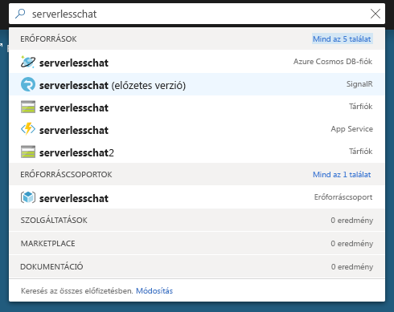

# <a name="quickstart-use-javascript-to-create-a-chat-room-with-azure-functions-and-signalr-service"></a>Rövid útmutató: Csevegőszoba létrehozása JavaScripttel Azure Functions és SignalR Service

Azure SignalR Service segítségével egyszerűen adhat hozzá valós idejű funkciókat az alkalmazásához, és Azure Functions egy kiszolgáló nélküli platform, amellyel infrastruktúra kezelése nélkül futtathatja a kódot. Ebben a rövid útmutatóban JavaScriptet fog használni egy kiszolgáló nélküli, valós idejű csevegőalkalmazás felépítéséhez a SignalR Service és a Functions használatával.

## <a name="prerequisites"></a>Előfeltételek

- Kódszerkesztő, például Visual Studio [Code](https://code.visualstudio.com/)
- Aktív előfizetéssel rendelkezik egy Azure-fiók. [Hozzon létre egy ingyenes fiókot.](https://azure.microsoft.com/free/?ref=microsoft.com&utm_source=microsoft.com&utm_medium=docs&utm_campaign=visualstudio)
- [Azure Functions Core Tools](https://github.com/Azure/azure-functions-core-tools#installing), 2-es vagy újabb verzió. Az Azure-függvényalkalmazások helyi futtatására szolgál.
- [Node.js](https://nodejs.org/en/download/), 10.x verzió

   > [!NOTE]
   > A példáknak az alkalmazás más verzióival Node.js, Azure Functions [a runtime-verziók](../azure-functions/functions-versions.md#languages) dokumentációjában talál további információt.

> [!NOTE]
> Ez a rövid útmutató macOS, Windows vagy Linux rendszeren is futtatható.

Problémákat? Próbálja ki [a hibaelhárítási útmutatót,](signalr-howto-troubleshoot-guide.md) [vagy tudajuk meg velünk a következőt:](https://aka.ms/asrs/qsjs).

## <a name="log-in-to-azure"></a>Jelentkezzen be az Azure-ba

Jelentkezzen be az Azure Portalra a <https://portal.azure.com/> webhelyen az Azure-fiókjával.

Problémákat? Próbálja ki [a hibaelhárítási útmutatót,](signalr-howto-troubleshoot-guide.md) [vagy tudajuk meg velünk a következőt:](https://aka.ms/asrs/qsjs).

[!INCLUDE [Create instance](includes/signalr-quickstart-create-instance.md)]

Problémákat? Próbálja ki [a hibaelhárítási útmutatót,](signalr-howto-troubleshoot-guide.md) [vagy tudajuk meg velünk a következőt:](https://aka.ms/asrs/qsjs).

[!INCLUDE [Clone application](includes/signalr-quickstart-clone-application.md)]

Problémákat? Próbálja ki [a hibaelhárítási útmutatót,](signalr-howto-troubleshoot-guide.md) [vagy tudajuk meg velünk a következőt:](https://aka.ms/asrs/qsjs).

## <a name="configure-and-run-the-azure-function-app"></a>Az Azure-függvényalkalmazás konfigurálása és futtatása

1. A böngészőben, amelyben meg van nyitva az Azure Portal, a portál tetején levő keresőmezőben a példány nevére való kereséssel ellenőrizze, hogy a korábban üzembe helyezett SignalR-szolgáltatáspéldány sikeresen létrejött-e. A megnyitáshoz válassza ki a példányt.

    

1. Válassza a **Kulcsok** elemet a SignalR-szolgáltatáspéldány kapcsolati sztringjeinek megtekintéséhez.

1. Válassza ki és másolja a vágólapra az elsődleges kapcsolati sztring értékét.

    

1. A kódszerkesztőben nyissa meg az *src/chat/javascript* mappát a klónozott adattárban.

1. Nevezze át a *local.settings.sample.json* fájlt *local.settings.json* névre.

1. A **local.settings.json** fájlban illessze be a kapcsolati sztringet az **AzureSignalRConnectionString** beállítás értékéhez. Mentse a fájlt.

1. A JavaScript-függvények mappákba vannak rendezve. Minden mappában két fájl található: a *function.json* határozza meg a függvényben használt kötéseket, az *index.js* pedig a függvény törzse. Ebben a függvényalkalmazásban két HTTP által indított függvény található:

    - **negotiate** – A *SignalRConnectionInfo* bemeneti kötést használja érvényes kapcsolatadatok létrehozásához és visszaküldéséhez.
    - **messages** – A kéréstörzsben fogadja a csevegés üzenetét, és a *SignalR* kimeneti kötés használatával továbbítja azt az összes csatlakoztatott ügyfélalkalmazás számára.

1. A terminálban győződjön meg arról, hogy az *src/chat/javascript mappában van.* Futtassa a függvényalkalmazást.

    ```bash
    func start
    ```

    
    
Problémákat? Próbálja ki [a hibaelhárítási útmutatót,](signalr-howto-troubleshoot-guide.md) [vagy tudajuk meg velünk a következőt:](https://aka.ms/asrs/qsjs).

[!INCLUDE [Run web application](includes/signalr-quickstart-run-web-application.md)]

Problémákat? Próbálja ki [a hibaelhárítási útmutatót,](signalr-howto-troubleshoot-guide.md) [vagy tudajuk meg velünk a következőt:](https://aka.ms/asrs/qsjs).

[!INCLUDE [Cleanup](includes/signalr-quickstart-cleanup.md)]

Problémákat? Próbálja ki [a hibaelhárítási útmutatót,](signalr-howto-troubleshoot-guide.md) [vagy tudajuk meg velünk a következőt:](https://aka.ms/asrs/qsjs).

## <a name="next-steps"></a>Következő lépések

Ebben a rövid útmutatóban egy valós idejű kiszolgáló nélküli alkalmazást épített és futtatott a VS Code-ban. A következőkben még többet tudhat meg az Azure Functions VS Code-ból történő üzembe helyezéséről.

> [!div class="nextstepaction"]
> [Az Azure Functions üzembe helyezése VS Code-dal](/azure/developer/javascript/tutorial-vscode-serverless-node-01)
