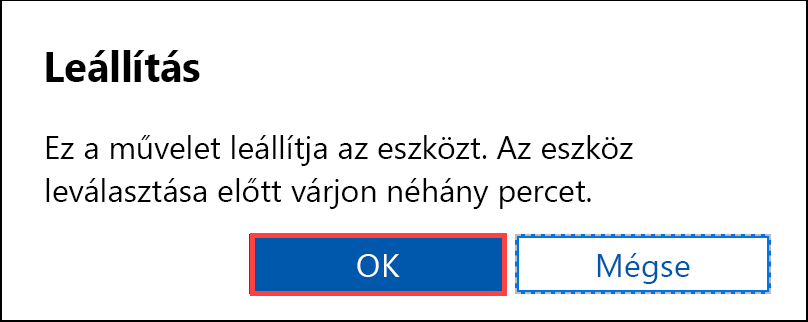
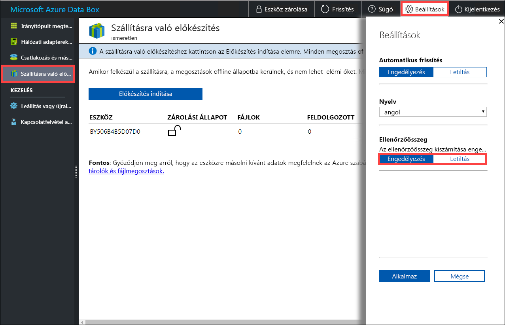

# <a name="use-the-local-web-ui-to-administer-your-data-box-and-data-box-heavy"></a>A helyi webes felhasználói felület használata a Data Box és Data Box Heavy felügyeletéhez

Ez a cikk a Data Box és Data Box Heavy eszközökön végrehajtható konfigurációs és felügyeleti feladatokat ismerteti. A Data Box és Data Box Heavy eszközöket a Azure Portal felhasználói felületen és az eszköz helyi webes FELÜLETén keresztül kezelheti. A cikk a helyi webes felhasználói felülettel végrehajtható feladatokra összpontosít.

A Data Box és Data Box Heavy helyi webes felhasználói felülete az eszköz kezdeti konfigurálására szolgál. A helyi webes felhasználói felület segítségével leállíthatja vagy újraindíthatja az eszközt, diagnosztikai teszteket futtathat, szoftvereket frissíthet, megtekintheti a naplók másolását, és létrehozhat egy naplófájlt Microsoft ügyfélszolgálatahoz. Két független csomóponttal rendelkező Data Box Heavy eszközön két különálló helyi webes felület érhető el, amely az eszköz egyes csomópontjainak felel meg.

A cikk az alábbi oktatóanyagokat tartalmazza:

- Támogatási csomag létrehozása
- Az eszköz leállítása és újraindítása
- ANYAGJEGYZÉK-vagy manifest-fájlok letöltése
- Az eszköz rendelkezésre álló kapacitásának megtekintése
- Ellenőrzőösszeg-érvényesítés kihagyása

## <a name="generate-support-package"></a>Támogatási csomag létrehozása

Ha eszközproblémákat tapasztal, létrehozhat egy támogatási csomagot a rendszernaplókból. A Microsoft támogatási szolgálata a csomag segítségével hárítja el a problémát. Támogatási csomag létrehozásához hajtsa végre a következő lépéseket:

1. A helyi webes felhasználói felületen nyissa meg a **Contact Support** (Kapcsolatfelvétel a támogatási szolgálattal) lapot, és kattintson a **Create Support package** (Támogatási csomag létrehozása) elemre.

    

2. A rendszer összeállítja a támogatási csomagot. A művelet pár percet vesz igénybe.

    

3. A támogatási csomag létrehozásának befejezését követően kattintson a **Download Support package** (Támogatási csomag letöltése) elemre. 

    

4. Tallózással válassza ki a letöltés helyét. Nyissa meg a mappát a tartalmak megtekintéséhez.

    


## <a name="shut-down-or-restart-your-device"></a>Az eszköz leállítása és újraindítása

Az eszközt a helyi webes felhasználói felület használatával állíthatja le vagy indíthatja újra. Az újraindítás előtt ajánlott offline állapotba állítani a gazdagépen található megosztásokat, majd magát az eszközt is. Ezzel a lehető legkisebbre csökkenti az adatsérülés esélyét. Az eszköz leállításakor ellenőrizze, hogy nincs-e folyamatban adatmásolás.

Az eszköz leállításához hajtsa végre az alábbi lépéseket.

1. A helyi webes felhasználói felületen lépjen a **Shut down or restart** (Leállítás vagy újraindítás) lapra.
2. Kattintson a **Shut down** (Leállítás) elemre.

    

3. Ha a rendszer megerősítést kér, kattintson az **OK** gombra a folytatáshoz.

    

Az eszköz leállítását követően az előlapon található bekapcsoló gombbal kapcsolhatja be az eszközt.

A Data Box újraindításához hajtsa végre az alábbi lépéseket.

1. A helyi webes felhasználói felületen lépjen a **Shut down or restart** (Leállítás vagy újraindítás) lapra.
2. Kattintson a **Restart** (Újraindítás) elemre.

    

3. Ha a rendszer megerősítést kér, kattintson az **OK** gombra a folytatáshoz.

   Az eszköz leáll, majd újraindul.

## <a name="download-bom-or-manifest-files"></a>ANYAGJEGYZÉK-vagy manifest-fájlok letöltése

Az anyagjegyzék (AJ) vagy a manifest-fájlok tartalmazzák a Data Box vagy Data Box Heavyba másolt fájlok listáját. Ezek a fájlok akkor jönnek létre, amikor előkészíti az eszközt a szállításra.

Mielőtt elkezdené, győződjön meg arról, hogy az eszköz elvégezte **szállításra való előkészítés** lépést. Az ANYAGJEGYZÉK-vagy jegyzékfájl-fájlok letöltéséhez kövesse az alábbi lépéseket:

1. Nyissa meg az eszköz helyi webes FELÜLETét. Látni fogja, hogy az eszköz befejezte a felkészülést a szállításra. Az eszköz előkészítésének befejezése után az eszköz állapota a **szállításra kész**állapotban jelenik meg.

    

2. A **fájlok** listájának letöltése gombra kattintva letöltheti a Data Box másolt fájlok listáját.

    

3. A Fájlkezelőben láthatja, hogy az eszközhöz való kapcsolódáshoz használt protokolltól és a használt Azure Storage-típustól függően a fájlok külön listája jön létre.

    

   Az alábbi táblázat a fájlneveket az Azure Storage-típusra és a használt kapcsolati protokollra képezi le.

    |Fájlnév  |Azure Storage-típus  |Használt kapcsolati protokoll |
    |---------|---------|---------|
    |databoxe2etest_BlockBlob. txt     |Blokkblobok         |SMB/NFS         |
    |databoxe2etest_PageBlob. txt     |Lapblobok         |SMB/NFS         |
    |databoxe2etest_AzFile-BOM. txt    |Azure Files         |SMB/NFS         |
    |databoxe2etest_PageBlock_Rest-BOM. txt     |Lapblobok         |REST        |
    |databoxe2etest_BlockBlock_Rest-BOM. txt    |Blokkblobok         |REST         |
    |mydbmdrg1_MDisk-BOM. txt    |Felügyelt lemez         |SMB/NFS         |
    |mydbmdrg2_MDisk-BOM. txt     |Felügyelt lemez         |SMB/NFS         |

Ezt a listát használhatja az Azure Storage-fiókba feltöltött fájlok ellenőrzéséhez, miután a Data Box visszatér az Azure-adatközpontba. Alább látható egy minta manifest-fájl.

> [!NOTE]
> Data Box Heavy a fájlok (AJ-fájlok) két csoportja szerepel az eszköz két csomópontjának megfelelően.

```xml
<file size="52689" crc64="0x95a62e3f2095181e">\databox\media\data-box-deploy-copy-data\prepare-to-ship2.png</file>
<file size="22117" crc64="0x9b160c2c43ab6869">\databox\media\data-box-deploy-copy-data\connect-shares-file-explorer2.png</file>
<file size="57159" crc64="0x1caa82004e0053a4">\databox\media\data-box-deploy-copy-data\verify-used-space-dashboard.png</file>
<file size="24777" crc64="0x3e0db0cd1ad438e0">\databox\media\data-box-deploy-copy-data\prepare-to-ship5.png</file>
<file size="162006" crc64="0x9ceacb612ecb59d6">\databox\media\data-box-cable-options\cabling-dhcp-data-only.png</file>
<file size="155066" crc64="0x051a08d36980f5bc">\databox\media\data-box-cable-options\cabling-2-port-setup.png</file>
<file size="150399" crc64="0x66c5894ff328c0b1">\databox\media\data-box-cable-options\cabling-with-switch-static-ip.png</file>
<file size="158082" crc64="0xbd4b4c5103a783ea">\databox\media\data-box-cable-options\cabling-mgmt-only.png</file>
<file size="148456" crc64="0xa461ad24c8e4344a">\databox\media\data-box-cable-options\cabling-with-static-ip.png</file>
<file size="40417" crc64="0x637f59dd10d032b3">\databox\media\data-box-portal-admin\delete-order1.png</file>
<file size="33704" crc64="0x388546569ea9a29f">\databox\media\data-box-portal-admin\clone-order1.png</file>
<file size="5757" crc64="0x9979df75ee9be91e">\databox\media\data-box-safety\japan.png</file>
<file size="998" crc64="0xc10c5a1863c5f88f">\databox\media\data-box-safety\overload_tip_hazard_icon.png</file>
<file size="5870" crc64="0x4aec2377bb16136d">\databox\media\data-box-safety\south-korea.png</file>
<file size="16572" crc64="0x05b13500a1385a87">\databox\media\data-box-safety\taiwan.png</file>
<file size="999" crc64="0x3f3f1c5c596a4920">\databox\media\data-box-safety\warning_icon.png</file>
<file size="1054" crc64="0x24911140d7487311">\databox\media\data-box-safety\read_safety_and_health_information_icon.png</file>
<file size="1258" crc64="0xc00a2d5480f4fcec">\databox\media\data-box-safety\heavy_weight_hazard_icon.png</file>
<file size="1672" crc64="0x4ae5cfa67c0e895a">\databox\media\data-box-safety\no_user_serviceable_parts_icon.png</file>
<file size="3577" crc64="0x99e3d9df341b62eb">\databox\media\data-box-safety\battery_disposal_icon.png</file>
<file size="993" crc64="0x5a1a78a399840a17">\databox\media\data-box-safety\tip_hazard_icon.png</file>
<file size="1028" crc64="0xffe332400278f013">\databox\media\data-box-safety\electrical_shock_hazard_icon.png</file>
<file size="58699" crc64="0x2c411d5202c78a95">\databox\media\data-box-deploy-ordered\data-box-ordered.png</file>
<file size="46816" crc64="0x31e48aa9ca76bd05">\databox\media\data-box-deploy-ordered\search-azure-data-box1.png</file>
<file size="24160" crc64="0x978fc0c6e0c4c16d">\databox\media\data-box-deploy-ordered\select-data-box-option1.png</file>
<file size="115954" crc64="0x0b42449312086227">\databox\media\data-box-disk-deploy-copy-data\data-box-disk-validation-tool-output.png</file>
<file size="6093" crc64="0xadb61d0d7c6d4deb">\databox\data-box-cable-options.md</file>
<file size="6499" crc64="0x080add29add367d9">\databox\data-box-deploy-copy-data-via-nfs.md</file>
<file size="11089" crc64="0xc3ce6b13a4fe3001">\databox\data-box-deploy-copy-data-via-rest.md</file>
<file size="9126" crc64="0x820856b5a54321ad">\databox\data-box-overview.md</file>
<file size="10963" crc64="0x5e9a14f9f4784fd8">\databox\data-box-safety.md</file>
<file size="5941" crc64="0x8631d62fbc038760">\databox\data-box-security.md</file>
<file size="12536" crc64="0x8c8ff93e73d665ec">\databox\data-box-system-requirements-rest.md</file>
<file size="3220" crc64="0x7257a263c434839a">\databox\data-box-system-requirements.md</file>
<file size="2823" crc64="0x63db1ada6fcdc672">\databox\index.yml</file>
<file size="4364" crc64="0x62b5710f58f00b8b">\databox\data-box-local-web-ui-admin.md</file>
<file size="3603" crc64="0x7e34c25d5606693f">\databox\TOC.yml</file>
```

Ez a fájl tartalmazza a Data Boxre vagy Data Box Heavyra másolt fájlok listáját. Ebben a fájlban a *crc64* érték a megfelelő fájlhoz generált ellenőrzőösszeggel kapcsolódik.

## <a name="view-available-capacity-of-the-device"></a>Az eszköz rendelkezésre álló kapacitásának megtekintése

Az eszköz irányítópultján tekintheti meg az eszköz rendelkezésre álló és felhasznált kapacitását.

1. A helyi webes felhasználói felületen lépjen a **View dashboard** (Irányítópult megtekintése) lapra.
2. A **Connect and copy** (Kapcsolódás és másolás) részen az eszköz szabad és felhasznált területe látható.

    

## <a name="skip-checksum-validation"></a>Ellenőrzőösszeg-érvényesítés kihagyása

A szállításra való felkészüléskor a rendszer alapértelmezés szerint ellenőrzőösszegeket hoz létre az adataihoz. Bizonyos ritka esetekben az adattípustól (kis fájlmérettől függően) a teljesítmény lassú lehet. Ilyen esetben kihagyhatja az ellenőrzőösszeg létrehozását.

Határozottan javasoljuk, hogy csak akkor tiltsa le az ellenőrző létrehozását, ha komoly hatással lenne a teljesítményre.

1. Az eszköz helyi webes FELÜLETének jobb felső sarkában válassza a **Beállítások lehetőséget**.

    

2. Tiltsa le az ellenőrzőösszeg-érvényesítést a **Disable** (Letiltás) paranccsal.
3. Kattintson az **Alkalmaz** gombra.

## <a name="next-steps"></a>További lépések

- Megtudhatja, hogyan [kezelheti a Data Box és Data Box Heavy a Azure Portalon keresztül](data-box-portal-admin.md).

