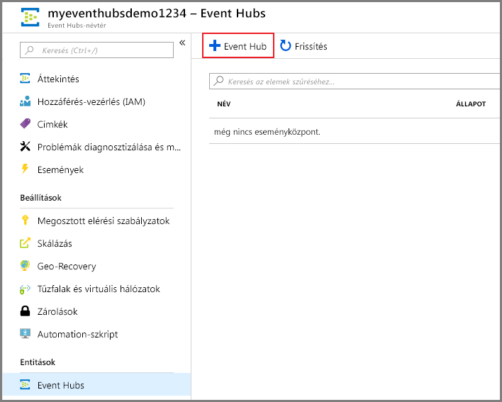

# Rövid útmutató: Eseményközpont létrehozása az Azure Portallal
Az Azure Event Hubs egy Big Data streamplatform és eseményfeldolgozó szolgáltatás, amely másodpercenként több millió esemény fogadására és feldolgozására képes. Az Event Hubs képes az elosztott szoftverek és eszközök által generált események, adatok vagy telemetria feldolgozására és tárolására. Az eseményközpontokba elküldött adatok bármilyen valós idejű elemzési szolgáltató vagy kötegelési/tárolóadapter segítségével átalakíthatók és tárolhatók. Az Event Hubs részletes áttekintéséért lásd az [Event Hubs áttekintését](event-hubs-about.md) és az [Event Hubs-szolgáltatásokat](event-hubs-features.md) ismertető cikket.

Ebben a rövid útmutatóban az [Azure Portal](https://portal.azure.com) használatával hoz létre eseményközpontot.

## Előfeltételek

A rövid útmutató elvégzéséhez győződjön meg róla, hogy rendelkezik az alábbiakkal:

- Egy Azure-előfizetés. Ha még nincs előfizetése, [hozzon létre egy ingyenes fiókot](https://azure.microsoft.com/free/), mielőtt hozzákezd.
- [Visual Studio 2019](https://www.visualstudio.com/vs) vagy újabb verzió.
- A [.NET Standard SDK](https://www.microsoft.com/net/download/windows) 2.0-s vagy újabb verziója.

## Hozzon létre egy erőforráscsoportot

Az erőforráscsoport Azure-erőforrások logikai gyűjteménye. Minden erőforrás üzembe helyezése és kezelése erőforráscsoportban történik. Erőforráscsoport létrehozása:

1. Jelentkezzen be az [Azure Portalra](https://portal.azure.com).
2. A bal oldali menüben válassza az **Erőforráscsoportok** lehetőséget. Ezután kattintson az **Add** (Hozzáadás) gombra.

   

2. Az **előfizetés**mezőben válassza ki annak az Azure-előfizetésnek a nevét, amelyben létre kívánja hozni az erőforráscsoportot.
3. Adja **meg az erőforráscsoport egyedi nevét**. A rendszer azonnal ellenőrzi, hogy a név elérhető-e az aktuálisan kiválasztott Azure-előfizetésben.
4. Válassza ki az erőforráscsoport **régióját** .
5. Válassza a **felülvizsgálat + létrehozás**lehetőséget.

   
6. A **felülvizsgálat + létrehozás** lapon válassza a **Létrehozás**lehetőséget. 

## Event Hubs-névtér létrehozása

Egy Event Hubs-névtér egyedi hatókörkezelési tárolót biztosít, amelyre a teljes tartománynevével lehet hivatkozni, és ebben a tárolóban egy vagy több eseményközpontot is létrehozhat. Ha létre szeretne hozni egy névteret az erőforráscsoportban a portál használatával, végezze el az alábbi műveleteket:

1. Az Azure Portalon kattintson az **Erőforrás létrehozása** gombra a képernyő bal felső részén.
2. A bal oldali menüben válassza a **minden szolgáltatás** lehetőséget, majd válassza a **csillag ( `*` )** lehetőséget a **Event Hubs** elem mellett az **elemzési** kategóriában. Győződjön meg arról, hogy a bal oldali navigációs menüben a **Event Hubs** a **Kedvencek közé** kerül. 
    
   
3. A bal oldali navigációs menüben kattintson a **Kedvencek** elemre, majd a **Hozzáadás** elemre az eszköztáron válassza a **Event Hubs** lehetőséget.

   
4. A **névtér létrehozása** oldalon hajtsa végre a következő lépéseket:
    1. Válassza ki azt az **előfizetést** , amelyben létre kívánja hozni a névteret.
    2. Válassza ki az előző lépésben létrehozott **erőforráscsoportot** . 
    3. Adja meg a névtér **nevét** . A rendszer azonnal ellenőrzi, hogy a név elérhető-e.
    4. Válassza ki a névtér **helyét** .    
    5. Válassza ki az **árképzési szintet** (alapszintű vagy standard).  
    6. Hagyja meg az **átviteli egységek** beállításait. További információ az átviteli egységekről: [Event Hubs skálázhatóság](event-hubs-scalability.md#throughput-units)  
    5. Kattintson a lap alján található **felülvizsgálat + létrehozás** lehetőségre.

       
   6. A **felülvizsgálat + létrehozás** oldalon tekintse át a beállításokat, majd kattintson a **Létrehozás**gombra. Várjon, amíg az üzembe helyezés befejeződik. 

       
   7. A **központi telepítés** lapon válassza az **erőforrás keresése** lehetőséget a névtér oldalának megnyitásához. 

      
   8. Ellenőrizze, hogy megjelenik-e a **Event Hubs névtér** oldal a következő példához hasonlóan: 

              

       > [!NOTE]
       > Az Azure Event Hubs egy Kafka-végpontot biztosít. Ez a végpont lehetővé teszi, hogy a Event Hubs névteret natív módon tudja értelmezni [Apache Kafka](https://kafka.apache.org/intro) üzenetküldési protokoll és API-k. Ezzel a képességgel a Kafka-témakörökhöz hasonlóan tud kommunikálni az Event hubokkal a protokoll-ügyfelek módosítása vagy a saját fürtök futtatása nélkül. A Event Hubs a Apache Kafka 1,0-es és újabb [verzióit](https://kafka.apache.org/10/documentation.html) támogatja. További információ: [Event Hubs használata Apache Kafka alkalmazásokból](event-hubs-for-kafka-ecosystem-overview.md).
    
## Eseményközpont létrehozása

Ha eseményközpontot szeretne létrehozni egy névtérben, végezze el a következő műveleteket:

1. A Event Hubs névtér lapon válassza a bal oldali menüben a **Event Hubs** lehetőséget.
1. Az ablak tetején kattintson a **+ Eseményközpont** elemre.
   
    
1. Adja meg az Event hub nevét, majd kattintson a **Létrehozás**gombra.
   
    
4. Az Event hub létrehozásának állapotát a riasztásokban tekintheti meg. Az Event hub létrehozása után az az alábbi képen látható módon jelenik meg az Event hubok listájában:

    

## Következő lépések

Ebben a cikkben egy erőforráscsoportot, egy Event Hubs-névteret és egy eseményközpontot hozott létre. Az események küldése az Event hub-tól (vagy) események fogadására vonatkozó részletes utasításokért lásd a **küldési és fogadási események** oktatóanyagokat: 

- [.NET Core](get-started-dotnet-standard-send-v2.md)
- [Java](get-started-java-send-v2.md)
- [Python](get-started-python-send-v2.md)
- [JavaScript](get-started-node-send-v2.md)
- [Ugrás](event-hubs-go-get-started-send.md)
- [C (csak küldés)](event-hubs-c-getstarted-send.md)
- [Apache Storm (csak fogadás)](event-hubs-storm-getstarted-receive.md)

[Azure portal]: https://portal.azure.com/
[3]: ./media/event-hubs-quickstart-portal/sender1.png
[4]: ./media/event-hubs-quickstart-portal/receiver1.png
