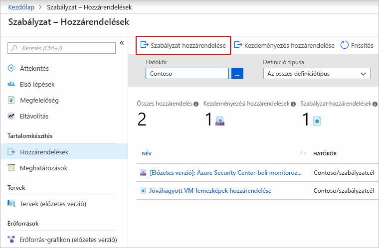
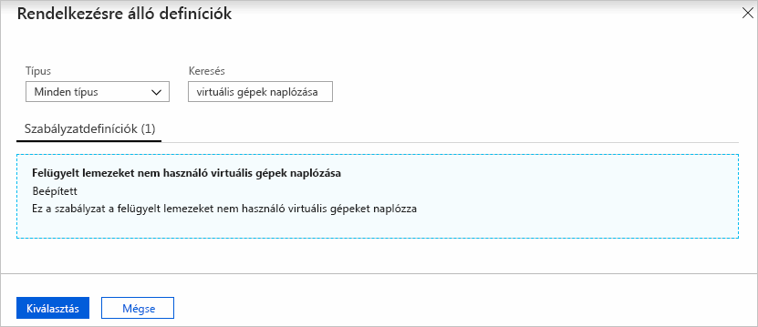

# Quickstart: Create a policy assignment to identify non-compliant resources

Az Azure-ral való megfelelőség megértéséhez szükséges első lépés a saját erőforrásai állapotának megállapítása.
Ez a rövid útmutató végigvezeti Önt a folyamaton, amellyel létrehozhat egy felügyelt lemezeket nem használó virtuális gépek azonosítására szolgáló szabályzat-hozzárendelést.

A folyamat végén sikeresen fogja azonosítani a felügyelt lemezeket nem használó virtuális gépeket. Ezek a szabályzat-hozzárendelés szempontjából *nem megfelelőnek* minősülnek.

Ha nem rendelkezik Azure-előfizetéssel, első lépésként mindössze néhány perc alatt létrehozhat egy [ingyenes](https://azure.microsoft.com/free/) fiókot.

## Szabályzat-hozzárendelés létrehozása

In this quickstart, you create a policy assignment and assign the *Audit VMs that do not use managed disks* policy definition.

1. Indítsa el az Azure Policy szolgáltatást az Azure Portalon. Ehhez kattintson a **Minden szolgáltatás** elemre, majd keresse meg, és válassza ki a **Szabályzat** elemet.

   

1. Válassza ki a **Hozzárendelések** elemet az Azure Policy oldal bal oldalán. A hozzárendelés egy olyan szabályzat, amely egy adott hatókörön belül érvényes.

   

1. Válassza a **Szabályzat hozzárendelése** lehetőséget a **Szabályzat – Hozzárendelések** oldal tetején.

   

1. A **Szabályzat hozzárendelése** oldalon a **Hatókör** kiválasztásához kattintson a három pontra, majd válasszon felügyeleti csoportot vagy előfizetést. Ha szeretne, válasszon erőforráscsoportot. A hatókör határozza meg, hogy a szabályzat-hozzárendelés milyen erőforrások vagy erőforráscsoportok esetében lesz kényszerítve. Ezután kattintson a **Kiválasztás** gombra a **Hatókör** oldal alján.

   Ebben a példában a **Contoso** előfizetést használjuk. Saját előfizetése ettől eltérhet.

1. Az erőforrások kizárhatóak a **Hatókör** alapján. A **Kizárások** alacsonyabb szinten kezdődnek, mint a **Hatókör** szintje. A **Kizárások** nem kötelezőek, ezért egyelőre hagyja őket üresen.

1. Kattintson a **Szabályzatdefiníció** melletti három pontra az elérhető definíciók listájának megjelenítéséhez. Az Azure Policy beépített szabályzatdefiníciókat tartalmaz, amelyeket felhasználhat. Számos szabályzatdefiníció elérhető, többek között az alábbiak:

   - Címke és a hozzá tartozó érték kényszerítése
   - Címke és a hozzá tartozó érték alkalmazása
   - Az SQL Server 12.0-ás verziójának megkövetelése

   For a partial list of available built-in policies, see [Azure Policy samples](./samples/index.md).

1. Keresse meg a *Felügyelt lemezeket nem használó virtuális gépek naplózása* definíciót a szabályzatdefiníciók listájában. Kattintson a szabályzatra, majd kattintson a **Kiválasztás** elemre.

   

1. A **Hozzárendelés neve** mező automatikusan kitöltődik a kiválasztott szabályzat nevével, de megadhat más nevet is. A példánkban meghagyjuk a *Felügyelt lemezeket nem használó virtuális gépek naplózása* értéket. Ha szeretné hozzáadhat egy **Leírást**. A leírás a szabályzat-hozzárendeléssel kapcsolatos információkat adja meg.
   A **Hozzárendelte** mező automatikusan ki lesz töltve az alapján, hogy ki van bejelentkezve. A mező kitöltése nem kötelező, megadhatók egyéni értékek.

1. A **Felügyelt identitás létrehozása** jelölőnégyzetet hagyja üresen. This box _must_ be checked when the policy or initiative includes a policy with the [deployIfNotExists](./concepts/effects.md#deployifnotexists) effect. As the policy used for this quickstart doesn't, leave it blank. További információkat a [felügyelt identitásokkal](../../active-directory/managed-identities-azure-resources/overview.md) és [a szervizelési biztonság működésével](./how-to/remediate-resources.md#how-remediation-security-works) kapcsolatos cikkben találhat.

1. Kattintson a **Hozzárendelés** gombra.

You're now ready to identify non-compliant resources to understand the compliance state of your environment.

## Nem megfelelő erőforrások azonosítása

Select **Compliance** in the left side of the page. Then locate the **Audit VMs that do not use managed disks** policy assignment you created.

If there are any existing resources that aren't compliant with this new assignment, they appear under **Non-compliant resources**.

Ha a meglévő erőforrások kiértékelésekor egy feltétel igaznak bizonyul, ezek az erőforrások a szabályzatnak nem megfelelőként lesznek megjelölve. A következő táblázat azt mutatja be, hogyan működnek együtt a szabályzatok különböző hatásai a feltételek kiértékelésével a megfelelőségi állapot eléréséhez. Although you don't see the evaluation logic in the Azure portal, the compliance state results are shown. A megfelelőségi állapotok eredménye lehet megfelelő vagy nem megfelelő.

| **Erőforrás-állapot** | **Hatás** | **Szabályzat-kiértékelés** | **Megfelelőségi állapot** |
| --- | --- | --- | --- |
| Létezik | Deny, Audit, Append\*, DeployIfNotExist\*, AuditIfNotExist\* | Igaz | Nem megfelelő |
| Létezik | Deny, Audit, Append\*, DeployIfNotExist\*, AuditIfNotExist\* | Hamis | Megfelelőség |
| Új | Naplózás, AuditIfNotExist\* | Igaz | Nem megfelelő |
| Új | Naplózás, AuditIfNotExist\* | Hamis | Megfelelőség |

\* Az Append, a DeployIfNotExist és az AuditIfNotExist hatás esetében az IF utasításnak TRUE értéket kell visszaadnia.
Emellett a létezési feltételnek FALSE értéket kell visszaadnia ahhoz, hogy a szabályzat nem megfelelőnek minősüljön. TRUE érték esetén az IF feltétel kiváltja a vonatkozó erőforrások létezési feltételének kiértékelését.

## Az erőforrások eltávolítása

To remove the assignment created, follow these steps:

1. Válassza a **Megfelelőség** (vagy **Hozzárendelések**) elemet az Azure Policy oldal bal oldalán, és keresse meg a létrehozott **Felügyelt lemezeket nem használó virtuális gépek naplózása** szabályzat-hozzárendelést.

1. Kattintson a jobb gombbal a **Felügyelt lemezeket nem használó virtuális gépek naplózása** szabályzat-hozzárendelésre, és válassza a **Hozzárendelés törlése** lehetőséget.

   

## Következő lépések

Ebben a rövid útmutatóban egy hatókörhöz rendelt hozzá egy szabályzatdefiníciót, és kiértékelte annak megfelelőségi jelentését.
The policy definition validates that all the resources in the scope are compliant and identifies which ones aren't.

To learn more about assigning policies to validate that new resources are compliant, continue to the tutorial for:

> [!div class="nextstepaction"]
> [Szabályzatok létrehozása és kezelése](./tutorials/create-and-manage.md)