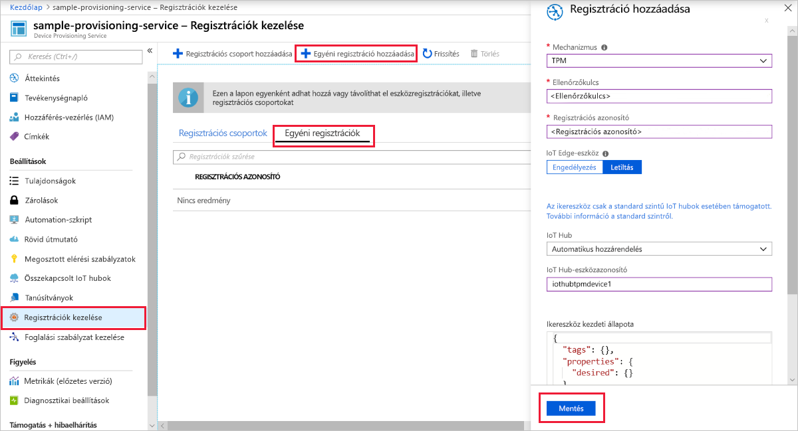
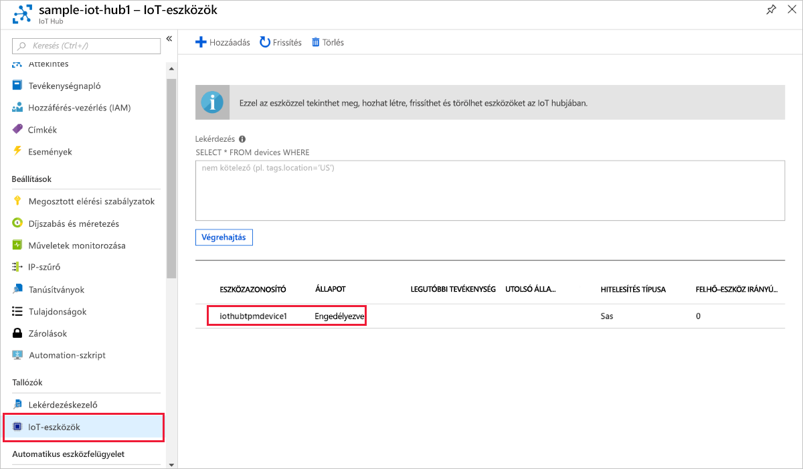

# <a name="quickstart-create-and-provision-a-simulated-tpm-device-using-c-device-sdk-for-iot-hub-device-provisioning-service"></a>Rövid útmutató: Szimulált TPM-eszköz létrehozása és kiépítése a C# eszközoldali SDK-val IoT Hub Device Provisioning Service

[!INCLUDE [iot-dps-selector-quick-create-simulated-device-tpm](../../includes/iot-dps-selector-quick-create-simulated-device-tpm.md)]

Ezek a lépések azt mutatják be, hogyan szimulálhat TPM-eszközt egy Windows operációs rendszert futtató fejlesztői gépen az [Azure IoT Samples for C#](https://github.com/Azure-Samples/azure-iot-samples-csharp) használatával. A minta a szimulált eszközt is csatlakoztatja egy IoT Hub Device Provisioning Service használatával. 

A mintakód a Windows TPM-szimulátort használja az eszköz [Hardveres biztonsági moduljaként (HSM)](https://azure.microsoft.com/blog/azure-iot-supports-new-security-hardware-to-strengthen-iot-security/). 

Ha nem ismeri az automatikus kiépítés folyamatát, tekintse át a [kiépítés áttekintését.](about-iot-dps.md#provisioning-process) Emellett a folytatás előtt végezze el az [IoT Hub eszközkiépítési szolgáltatás beállítása az Azure Portallal](./quick-setup-auto-provision.md) című cikk lépéseit. 

Az Azure IoT Device Provisioning Service kétféle típusú regisztrációt támogat:

- [Regisztrációs csoportok](concepts-service.md#enrollment-group): Több kapcsolódó eszköz regisztrálásához.
- [Egyéni regisztrációk](concepts-service.md#individual-enrollment): Egyetlen eszköz regisztrálásához.

Ez a cikk az egyéni regisztrációkat ismerteti.

[!INCLUDE [IoT Device Provisioning Service basic](../../includes/iot-dps-basic.md)]

<a id="setupdevbox"></a>
## <a name="prepare-the-development-environment"></a>A fejlesztési környezet előkészítése 

1. Győződjön meg arról, hogy a [.NET Core 2.1 SDK](https://dotnet.microsoft.com/download) vagy újabb telepítve van a gépen. 

1. Győződjön meg arról, hogy a(z) `git` telepítve van a gépen, és a parancsablakból elérhető környezeti változókhoz van adva. A [Software Freedom Conservancy's Git ügyfél eszközeiben](https://git-scm.com/download/) találja a telepíteni kívánt `git` eszközök legújabb verzióját, amely tartalmazza a **Git Bash** eszközt, azt a parancssori alkalmazást, amellyel kommunikálhat a helyi Git-adattárral. 

1. Nyisson meg egy parancssort vagy a Git Basht. Klónozza az Azure IoT-mintákat a C# GitHub-adattárhoz:

    ```cmd
    git clone https://github.com/Azure-Samples/azure-iot-samples-csharp.git
    ```

## <a name="provision-the-simulated-device"></a>A szimulált eszköz kiépítése

1. Jelentkezzen be az Azure Portalra. Válassza a **Minden erőforrás** gombot a bal oldali menüben, és nyissa meg a Device Provisioning Service-t. Az Áttekintés **panelen** jegyezze fel az **_Azonosító hatóköre_** értéket.

     

1. Egy parancssorban módosítsa a könyvtárakat a TPM-eszközkiépítési minta projektkönyvtárára.

    ```cmd
    cd .\azure-iot-samples-csharp\provisioning\Samples\device\TpmSample
    ```

1. Írja be az alábbi parancsot, és futtassa a TPM-eszközkiépítési mintát. Az `<IDScope>` értéket cserélje le a kiépítési szolgáltatás Azonosító hatóköre értékére. 

    ```cmd
    dotnet run <IDScope>
    ```

    Ez a parancs elindítja a TPM lapkaszimulátort egy külön parancssorban. Windows rendszeren előfordulhat, hogy egy riasztási Windows biztonság, amely megkérdezi, hogy engedélyezni szeretné-e Simulator.exe a nyilvános hálózatokon való kommunikációt. Ebben a példában visszavonhatja a kérést.

1. Az eredeti parancsablakban megjelenik az **_Ellenőrzőkulcs,_** a **_Regisztrációs azonosító_** és az eszközregisztrációhoz szükséges javasolt eszközazonosító. **** Jegyezze fel ezeket az értékeket. Ezzel az értékkel egyéni regisztrációt hozhat létre a Device Provisioning Service-példányban. 
   > [!NOTE]
   > Ne keverje össze a parancskimenetet tartalmazó ablakot a TPM-szimulátor kimenetét tartalmazó ablakkal. Előfordulhat, hogy ki kell választania az eredeti parancsablakot, hogy az előtérbe kerüljön.

     

1. A Azure Portal a Device Provisioning Service menüjében válassza a **Regisztrációk kezelése lehetőséget.** Válassza az **Egyéni regisztrációk** lapot, majd a felül található **Egyéni** regisztráció hozzáadása gombot. 

1. A Regisztráció **hozzáadása panelen** adja meg a következő adatokat:
   - Válassza a **TPM** elemet az identitás igazolási *Mechanizmusaként*.
   - Adja meg *a* TPM-eszköz regisztrációs azonosítóját és ellenőrzőkulcsát a korábban feljegyzett értékekből. 
   - Válassza ki a kiépítési szolgáltatáshoz kapcsolódó egyik IoT hubot.
   - Ha kívánja, megadhatja az alábbi információkat is:
       - Adjon meg egy egyedi *eszközazonosítót* (használhatja a javasoltat, vagy megadhatja a sajátját). Ne használjon bizalmas adatokat az eszköz elnevezésekor. Ha úgy dönt, hogy nem ad meg ilyen adatokat, a rendszer a regisztrációs azonosítóval azonosítja az eszközt.
       - Frissítse az **Eszköz kezdeti ikerállapotát** az eszköz kívánt kezdeti konfigurációjával.
   - Ha elkészült, kattintson a **Mentés gombra.** 

       

   Sikeres beléptetés esetén az eszköz *Regisztrációs azonosítója* megjelenik az *Egyéni beléptetések* lapon lévő listában. 

1. A *szimulált* eszköz regisztráláshoz nyomja le az **** Enter billentyűt a **** parancsablakban (az ellenőrzőkulcsot, a regisztrációs azonosítót és a javasolt eszközazonosítót megjelenítő ablakban). **** Figyelje meg az eszköz rendszerindítását szimuláló és az eszközkiépítési szolgáltatáshoz az IoT Hub információk lekérése érdekében kapcsolódó üzeneteket. 

1. Ellenőrizze, hogy a rendszer kiépítette-e az eszközt. Ha sikeresen kiépíti a szimulált eszközt a kiépítési szolgáltatáshoz csatolt IoT Hubon, az eszköz azonosítója megjelenik a hub **IoT-eszközök panelén.** 

     

    Ha módosította az *Eszköz kezdeti ikerállapota* alapértelmezett értékét az eszköz beléptetési bejegyzésében, az lekérheti és felhasználhatja a kívánt ikerállapotot a központból. További információ: [Eszközök ikerállapotának megismerése és használata az IoT hubon](../iot-hub/iot-hub-devguide-device-twins.md).

## <a name="clean-up-resources"></a>Az erőforrások eltávolítása

Ha azt tervezi, hogy folytatja az eszköz ügyfélmintán való munkát és annak felfedezését, akkor ne tisztítsa meg az ebben a rövid útmutatóban létrehozott erőforrásokat. Ha nem folytatja a munkát, a következő lépésekkel törölheti a rövid útmutatóban létrehozott összes erőforrást.

1. Zárja be az eszközügyfél minta kimeneti ablakát a gépen.
1. Zárja be a TPM szimulátor ablakát a gépen.
1. A bal oldali menüben válassza a Azure Portal lehetőséget, **majd** válassza ki a Device Provisioning Service-t. Az Áttekintés panel **tetején** kattintson a **törlés gombra** a panel tetején.  
1. A bal oldali menüben válassza Azure Portal **az** Összes erőforrás lehetőséget, majd válassza ki az IoT Hubot. Az Áttekintés panel **tetején** kattintson a **törlés gombra** a panel tetején.  

## <a name="next-steps"></a>Következő lépések

Ebben a rövid útmutatóban létrehozott egy szimulált TPM-eszközt a gépén, és kiépítette azt az IoT Hubon a IoT Hub Device Provisioning Service. Ha meg szeretne ismerkedni a TPM-eszköz programozott regisztrálásának menetével, folytassa a TPM-eszközök programozott regisztrációjának rövid útmutatójában. 

> [!div class="nextstepaction"]
> [Azure rövid útmutató – TPM-eszköz regisztrálása Azure IoT Hub Device Provisioning Service-hez](quick-enroll-device-tpm-csharp.md)
