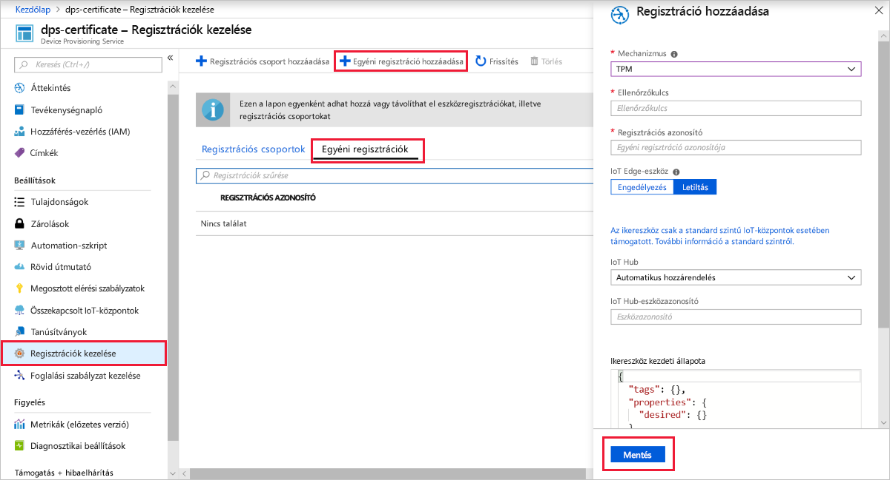

# <a name="quickstart-create-and-provision-a-simulated-tpm-device-using-java-device-sdk-for-azure-iot-hub-device-provisioning-service"></a>Rövid útmutató: Szimulált TPM-eszköz létrehozása és üzembe helyezésa Java-eszköz SDK-használatával az Azure IoT Hub-eszközkiépítési szolgáltatáshoz

[!INCLUDE [iot-dps-selector-quick-create-simulated-device-tpm](../../includes/iot-dps-selector-quick-create-simulated-device-tpm.md)]

Ebben a rövid útmutatóban egy szimulált IoT-eszközt hoz létre egy Windows-számítógépen. A szimulált eszköz hardverbiztonsági modulként (HSM) tartalmaz egy TPM-szimulátort. Az eszköz minta Java-kódot, hogy csatlakoztassa a szimulált eszköz az IoT hub segítségével egyéni regisztráció az eszköz kiépítési szolgáltatás (DPS).

## <a name="prerequisites"></a>Előfeltételek

- Az [automatikus kiépítés fogalmainak áttekintése](concepts-auto-provisioning.md).
- Az [IoT Hub-eszközkiépítési szolgáltatás beállítása az Azure Portalon.](./quick-setup-auto-provision.md)
- Egy aktív előfizetéssel rendelkező Azure-fiók. [Hozzon létre egyet ingyen.](https://azure.microsoft.com/free/?ref=microsoft.com&utm_source=microsoft.com&utm_medium=docs&utm_campaign=visualstudio)
- [Java SE Fejlesztői Készlet 8](https://aka.ms/azure-jdks).
- [Maven](https://maven.apache.org/install.html).
- [Git](https://git-scm.com/download/).

[!INCLUDE [IoT Device Provisioning Service basic](../../includes/iot-dps-basic.md)]

## <a name="prepare-the-environment"></a>A környezet előkészítése 

1. Győződjön meg arról, hogy a [Java SE Development Kit 8](https://aka.ms/azure-jdks) telepítve van a gépén.

1. Töltse le és telepítse a [Mavent](https://maven.apache.org/install.html).

1. Győződjön meg arról, hogy a(z) `git` telepítve van a gépen, és a parancsablakból elérhető környezeti változókhoz van adva. A [Software Freedom Conservancy's Git ügyfél eszközeiben](https://git-scm.com/download/) találja a telepíteni kívánt `git` eszközök legújabb verzióját, amely tartalmazza a **Git Bash** eszközt, azt a parancssori alkalmazást, amellyel kommunikálhat a helyi Git-adattárral. 

1. Nyisson meg egy parancssort. Klónozza a GitHub-tárházat az eszközszimuláció kódmintájának beszerzéséhez.
    
    ```cmd/sh
    git clone https://github.com/Azure/azure-iot-sdk-java.git --recursive
    ```

1. Futtassa a [TPM-szimulátort](https://docs.microsoft.com/windows/device-security/tpm/trusted-platform-module-overview) a szimulált eszköz [HSM-jének.](https://azure.microsoft.com/blog/azure-iot-supports-new-security-hardware-to-strengthen-iot-security/) Kattintson a **Hozzáférés engedélyezése** elemre a _Windows tűzfal_ beállításmódosításának engedélyezéséhez. A 2321-es és a 2322-es portokon lévő szoftvercsatornán keresztül figyel. Ne zárja be ezt az ablakot; meg kell tartani ezt a szimulátort, amíg a végén a rövid útmutató. 

    ```cmd/sh
    .\azure-iot-sdk-java\provisioning\provisioning-tools\tpm-simulator\Simulator.exe
    ```

    

1. Egy különálló parancssorban keresse meg a gyökérmappát, és építse fel a mintafüggőségeket.

    ```cmd/sh
    cd azure-iot-sdk-java
    mvn install -DskipTests=true
    ```

1. Lépjen a mintamappára.

    ```cmd/sh
    cd provisioning/provisioning-samples/provisioning-tpm-sample
    ```

1. Jelentkezzen be az Azure Portalon, válassza a bal oldali menü **Minden erőforrás** gombját, és nyissa meg az Eszközkiépítési szolgáltatást. Vegye figyelembe az _azonosító hatókörét_ és _a kiépítési szolgáltatás globális végpontját._

    

1. Szerkessze, `src/main/java/samples/com/microsoft/azure/sdk/iot/ProvisioningTpmSample.java` hogy tartalmazza az _azonosító hatókör_ és a _kiépítési szolgáltatás globális végpont,_ ahogy azt korábban említettük.  

    ```java
    private static final String idScope = "[Your ID scope here]";
    private static final String globalEndpoint = "[Your Provisioning Service Global Endpoint here]";
    private static final ProvisioningDeviceClientTransportProtocol PROVISIONING_DEVICE_CLIENT_TRANSPORT_PROTOCOL = ProvisioningDeviceClientTransportProtocol.HTTPS;
    ```
    Mentse a fájlt.

1. A következő parancsokkal hozhatja létre a projektet, navigálhat a célmappára, és végrehajthatja a létrehozott .jar fájlt. Cserélje `version` le a helyőrzőt a Java verziójára.

    ```cmd/sh
    mvn clean install
    cd target
    java -jar ./provisioning-tpm-sample-{version}-with-deps.jar
    ```

1. A program elkezd futni. Jegyezze fel a következő szakasz _ellenőrző kulcsát_ és _regisztrációs azonosítóját,_ és hagyja futni a programot.

    
    

## <a name="create-a-device-enrollment-entry"></a>Eszközregisztrációs bejegyzés létrehozása

Az Azure IoT Device Provisioning Service kétféle típusú regisztrációt támogat:

- [Regisztrációs csoportok](concepts-service.md#enrollment-group): Több kapcsolódó eszköz regisztrálásához.
- [Egyéni regisztrációk:](concepts-service.md#individual-enrollment)Egyetlen eszköz regisztrálására használható.

Ez a cikk bemutatja az egyes regisztrációk.

1. Jelentkezzen be az Azure Portalon, válassza a bal oldali menü **Minden erőforrás** gombját, és nyissa meg az Eszközkiépítési szolgáltatást.

1. Az Eszközkiépítési szolgáltatás menüben válassza **a Regisztrációk kezelése**lehetőséget. Válassza az **Egyéni regisztrációk** lapot, és felül válassza az **Egyéni beléptetés hozzáadása** gombot. 

1. A **Beiktatás hozzáadása** panelen adja meg a következő adatokat:
   - Válassza a **TPM** elemet az identitás igazolási *Mechanizmusaként*.
   - Adja meg a TPM-eszköz *regisztrációs azonosítóját* és *ellenőrzőkulcsát* a korábban megadott értékekből.
   - Válassza ki a kiépítési szolgáltatáshoz kapcsolódó egyik IoT hubot.
   - Ha kívánja, megadhatja az alábbi információkat is:
       - Adjon meg egy egyedi *eszközazonosítót*. Ne használjon bizalmas adatokat az eszköz elnevezésekor. Ha úgy dönt, hogy nem ad meg egyet, a regisztrációs azonosítót fogja használni az eszköz azonosítására.
       - Frissítse az **Eszköz kezdeti ikerállapotát** az eszköz kívánt kezdeti konfigurációjával.
   - Miután elkészült, nyomja meg a **Mentés** gombot. 

       

   Sikeres beléptetés esetén az eszköz *Regisztrációs azonosítója* megjelenik az *Egyéni regisztrációk* lapon lévő listában. 


## <a name="simulate-the-device"></a>Az eszköz szimulálása

1. A java mintakódot futtató parancsablakban nyomja le az *Enter* billentyűt az alkalmazás futtatásának folytatásához. Figyelje meg az eszköz rendszerindítását szimuláló és az eszközkiépítési szolgáltatáshoz az IoT Hub információk lekérése érdekében kapcsolódó üzeneteket.  

    

1. A szimulált eszköz sikeres kiépítése a létesítési szolgáltatáshoz kapcsolódó IoT hub, az eszköz azonosítója jelenik meg a hub **IoT-eszközök** panel.

     

    Ha módosította az *Eszköz kezdeti ikerállapota* alapértelmezett értékét az eszköz beléptetési bejegyzésében, az lekérheti és felhasználhatja a kívánt ikerállapotot a központból. További információ: [Eszközök ikerállapotának megismerése és használata az IoT hubon](../iot-hub/iot-hub-devguide-device-twins.md).


## <a name="clean-up-resources"></a>Az erőforrások eltávolítása

Ha azt tervezi, hogy folytatja a munkát, és vizsgálja meg az eszköz ügyfél minta, ne törölje az ebben a rövid útmutatóban létrehozott erőforrásokat. Ha nem tervezi a folytatást, az alábbi lépésekkel törölje az összes olyan erőforrást, amelyet ez a rövid útmutató hozott létre.

1. Zárja be az eszközügyfél minta kimeneti ablakát a gépen.
1. Zárja be a TPM szimulátor ablakát a gépen.
1. Az Azure Portal bal oldali menüjében válassza az **Összes erőforrás** t, majd válassza ki az Eszközkiépítési szolgáltatást. Nyissa meg a **szolgáltatás Regisztrációk kezelése** panelt, majd válassza az Egyéni **regisztrációk** lapot. *REGISTRATION ID* **Delete** 
1. Az Azure Portal bal oldali menüjében válassza az **Összes erőforrás** lehetőséget, majd válassza ki az IoT-központot. Nyissa meg az **IoT-eszközök** panelt a hubhoz, jelölje be a rövid útmutatóban regisztrált eszköz *eszközazonosítója* melletti jelölőnégyzetet, majd nyomja meg a **Törlés** gombot az ablaktábla tetején.

## <a name="next-steps"></a>További lépések

Ebben a rövid útmutatóban létrehozott egy TPM szimulált eszközt a gépen, és kiépítette azt az IoT Hub-eszközkiépítési szolgáltatás használatával az IoT Hub-eszközkiépítési szolgáltatás használatával. A TPM-eszköz programozott regisztrálásáról további információ a TPM-eszközök programozott regisztrációjának rövid útmutatójával. 

> [!div class="nextstepaction"]
> [Azure-gyorsindítás – TPM-eszköz regisztrálása az Azure IoT Hub-eszközkiépítési szolgáltatásra](quick-enroll-device-tpm-java.md)
