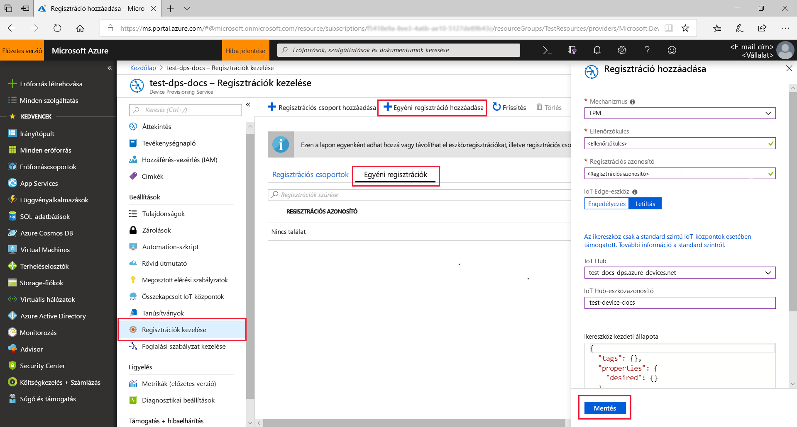
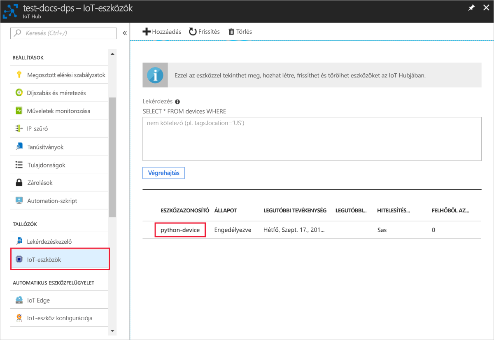

# <a name="quickstart-create-and-provision-a-simulated-tpm-device-using-python-device-sdk-for-iot-hub-device-provisioning-service"></a>Rövid útmutató: szimulált TPM-eszköz létrehozása és kiépítése a IoT Hub Device Provisioning Service Python Device SDK-val

[!INCLUDE [iot-dps-selector-quick-create-simulated-device-tpm](../../includes/iot-dps-selector-quick-create-simulated-device-tpm.md)]

Ebben a rövid útmutatóban egy szimulált IoT-eszközt hoz létre egy Windows rendszerű számítógépen. A szimulált eszköz hardveres biztonsági modulként (HSM) tartalmazza a TPM-szimulátort. A szimulált eszközt az IoT hub használatával a Device kiépítési szolgáltatással (DPS) való egyéni regisztrációval csatlakoztathatja az eszközhöz.

## <a name="prerequisites"></a>Előfeltételek

- Ismerje meg a [kiépítési](about-iot-dps.md#provisioning-process) fogalmakat.
- [A IoT hub Device Provisioning Service beállításának befejezése a Azure Portal](./quick-setup-auto-provision.md).
- Aktív előfizetéssel rendelkező Azure-fiók. [Hozzon létre egyet ingyen](https://azure.microsoft.com/free/?ref=microsoft.com&utm_source=microsoft.com&utm_medium=docs&utm_campaign=visualstudio).
- [Visual Studio 2015 +](https://visualstudio.microsoft.com/vs/) asztali fejlesztés C++ nyelven.
- A [CMAK-Build rendszere](https://cmake.org/download/).
- [Git](https://git-scm.com/download/).

> [!IMPORTANT]
> Ez a cikk csak az elavult v1 Python SDK-ra vonatkozik. Az IOT hub Device kiépítési szolgáltatáshoz tartozó eszközök és szolgáltatások ügyfelei még nem érhetők el a v2-ben. A csapat jelenleg nem működik, hogy a v2-et a szolgáltatás paritására hozza.

[!INCLUDE [IoT Device Provisioning Service basic](../../includes/iot-dps-basic.md)]

## <a name="prepare-the-environment"></a>A környezet előkészítése 

1. Győződjön meg arról, hogy telepítette a [Visual studio](https://visualstudio.microsoft.com/vs/) 2015-es vagy újabb verzióját, és a Visual Studio telepítéséhez engedélyezve van az "asztali fejlesztés C++-ban" számítási feladattal.

1. Töltse le és telepítse a [CMake buildelési rendszert](https://cmake.org/download/).

1. Győződjön meg arról, hogy a(z) `git` telepítve van a gépen, és a parancsablakból elérhető környezeti változókhoz van adva. A [Software Freedom Conservancy's Git ügyfél eszközeiben](https://git-scm.com/download/) találja a telepíteni kívánt `git` eszközök legújabb verzióját, amely tartalmazza a **Git Bash** eszközt, azt a parancssori alkalmazást, amellyel kommunikálhat a helyi Git-adattárral. 

1. Nyisson meg egy parancssort vagy a Git Basht. Klónozza a GitHub-adattárat az eszközszimuláció kódmintájához:
    
    ```cmd/sh
    git clone --single-branch --branch v1-deprecated https://github.com/Azure/azure-iot-sdk-python.git --recursive
    ```

1. Hozzon létre egy mappát a GitHub-adattár helyi másolatában a CMake buildelési folyamathoz. 

    ```cmd/sh
    cd azure-iot-sdk-python/c
    mkdir cmake
    cd cmake
    ```

1. A kódminta Windows TPM szimulátort használ. Futtassa az alábbi parancsot a SAS jogkivonat-hitelesítés engedélyezéséhez. Ez egy Visual Studio megoldást is létrehoz a szimulált eszközhöz.

    ```cmd/sh
    cmake -Duse_prov_client:BOOL=ON -Duse_tpm_simulator:BOOL=ON ..
    ```

1. Egy külön parancssorban navigáljon a TPM szimulátor mappájához, és futtassa a [TPM](/windows/device-security/tpm/trusted-platform-module-overview) szimulátort a szimulált eszköz [HSM](https://azure.microsoft.com/blog/azure-iot-supports-new-security-hardware-to-strengthen-iot-security/) -ként való futtatásához. Kattintson a **Hozzáférés engedélyezése** elemre. A 2321-es és a 2322-es portokon lévő szoftvercsatornán keresztül figyel. Ne zárjuk be a parancssorablakot; ezt a szimulátort a rövid útmutató végéig kell megtartania. 

    ```cmd/sh
    .\azure-iot-sdk-python\c\provisioning_client\deps\utpm\tools\tpm_simulator\Simulator.exe
    ```

    


## <a name="create-a-device-enrollment-entry"></a>Eszközregisztrációs bejegyzés létrehozása

Az Azure IoT Device Provisioning Service kétféle típusú regisztrációt támogat:

- [Regisztrációs csoportok](concepts-service.md#enrollment-group): Több kapcsolódó eszköz regisztrálásához.
- [Egyéni regisztrációk](concepts-service.md#individual-enrollment): egyetlen eszköz regisztrálására szolgál.

Ez a cikk az egyéni regisztrációkat mutatja be.

1. Nyissa meg a *cmake* mappában létrehozott `azure_iot_sdks.sln` nevű megoldást, és építse fel azt a Visual Studióban.

1. Kattintson a jobb gombbal a **tpm_device_provision** projektre, és válassza a **Set as Startup Project** (Beállítás kezdőprojektként) lehetőséget. Futtassa a megoldást. A kimeneti ablak megjeleníti az eszközök regisztrálásához szükséges **_hátirat kulcsot_** és **_regisztrációs azonosítót_** . Jegyezze fel ezeket az értékeket. 

    

1. Jelentkezzen be a Azure Portalba, majd a bal oldali menüben kattintson a **minden erőforrás** gombra, és nyissa meg az eszköz kiépítési szolgáltatását.

1. Az eszközök kiépítési szolgáltatásának menüjében válassza a **regisztrációk kezelése** lehetőséget. Válassza az **Egyéni regisztrációk** fület, és válassza az **Egyéni regisztráció hozzáadása** gombot a felső részen. 

1. A **beléptetés hozzáadása** panelen adja meg a következő adatokat:
   - Válassza a **TPM** elemet az identitás igazolási *Mechanizmusaként*.
   - Adja meg a TPM-eszköz *regisztrációs azonosítóját* és a *jóváhagyás kulcsát* a korábban feljegyzett értékek közül.
   - Válassza ki a kiépítési szolgáltatáshoz kapcsolódó egyik IoT hubot.
   - Ha kívánja, megadhatja az alábbi információkat is:
       - Adjon meg egy egyedi *azonosítót*. Ne használjon bizalmas adatokat az eszköz elnevezésekor. Ha úgy dönt, hogy nem ad meg egyet, a rendszer a regisztrációs azonosítót fogja használni az eszköz azonosítására.
       - Frissítse az **Eszköz kezdeti ikerállapotát** az eszköz kívánt kezdeti konfigurációjával.
   - Ha elkészült, kattintson a **Save (Mentés** ) gombra. 

       

   Sikeres beléptetés esetén az eszköz *Regisztrációs azonosítója* megjelenik az *Egyéni beléptetések* lapon lévő listában. 


## <a name="simulate-the-device"></a>Az eszköz szimulálása

1. Töltse le és telepítse a [Python 2.x-es vagy 3.x-es verzióját](https://www.python.org/downloads/). Mindenképp a rendszernek megfelelő, 32 vagy 64 bites telepítést használja. Amikor a rendszer erre kéri, mindenképp adja hozzá a Pythont a platformspecifikus környezeti változókhoz.
    - Ha Windows operációs rendszert használ, a [Visual C++ terjeszthető csomagra](https://support.microsoft.com/help/2977003/the-latest-supported-visual-c-downloads) van szükség a Python natív DLL-jei használatához.

1. A Python-csomagok létrehozásához kövesse [ezeket az utasításokat](https://github.com/Azure/azure-iot-sdk-python/blob/v1-deprecated/doc/python-devbox-setup.md).

   > [!NOTE]
   > A `build_client.cmd` futtatása esetén mindenképp használja a `--use-tpm-simulator` jelzőt.
   > 
   > [!NOTE]
   > A `pip` használata esetén mindenképp telepítse az `azure-iot-provisioning-device-client` csomagot is. Vegye figyelembe, hogy a kiadott PIP-csomagok az igazi TPM-et használják, nem a szimulátort. A szimulátor használatához a fordítást a `--use-tpm-simulator` jelzőt használva a forrásból kell elvégeznie.

1. Lépjen a mintákat tartalmazó mappára.

    ```cmd/sh
    cd azure-iot-sdk-python/provisioning_device_client/samples
    ```

1. A Python IDE használatával módosítsa a **provisioning\_device\_client\_sample.py** nevű Python-szkriptet. Módosítsa a *globális \_ prov \_ URI* és az  *ID \_ scope* változót a korábban feljegyzett értékekre. Arról is győződjön meg, hogy a *SECURITY\_DEVICE\_TYPE* változó `ProvisioningSecurityDeviceType.TPM` értékre van állítva.

    ```python
    GLOBAL_PROV_URI = "{globalServiceEndpoint}"
    ID_SCOPE = "{idScope}"
    SECURITY_DEVICE_TYPE = ProvisioningSecurityDeviceType.TPM
    PROTOCOL = ProvisioningTransportProvider.HTTP
    ```

    

1. Futtassa a mintát. 

    ```cmd/sh
    python provisioning_device_client_sample.py
    ```

1. Figyelje meg az eszköz rendszerindítását szimuláló és az eszközkiépítési szolgáltatáshoz az IoT Hub információk lekérése érdekében kapcsolódó üzeneteket. 

    

1. Ha sikeresen kiépíti a szimulált eszközt a kiépítési szolgáltatáshoz kapcsolódó IoT hub-ra, az eszköz azonosítója megjelenik a hub **IoT-eszközök** paneljén.

     

    Ha módosította az *Eszköz kezdeti ikerállapota* alapértelmezett értékét az eszköz beléptetési bejegyzésében, az lekérheti és felhasználhatja a kívánt ikerállapotot a központból. További információ: [az eszközök ikrek megismerése és használata IoT hub](../iot-hub/iot-hub-devguide-device-twins.md)


## <a name="clean-up-resources"></a>Az erőforrások eltávolítása

Ha azt tervezi, hogy folytatja a munkát, és megkeresi az eszköz ügyféloldali mintáját, ne törölje az ebben a rövid útmutatóban létrehozott erőforrásokat. Ha nem folytatja a műveletet, a következő lépésekkel törölheti az ebben a rövid útmutatóban létrehozott összes erőforrást.

1. Zárja be az eszközügyfél minta kimeneti ablakát a gépen.
1. Zárja be a TPM szimulátor ablakát a gépen.
1. A Azure Portal bal oldali menüjében válassza a **minden erőforrás** lehetőséget, majd válassza ki az eszköz kiépítési szolgáltatását. Nyissa meg a szolgáltatás **regisztrációk kezelése** paneljét, majd válassza az **Egyéni regisztrációk** lapot. Jelölje be az ebben a rövid útmutatóban regisztrált eszköz *regisztrációs azonosítójának* melletti jelölőnégyzetet, majd kattintson a panel tetején található **Törlés** gombra. 
1. A Azure Portal bal oldali menüjében válassza a **minden erőforrás** lehetőséget, majd válassza ki az IoT hubot. Nyissa meg a **IoT-eszközök** panelt, jelölje be az ebben a rövid útmutatóban regisztrált eszköz *azonosítója* melletti jelölőnégyzetet, majd kattintson a panel tetején található **Törlés** gombra.

## <a name="next-steps"></a>Következő lépések

Ebben a rövid útmutatóban létrehozott egy TPM-mel szimulált eszközt a gépen, és kiosztotta azt az IoT hubhoz a IoT Hub Device Provisioning Service használatával. A TPM-eszköz programozott módon történő regisztrálásának megismeréséhez folytassa a TPM-eszköz programozott beléptetését bemutató rövid útmutatóval. 

> [!div class="nextstepaction"]
> [Azure rövid útmutató – TPM-eszköz regisztrálása az Azure-ban IoT Hub Device Provisioning Service](quick-enroll-device-tpm-python.md)