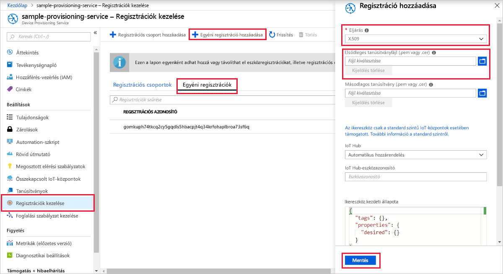
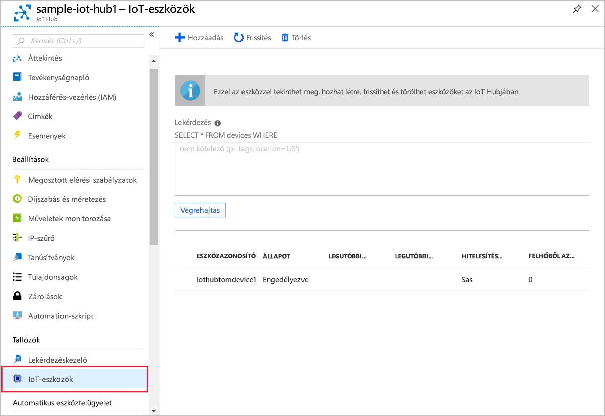

# <a name="quickstart-create-and-provision-an-x509-device-using-c-device-sdk-for-iot-hub-device-provisioning-service"></a>Rövid útmutató: X. 509 eszköz létrehozása és kiépítése a IoT Hub Device Provisioning Service C# eszközoldali SDK-val

[!INCLUDE [iot-dps-selector-quick-create-simulated-device-x509](../../includes/iot-dps-selector-quick-create-simulated-device-x509.md)]

Ezek a lépések bemutatják, hogyan használható az eszköz kódja a [C# Azure IoT-mintákkal](https://github.com/Azure-Samples/azure-iot-samples-csharp) egy X. 509 eszköz kiépítéséhez. Ebben a cikkben egy eszköz mintakód használatával fog futni a fejlesztői gépen, hogy az eszköz kiépítési szolgáltatásával kapcsolódjon IoT Hubhoz.

Ha nem ismeri az kiépítés folyamatát, tekintse át a [kiépítés](about-iot-dps.md#provisioning-process) áttekintését. Emellett a folytatás előtt végezze el az [IoT Hub eszközkiépítési szolgáltatás beállítása az Azure Portallal](./quick-setup-auto-provision.md) című cikk lépéseit. 

Az Azure IoT Device Provisioning Service kétféle típusú regisztrációt támogat:
- [Regisztrációs csoportok](concepts-service.md#enrollment-group): Több kapcsolódó eszköz regisztrálásához.
- [Egyéni regisztrációk](concepts-service.md#individual-enrollment): Egyetlen eszköz regisztrálásához.

Ez a cikk az egyéni regisztrációkat ismerteti.

[!INCLUDE [IoT Device Provisioning Service basic](../../includes/iot-dps-basic.md)]

<a id="setupdevbox"></a>
## <a name="prepare-the-development-environment"></a>A fejlesztési környezet előkészítése 

1. Győződjön meg arról, hogy a(z) `git` telepítve van a gépen, és a parancsablakból elérhető környezeti változókhoz van adva. A [Software Freedom Conservancy's Git ügyfél eszközeiben](https://git-scm.com/download/) találja a telepíteni kívánt `git` eszközök legújabb verzióját, amely tartalmazza a **Git Bash** eszközt, azt a parancssori alkalmazást, amellyel kommunikálhat a helyi Git-adattárral. 

1. Nyisson meg egy parancssort vagy a Git Basht. Az Azure IoT-minták klónozása a C# GitHub-tárházban:
    
    ```bash
    git clone https://github.com/Azure-Samples/azure-iot-samples-csharp.git
    ```

1. Győződjön meg arról, hogy a [.net Core 3.0.0 SDK vagy újabb verziója](https://www.microsoft.com/net/download/windows) telepítve van a gépen. A következő parancs használatával ellenőrizhető a verzió.

    ```bash
    dotnet --info
    ```


## <a name="create-a-self-signed-x509-device-certificate"></a>Önaláírt X.509-eszköztanúsítvány létrehozása

Ebben a szakaszban létrehoz egy önaláírt X. 509 teszt-tanúsítványt `iothubx509device1` a tulajdonos köznapi neve alapján. Fontos szem előtt tartani az alábbi szempontokat:

* Az önaláírt tanúsítványok csak tesztelési célokra alkalmasak, és nem javasolt őket éles környezetben alkalmazni.
* Az önaláírt tanúsítványok alapértelmezett lejárati ideje 1 év.
* A IoT eszköz azonosítója a tulajdonos köznapi neve lesz a tanúsítványon. Ügyeljen arra, hogy olyan tulajdonosi nevet használjon, amely megfelel az [eszköz azonosító sztring követelményeinek](../iot-hub/iot-hub-devguide-identity-registry.md#device-identity-properties).

A [X509Sample](https://github.com/Azure-Samples/azure-iot-samples-csharp/tree/master/provisioning/Samples/device/X509Sample) mintakód használatával hozza létre az eszköz egyéni beléptetési bejegyzéséhez használni kívánt tanúsítványt.


1. A PowerShell-parancssorban módosítsa a könyvtárakat az X. 509 eszköz kiépítési mintájának projekt könyvtárába.

    ```powershell
    cd .\azure-iot-samples-csharp\provisioning\Samples\device\X509Sample
    ```

2. A mintakód úgy lett beállítva, hogy egy jelszóval védett PKCS12 formázott fájlban (certificate.pfx) tárolt X.509-tanúsítványokat használja. Emellett egy nyilvános kulcsú tanúsítványfájl (Certificate. cer) szükséges ahhoz, hogy a rövid útmutatóban később egyéni regisztrációt hozzon létre. Az önaláírt tanúsítvány és a hozzá tartozó. cer és. pfx fájlok létrehozásához futtassa a következő parancsot:

    ```powershell
    PS D:\azure-iot-samples-csharp\provisioning\Samples\device\X509Sample> .\GenerateTestCertificate.ps1 iothubx509device1
    ```

3. A szkript kér egy PFX-jelszót. Jegyezze meg ezt a jelszót, később újra fel kell használni a minta futtatásakor. A futtatásával elvégezheti `certutil` a tanúsítvány kiírását, és ellenőrizheti a tulajdonos nevét.

    ```powershell
    PS D:\azure-iot-samples-csharp\provisioning\Samples\device\X509Sample> certutil .\certificate.pfx
    Enter PFX password:
    ================ Certificate 0 ================
    ================ Begin Nesting Level 1 ================
    Element 0:
    Serial Number: 7b4a0e2af6f40eae4d91b3b7ff05a4ce
    Issuer: CN=iothubx509device1, O=TEST, C=US
     NotBefore: 2/1/2021 6:18 PM
     NotAfter: 2/1/2022 6:28 PM
    Subject: CN=iothubx509device1, O=TEST, C=US
    Signature matches Public Key
    Root Certificate: Subject matches Issuer
    Cert Hash(sha1): e3eb7b7cc1e2b601486bf8a733887a54cdab8ed6
    ----------------  End Nesting Level 1  ----------------
      Provider = Microsoft Strong Cryptographic Provider
    Signature test passed
    CertUtil: -dump command completed successfully.    
    ```

 ## <a name="create-an-individual-enrollment-entry-for-the-device"></a>Egyéni beléptetési bejegyzés létrehozása az eszközhöz


1. Jelentkezzen be a Azure Portalba, majd a bal oldali menüben kattintson a **minden erőforrás** gombra, és nyissa meg a kiépítési szolgáltatást.

2. Az eszközök kiépítési szolgáltatásának menüjében válassza a **regisztrációk kezelése** lehetőséget. Válassza az **Egyéni regisztrációk** fület, és válassza az **Egyéni regisztráció hozzáadása** gombot a felső részen. 

3. A **beléptetés hozzáadása** panelen adja meg a következő adatokat:
   - Válassza az **X.509** elemet az identitás igazolási *Mechanizmusaként*.
   - Az *elsődleges tanúsítvány. PEM vagy. cer fájlban* válassza a *fájl kiválasztása* lehetőséget, majd válassza ki az előző lépésekben létrehozott tanúsítványfájl- **tanúsítványt. cer** fájlt.
   - Az **Eszközazonosító** mezőt hagyja üresen. Az eszköz kiépítésekor a rendszer az eszközazonosítót az X.509-tanúsítványban lévő **iothubx509device1** köznapi névre állítja be. Ez a köznapi név az egyéni beléptetési bejegyzés regisztrációs AZONOSÍTÓjának a neve is lesz. 
   - Ha kívánja, megadhatja az alábbi információkat is:
       - Válassza ki a kiépítési szolgáltatáshoz kapcsolódó egyik IoT hubot.
       - Frissítse az **Eszköz kezdeti ikerállapotát** az eszköz kívánt kezdeti konfigurációjával.
   - Ha elkészült, kattintson a **Save (Mentés** ) gombra. 

     [](./media/quick-create-simulated-device-x509-csharp/device-enrollment.png#lightbox)
    
   Sikeres regisztráció esetén az X.509 regisztrációs bejegyzés **iothubx509device1** azonosítóval jelenik meg a *Regisztrációs azonosító* oszlopban az *Egyéni regisztrációk* lapon. 


## <a name="provision-the-device"></a>Az eszköz kiépítése

1. A kiépítési szolgáltatás **Áttekintés** paneljén jegyezze fel az **_azonosító hatókör_** értékét.

     


2. Írja be az alábbi parancsot az X.509-eszköz kiépítési mintájának összeállításához és futtatásához. Az `<IDScope>` értéket cserélje le a kiépítési szolgáltatás Azonosító hatóköre értékére. 

    A tanúsítványfájl alapértelmezett értéke *./Certificate.pfx* , és a rendszer megkéri a. pfx jelszót.  

    ```powershell
    dotnet run -- -s <IDScope>
    ```

    Ha mindent paraméterként szeretne átadni, használhatja a következő példát.

    ```powershell
    dotnet run -- -s 0ne00000A0A -c certificate.pfx -p 1234
    ```


3. Az eszköz csatlakozik a DPS-hez, és hozzá lesz rendelve egy IoT Hubhoz. Az eszköz emellett egy telemetria üzenetet is küld a hubhoz.

    ```output
    Loading the certificate...
    Found certificate: 10952E59D13A3E388F88E534444484F52CD3D9E4 CN=iothubx509device1, O=TEST, C=US; PrivateKey: True
    Using certificate 10952E59D13A3E388F88E534444484F52CD3D9E4 CN=iothubx509device1, O=TEST, C=US
    Initializing the device provisioning client...
    Initialized for registration Id iothubx509device1.
    Registering with the device provisioning service...
    Registration status: Assigned.
    Device iothubx509device2 registered to sample-iot-hub1.azure-devices.net.
    Creating X509 authentication for IoT Hub...
    Testing the provisioned device with IoT Hub...
    Sending a telemetry message...
    Finished.
    ```

4. Ellenőrizze, hogy a rendszer kiépítette-e az eszközt. Ha sikeresen kiépíti az eszközt a kiépítési szolgáltatáshoz társított IoT hubhoz, az eszköz azonosítója megjelenik a hub **IoT-eszközök** paneljén. 

     

    Ha módosította az *Eszköz kezdeti ikerállapota* alapértelmezett értékét az eszköz beléptetési bejegyzésében, az lekérheti és felhasználhatja a kívánt ikerállapotot a központból. További információ: [az eszközök ikrek megismerése és használata IoT hub](../iot-hub/iot-hub-devguide-device-twins.md)


## <a name="clean-up-resources"></a>Az erőforrások eltávolítása

Ha azt tervezi, hogy folytatja a munkát, és megkeresi az eszköz ügyféloldali mintáját, ne törölje az ebben a rövid útmutatóban létrehozott erőforrásokat. Ha nem folytatja a műveletet, a következő lépésekkel törölheti az ebben a rövid útmutatóban létrehozott összes erőforrást.

1. Zárja be az eszközügyfél minta kimeneti ablakát a gépen.
1. Zárja be a TPM szimulátor ablakát a gépen.
1. A Azure Portal bal oldali menüjében válassza a **minden erőforrás** lehetőséget, majd válassza ki az eszköz kiépítési szolgáltatását. Az **Áttekintés** panel felső részén kattintson a **Törlés** gombra a ablaktábla tetején.  
1. A Azure Portal bal oldali menüjében válassza a **minden erőforrás** lehetőséget, majd válassza ki az IoT hubot. Az **Áttekintés** panel felső részén kattintson a **Törlés** gombra a ablaktábla tetején.  

## <a name="next-steps"></a>Következő lépések

Ebben a rövid útmutatóban egy X. 509 eszközt telepített az IoT hubhoz az Azure IoT Hub Device Provisioning Service használatával. Az X. 509 eszköz programozott módon történő regisztrálásának megismeréséhez folytassa az X. 509 eszközök programozott regisztrálására szolgáló rövid útmutatóval. 

> [!div class="nextstepaction"]
> [Azure rövid útmutató – X. 509 eszközök regisztrálása az Azure-ba IoT Hub Device Provisioning Service](quick-enroll-device-x509-csharp.md)
