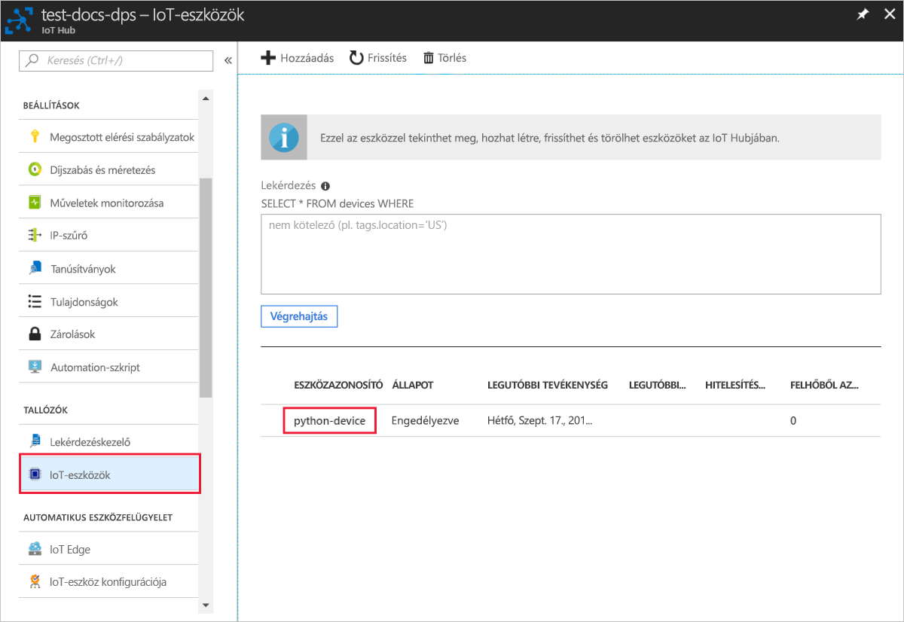

# <a name="quickstart-create-and-provision-a-simulated-x509-device-using-python-device-sdk-for-iot-hub-device-provisioning-service"></a>Rövid útmutató: szimulált X. 509 eszköz létrehozása és kiépítése a IoT Hub Device Provisioning Service Python Device SDK-val

[!INCLUDE [iot-dps-selector-quick-create-simulated-device-x509](../../includes/iot-dps-selector-quick-create-simulated-device-x509.md)]

Ebben a rövid útmutatóban egy fejlesztői gépet kell kiépíteni Python X. 509 eszközként. Az [Azure IoT PYTHON SDK](https://github.com/Azure/azure-iot-sdk-python) -ból származó minta-eszköz használatával csatlakoztathatja az eszközt az IoT hub-hoz. Ebben a példában a Device kiépítési szolgáltatás (DPS) egyéni regisztrációt használ.

## <a name="prerequisites"></a>Előfeltételek

- Ismerje meg a [kiépítési](about-iot-dps.md#provisioning-process) fogalmakat.
- [A IoT hub Device Provisioning Service beállításának befejezése a Azure Portal](./quick-setup-auto-provision.md).
- Aktív előfizetéssel rendelkező Azure-fiók. [Hozzon létre egyet ingyen](https://azure.microsoft.com/free/?ref=microsoft.com&utm_source=microsoft.com&utm_medium=docs&utm_campaign=visualstudio).
- [Python 3.5.3 vagy újabb](https://www.python.org/downloads/)
- [Git](https://git-scm.com/download/).


[!INCLUDE [IoT Device Provisioning Service basic](../../includes/iot-dps-basic.md)]

## <a name="prepare-the-environment"></a>A környezet előkészítése 

1. Győződjön meg arról, hogy a(z) `git` telepítve van a gépen, és a parancsablakból elérhető környezeti változókhoz van adva. A [Software Freedom Conservancy's Git ügyfél eszközeiben](https://git-scm.com/download/) találja a telepíteni kívánt `git` eszközök legújabb verzióját, amely tartalmazza a **Git Bash** eszközt, azt a parancssori alkalmazást, amellyel kommunikálhat a helyi Git-adattárral. 

2. Nyisson meg egy git bash-parancssort. Az [Azure IoT PYTHON SDK](https://github.com/Azure/azure-iot-sdk-python)-hoz készült GitHub-tárház klónozása.
    
    ```cmd/sh
    git clone https://github.com/Azure/azure-iot-sdk-python.git --recursive
    ```


## <a name="create-a-self-signed-x509-device-certificate"></a>Önaláírt X.509-eszköztanúsítvány létrehozása 

Ebben a szakaszban egy önaláírt X. 509 tanúsítványt fog létrehozni. Fontos szem előtt tartani az alábbi szempontokat:

* Az önaláírt tanúsítványok csak tesztelési célokra alkalmasak, és nem javasolt őket éles környezetben alkalmazni.
* Az önaláírt tanúsítványok alapértelmezett lejárati ideje 1 év.

Ha még nincs tanúsítványa az eszköz hitelesítéséhez, létrehozhat egy önaláírt tanúsítványt az OpenSSL használatával a jelen cikk teszteléséhez.  Az OpenSSL a git-telepítés része. 

1. Futtassa a következő parancsot a git bash-parancssorban.

    # <a name="windows"></a>[Windows](#tab/windows)
    
    ```bash
    winpty openssl req -outform PEM -x509 -sha256 -newkey rsa:4096 -keyout ./python-device.key.pem -out ./python-device.pem -days 365 -extensions usr_cert -subj "//CN=Python-device-01"
    ```

    > [!IMPORTANT]
    > A tulajdonos neve () számára megadott extra továbbítási perjel `//CN=Python-device-01` csak akkor szükséges, ha a karakterláncot a git használatával Windows platformokon szeretné elmenekülni. 

    # <a name="linux"></a>[Linux](#tab/linux)
    
    ```bash
    openssl req -outform PEM -x509 -sha256 -newkey rsa:4096 -keyout ./python-device.key.pem -out ./python-device.pem -days 365 -extensions usr_cert -subj "/CN=Python-device-01"
    ```
    
    ---
    
2. Amikor a rendszer kéri, hogy **adja meg a PEM pass kifejezést:**, használja a pass kifejezést a `1234` cikk teszteléséhez.    

3. Ha ismét megkérdezi a-t, **írja be a PEM pass kifejezést:**, használja újra a pass kifejezést `1234` .    

A rendszer létrehoz egy teszt tanúsítványfájl-fájlt (*Python-Device. PEM*) és egy titkos kulcsot tartalmazó fájlt (*Python-Device. key. PEM*) abban a könyvtárban, ahol a parancsot futtatta `openssl` .


## <a name="create-an-individual-enrollment-entry-in-dps"></a>Egyéni beléptetési bejegyzés létrehozása a DPS-ben


Az Azure IoT Device Provisioning Service kétféle típusú regisztrációt támogat:

- [Regisztrációs csoportok](concepts-service.md#enrollment-group): Több kapcsolódó eszköz regisztrálásához.
- [Egyéni regisztrációk](concepts-service.md#individual-enrollment): egyetlen eszköz regisztrálására szolgál.

Ez a cikk egy egyedi regisztrációt mutat be egyetlen eszközhöz az IoT hub használatával.

1. Jelentkezzen be a Azure Portalba, majd a bal oldali menüben kattintson a **minden erőforrás** gombra, és nyissa meg a kiépítési szolgáltatást.

2. Az eszközök kiépítési szolgáltatásának menüjében válassza a **regisztrációk kezelése** lehetőséget. Válassza az **Egyéni regisztrációk** fület, és válassza az **Egyéni regisztráció hozzáadása** gombot a felső részen. 

3. A **beléptetés hozzáadása** panelen adja meg a következő adatokat:
   - Válassza az **X.509** elemet az identitás igazolási *Mechanizmusaként*.
   - Az *elsődleges tanúsítvány. PEM vagy. cer fájlban* válassza a *fájl kiválasztása* elemet a **Python-Device. PEM** fájl kiválasztásához, ha a korábban létrehozott teszt-tanúsítványt használja.
   - Ha kívánja, megadhatja az alábbi információkat is:
     - Válassza ki a kiépítési szolgáltatáshoz kapcsolódó egyik IoT hubot.
     - Frissítse az **Eszköz kezdeti ikerállapotát** az eszköz kívánt kezdeti konfigurációjával.
   - Ha elkészült, kattintson a **Save (Mentés** ) gombra. 

     [](./media/python-quick-create-simulated-device-x509/device-enrollment.png#lightbox)

   Sikeres regisztráció esetén az X. 509 eszköze **Python-Device-01** néven jelenik meg a *regisztrációs azonosító* oszlopban az *Egyéni beléptetések* lapon. Ez a regisztrációs érték az eszköz tanúsítványának tulajdonos nevéből származik. 

## <a name="simulate-the-device"></a>Az eszköz szimulálása

A Python-kiépítési minta, a [provision_x509. a.](https://github.com/Azure/azure-iot-sdk-python/blob/master/azure-iot-device/samples/async-hub-scenarios/provision_x509.py) a mappában található. `azure-iot-sdk-python/azure-iot-device/samples/async-hub-scenarios` Ez a példa hat környezeti változót használ a IoT-eszközök DPS-vel történő hitelesítéséhez és kiépítéséhez. Ezek a környezeti változók a következők:

| Változó neve              | Description                                     |
| :------------------------- | :---------------------------------------------- |
| `PROVISIONING_HOST`        |  Ez az érték a DPS-erőforráshoz való csatlakozáshoz használt globális végpont. |    
| `PROVISIONING_IDSCOPE`     |  Ez az érték a DPS-erőforrás azonosító hatóköre |    
| `DPS_X509_REGISTRATION_ID` |  Ez az érték az eszköz azonosítója. Emellett meg kell egyeznie a tulajdonos nevével az eszköz tanúsítványán |    
| `X509_CERT_FILE`           |  Az eszköz tanúsítványának fájlneve |    
| `X509_KEY_FILE`            |  Az eszköz tanúsítványához tartozó titkos kulcs fájlneve |
| `PASS_PHRASE`              |  A tanúsítvány és a titkos kulcs fájljának () titkosításához használt pass kifejezés `1234` . |    

1. Az eszközök kiépítési szolgáltatásának menüjében válassza az **Áttekintés** lehetőséget. Jegyezze fel az _azonosító hatókörét_ és a _globális eszköz végpontját_.

    

2. A git bash-parancssorban az alábbi parancsokkal adja hozzá a környezeti változókat a globális eszköz végpontjának és AZONOSÍTÓjának hatóköréhez.

    ```bash
    $export PROVISIONING_HOST=global.azure-devices-provisioning.net
    $export PROVISIONING_IDSCOPE=<ID scope for your DPS resource>
    ```

3. A IoT-eszköz regisztrációs AZONOSÍTÓjának egyeznie kell a tulajdonos nevével az eszköz tanúsítványán. Ha önaláírt tesztelési tanúsítványt hozott létre, az az `Python-device-01` eszköz tulajdonosának neve és regisztrációs azonosítója. 

    Ha már van egy eszköz tanúsítványa, a `certutil` segítségével ellenőrizheti, hogy az eszközhöz milyen köznapi név van használatban az önaláírt tesztelési tanúsítványhoz az alábbi ábrán látható módon:

    ```bash
    $ certutil python-device.pem
    X509 Certificate:
    Version: 3
    Serial Number: fa33152fe1140dc8
    Signature Algorithm:
        Algorithm ObjectId: 1.2.840.113549.1.1.11 sha256RSA
        Algorithm Parameters:
        05 00
    Issuer:
        CN=Python-device-01
      Name Hash(sha1): 1dd88de40e9501fb64892b698afe12d027011000
      Name Hash(md5): a62c784820daa931b9d3977739b30d12
    
     NotBefore: 1/29/2021 7:05 PM
     NotAfter: 1/29/2022 7:05 PM
    
    Subject:
        ===> CN=Python-device-01 <===
      Name Hash(sha1): 1dd88de40e9501fb64892b698afe12d027011000
      Name Hash(md5): a62c784820daa931b9d3977739b30d12
    ```

    A git bash-parancssorban a következő módon állítsa be a regisztrációs azonosító környezeti változóját:

    ```bash
    $export DPS_X509_REGISTRATION_ID=Python-device-01
    ```

4. A git bash-parancssorban állítsa be a tanúsítványfájl, a titkos kulcs fájlja és a pass kifejezés környezeti változóit.

    ```bash
    $export X509_CERT_FILE=./python-device.pem
    $export X509_KEY_FILE=./python-device.key.pem
    $export PASS_PHRASE=1234
    ```

5. Ha a **Python 3,7** -es vagy újabb verzióját nem használja, tekintse át a kód [módosítását](https://github.com/Azure/azure-iot-sdk-python/tree/master/azure-iot-device/samples/async-hub-scenarios#advanced-iot-hub-scenario-samples-for-the-azure-iot-hub-device-sdk) a [provision_x509.](https://github.com/Azure/azure-iot-sdk-python/blob/master/azure-iot-device/samples/async-hub-scenarios/provision_x509.py) `asyncio.run(main())` 

6. Futtassa a mintát. A minta csatlakozni fog, kiépíti az eszközt egy hubhoz, és elküld néhány tesztüzenet a központba.

    ```bash
    $ winpty python azure-iot-sdk-python/azure-iot-device/samples/async-hub-scenarios/provision_x509.py
    RegistrationStage(RequestAndResponseOperation): Op will transition into polling after interval 2.  Setting timer.
    The complete registration result is
    Python-device-01
    TestHub12345.azure-devices.net
    initialAssignment
    null
    Will send telemetry from the provisioned device
    sending message #4
    sending message #7
    sending message #2
    sending message #8
    sending message #5
    sending message #9
    sending message #1
    sending message #6
    sending message #10
    sending message #3
    done sending message #4
    done sending message #7
    done sending message #2
    done sending message #8
    done sending message #5
    done sending message #9
    done sending message #1
    done sending message #6
    done sending message #10
    done sending message #3
    ```

7. A portálon navigáljon a kiépítési szolgáltatáshoz társított IoT hubhoz, és nyissa meg a bal oldali menü **Explorers (felfedezők** ) szakaszában található **IoT-eszközök** panelt. Ha sikeresen kiépíti a szimulált X.509-eszközt a hubon, az eszköz azonosítója megjelenik a **Device Explorer** panelen, a hozzá tartozó *ÁLLAPOT* pedig **engedélyezett** lesz. Előfordulhat, hogy a felső **frissítés** gombra kell kattintania, ha már megnyitotta a panelt a minta eszköz futtatása előtt. 

     

> [!NOTE]
> Ha módosította az *Eszköz kezdeti ikerállapota* alapértelmezett értékét az eszköz beléptetési bejegyzésében, az lekérheti és felhasználhatja a kívánt ikerállapotot a központból. További információ: [Eszközök ikerállapotának megismerése és használata az IoT hubon](../iot-hub/iot-hub-devguide-device-twins.md).
>

## <a name="clean-up-resources"></a>Az erőforrások eltávolítása

Ha azt tervezi, hogy folytatja a munkát, és megkeresi az eszköz ügyféloldali mintáját, ne törölje az ebben a rövid útmutatóban létrehozott erőforrásokat. Ha nem folytatja a műveletet, a következő lépésekkel törölheti az ebben a rövid útmutatóban létrehozott összes erőforrást.

1. Zárja be az eszközügyfél minta kimeneti ablakát a gépen.
2. A Azure Portal bal oldali menüjében válassza a **minden erőforrás** lehetőséget, majd válassza ki az eszköz kiépítési szolgáltatását. Nyissa meg a szolgáltatás **regisztrációk kezelése** paneljét, majd válassza az **Egyéni regisztrációk** lapot. Jelölje be az ebben a rövid útmutatóban regisztrált eszköz *regisztrációs azonosítójának* melletti jelölőnégyzetet, majd kattintson a panel tetején található **Törlés** gombra. 
3. A Azure Portal bal oldali menüjében válassza a **minden erőforrás** lehetőséget, majd válassza ki az IoT hubot. Nyissa meg a **IoT-eszközök** panelt, jelölje be az ebben a rövid útmutatóban regisztrált eszköz *azonosítója* melletti jelölőnégyzetet, majd kattintson a panel tetején található **Törlés** gombra.

## <a name="next-steps"></a>Következő lépések

Ebben a rövid útmutatóban létrehozott egy szimulált X. 509 eszközt a fejlesztői gépen, és kiépíti azt az IoT hubhoz a portálon elérhető Azure IoT Hub Device Provisioning Service használatával. Az X. 509 eszköz programozott módon történő regisztrálásának megismeréséhez folytassa az X. 509 eszközök programozott regisztrálására szolgáló rövid útmutatóval. 

> [!div class="nextstepaction"]
> [Azure rövid útmutató – X. 509 eszközök regisztrálása az Azure-ba IoT Hub Device Provisioning Service](quick-enroll-device-x509-python.md)
