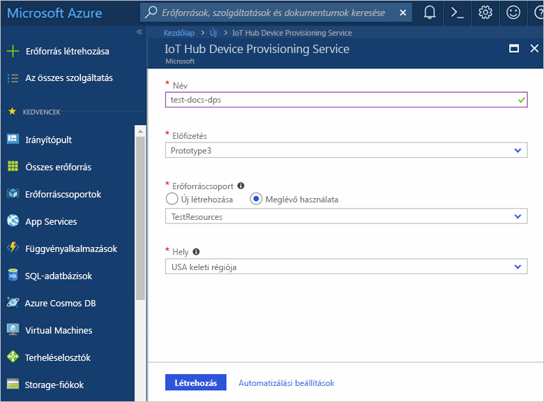

# Rövid útmutató: a IoT Hub Device Provisioning Service beállítása a Azure Portal

Ezek a lépések azt mutatják be, hogyan történik az Azure felhőbeli erőforrások üzembe helyezése a portálon az eszközkiépítéshez. A cikkben ismertetett lépésekkel a következők hajthatók végre: az IoT Hub és egy új IoT Hub Device Provisioning szolgáltatás létrehozása, valamint a két szolgáltatás összekapcsolása. 

Ha nem rendelkezik Azure-előfizetéssel, mindössze néhány perc alatt létrehozhat egy [ingyenes fiókot](https://azure.microsoft.com/free/?WT.mc_id=A261C142F) a virtuális gép létrehozásának megkezdése előtt.

## IoT Hub létrehozása

[!INCLUDE [iot-hub-include-create-hub](../../includes/iot-hub-include-create-hub.md)]

## Új példány létrehozása az IoT Hub eszközkiépítési szolgáltatáshoz

1. Kattintson ismét az **+ erőforrás létrehozása** gombra.

2. *Keresse meg a piactéren* az **eszköz kiépítési szolgáltatását**. Válassza a **IoT hub Device Provisioning Service** lehetőséget, és nyomja le a **Létrehozás** gombot. 

3. Adja meg az alábbi adatokat az új eszköz kiépítési szolgáltatásának példányához, és kattintson a **create (létrehozás**).

    * **Név:** Adjon egy egyedi nevet az új Device Provisioning Service-példánynak. Ha a megadott név elérhető, egy zöld pipa jelenik meg.
    * **Előfizetés:** Válassza ki a Device Provisioning Service-példány létrehozásához használni kívánt előfizetést.
    * **Erőforráscsoport:** A mezőben létrehozhat egy új erőforráscsoportot, vagy kiválaszthat egy meglévőt, amely az új példányt tartalmazza majd. Válassza ugyanazt az erőforráscsoportot, amely a fent létrehozott IoT Hubot tartalmazza, például: **TestResources**. Ha az összes kapcsolódó erőforrást egy csoportban helyezi el, akkor mindet együtt kezelheti. Az erőforráscsoport törlése például az adott csoportban található összes erőforrást is törli. További információ: [Azure Resource Manager erőforráscsoportok kezelése](../azure-resource-manager/manage-resource-groups-portal.md).
    * **Hely:** Válassza ki azt a helyet, amely az eszközökhöz legközelebb esik.

        

4. Válassza az értesítés gombot az erőforrás-példány létrehozásának figyeléséhez. A szolgáltatás sikeres üzembe helyezését követően válassza a **rögzítés az irányítópulton**lehetőséget, majd **nyissa meg az erőforrást**.

    

## Az IoT hub és az eszköz kiépítési szolgáltatásának összekapcsolása

Ebben a szakaszban egy konfigurációt ad hozzá az eszköz kiépítési szolgáltatásának példányához. A konfiguráció állítja be azt az IoT Hubot, amelyen az eszközök létesítése megtörténik.

1. Válassza a **minden erőforrás** gombot a Azure Portal bal oldali menüjében. Válassza ki az eszközkiépítési szolgáltatás előző szakaszban létrehozott példányát.  

2. Az eszköz kiépítési szolgáltatásának menüjében válassza a **csatolt IoT hubok**elemet. Nyomja meg a felül látható **+ Hozzáadás** gombot. 

3. A **Hivatkozás hozzáadása IoT-központhoz** lapon adja meg az alábbi adatokat az új Device Provisioning Service-példány egy IoT Hubhoz történő hozzákapcsolásához. Ezután nyomja meg a **Mentés gombot**. 

    * **Előfizetés:** Válassza ki az új Device Provisioning Service-példányhoz kapcsolni kívánt IoT Hubot tartalmazó előfizetést.
    * **IoT Hub:** Válassza ki az új Device Provisioning Service-példányhoz kapcsolni kívánt IoT Hubot.
    * **Hozzáférési szabályzat:** Válassza az **iothubowner** hitelesítő adatait az IoT Hubra mutató kapcsolat kiépítéséhez.  

        

3. Most látnia kell a kiválasztott hubot a **Csatolt IoT Hubok** panelen. Előfordulhat, hogy a **frissítését** kell megtalálnia a megjelenítéshez.

## Az erőforrások eltávolítása

Az ebben a gyűjteményben lévő többi rövid útmutató erre a rövid útmutatóra épül. Ha azt tervezi, hogy az ezt követő rövid útmutatókkal vagy az oktatóanyagokkal dolgozik tovább, akkor ne törölje az ebben a rövid útmutatóban létrehozott erőforrásokat. Ha nem folytatja a munkát, akkor a következő lépésekkel törölheti az Azure Portalon a rövid útmutatóhoz létrehozott összes erőforrást.

1. A Azure Portal bal oldali menüjében válassza a **minden erőforrás** lehetőséget, majd válassza ki az eszköz kiépítési szolgáltatását. Az eszköz részletes paneljének tetején válassza a **Törlés**lehetőséget.  
2. A Azure Portal bal oldali menüjében válassza a **minden erőforrás** lehetőséget, majd válassza ki az IoT hubot. A hub részletes paneljének tetején válassza a **Törlés**lehetőséget.  

## Következő lépések

Ebben a rövid útmutatóban üzembe helyezett egy IoT hubot és egy eszköz kiépítési szolgáltatási példányát, és összekapcsolta a két erőforrást. Ha szeretné megtudni, hogyan lehet szimulált eszközt kiépíteni a telepítővel, folytassa a szimulált eszköz létrehozására szolgáló rövid útmutatóval.

> [!div class="nextstepaction"]
> [Szimulált eszköz létrehozásának rövid útmutatója](./quick-create-simulated-device.md)
