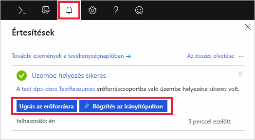

# Quickstart: Set up the IoT Hub Device Provisioning Service with the Azure portal

Ezek a lépések azt mutatják be, hogyan történik az Azure felhőbeli erőforrások üzembe helyezése a portálon az eszközkiépítéshez. A cikkben ismertetett lépésekkel a következők hajthatók végre: az IoT Hub és egy új IoT Hub Device Provisioning szolgáltatás létrehozása, valamint a két szolgáltatás összekapcsolása. 

Ha nem rendelkezik Azure-előfizetéssel, mindössze néhány perc alatt létrehozhat egy [ingyenes fiókot](https://azure.microsoft.com/free/?WT.mc_id=A261C142F) a virtuális gép létrehozásának megkezdése előtt.

## IoT Hub létrehozása

[!INCLUDE [iot-hub-include-create-hub](../../includes/iot-hub-include-create-hub.md)]

## Új példány létrehozása az IoT Hub eszközkiépítési szolgáltatáshoz

1. Select the **+ Create a resource** button again.

2. *Search the Marketplace* for the **Device Provisioning Service**. Select **IoT Hub Device Provisioning Service** and hit the **Create** button. 

3. Provide the following information for your new Device Provisioning Service instance and hit **Create**.

    * **Név:** Adjon egy egyedi nevet az új Device Provisioning Service-példánynak. Ha a megadott név elérhető, egy zöld pipa jelenik meg.
    * **Előfizetés:** Válassza ki a Device Provisioning Service-példány létrehozásához használni kívánt előfizetést.
    * **Erőforráscsoport:** A mezőben létrehozhat egy új erőforráscsoportot, vagy kiválaszthat egy meglévőt, amely az új példányt tartalmazza majd. Válassza ugyanazt az erőforráscsoportot, amely a fent létrehozott IoT Hubot tartalmazza, például: **TestResources**. Ha az összes kapcsolódó erőforrást egy csoportban helyezi el, akkor mindet együtt kezelheti. Az erőforráscsoport törlése például az adott csoportban található összes erőforrást is törli. For more information, see [Manage Azure Resource Manager resource groups](../azure-resource-manager/manage-resource-groups-portal.md).
    * **Hely:** Válassza ki azt a helyet, amely az eszközökhöz legközelebb esik.

        

4. Select the notification button to monitor the creation of the resource instance. Once the service is successfully deployed, select **Pin to dashboard**, and then **Go to resource**.

    

## Link the IoT hub and your Device Provisioning Service

In this section, you will add a configuration to the Device Provisioning Service instance. A konfiguráció állítja be azt az IoT Hubot, amelyen az eszközök létesítése megtörténik.

1. Select the **All resources** button from the left-hand menu of the Azure portal. Válassza ki az eszközkiépítési szolgáltatás előző szakaszban létrehozott példányát.  

2. From the Device Provisioning Service's menu, select **Linked IoT hubs**. Hit the **+ Add** button seen at the top. 

3. A **Hivatkozás hozzáadása IoT-központhoz** lapon adja meg az alábbi adatokat az új Device Provisioning Service-példány egy IoT Hubhoz történő hozzákapcsolásához. Then hit **Save**. 

    * **Előfizetés:** Válassza ki az új Device Provisioning Service-példányhoz kapcsolni kívánt IoT Hubot tartalmazó előfizetést.
    * **IoT Hub:** Válassza ki az új Device Provisioning Service-példányhoz kapcsolni kívánt IoT Hubot.
    * **Hozzáférési szabályzat:** Válassza az **iothubowner** hitelesítő adatait az IoT Hubra mutató kapcsolat kiépítéséhez.  

        

3. Most látnia kell a kiválasztott hubot a **Csatolt IoT Hubok** panelen. You might need to hit **Refresh** for it to show up.

## Az erőforrások eltávolítása

Az ebben a gyűjteményben lévő többi rövid útmutató erre a rövid útmutatóra épül. Ha azt tervezi, hogy az ezt követő rövid útmutatókkal vagy az oktatóanyagokkal dolgozik tovább, akkor ne törölje az ebben a rövid útmutatóban létrehozott erőforrásokat. Ha nem folytatja a munkát, akkor a következő lépésekkel törölheti az Azure Portalon a rövid útmutatóhoz létrehozott összes erőforrást.

1. From the left-hand menu in the Azure portal, select **All resources** and then select your Device Provisioning Service. At the top of the device detail pane, select **Delete**.  
2. From the left-hand menu in the Azure portal, select **All resources** and then select your IoT hub. At the top of the hub detail pane, select **Delete**.  

## Következő lépések

In this quickstart, you’ve deployed an IoT hub and a Device Provisioning Service instance, and linked the two resources. To learn how to use this setup to provision a simulated device, continue to the quickstart for creating a simulated device.

> [!div class="nextstepaction"]
> [Quickstart to create a simulated device](./quick-create-simulated-device.md)
