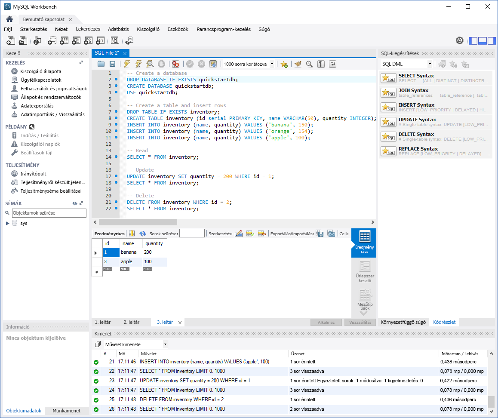

# <a name="azure-database-for-mariadb-use-mysql-workbench-to-connect-and-query-data"></a>Azure Database for MariaDB: Csatlakozás és adatlekérdezés a MySQL Workbench használatával

Ez a rövid útmutató azt szemlélteti, hogyan lehet a MySQL Workbench használatával csatlakozni egy Azure Database for MariaDB-példányhoz. 

## <a name="prerequisites"></a>Előfeltételek

Ez a rövid útmutató az alábbi útmutatók valamelyikében létrehozott erőforrásokat használja kiindulópontként:

- [Azure-adatbázis létrehozása MariaDB-kiszolgálóhoz az Azure Portal használatával](./quickstart-create-mariadb-server-database-using-azure-portal.md)
- [Azure Database for MariaDB-kiszolgáló létrehozása az Azure CLI használatával](./quickstart-create-mariadb-server-database-using-azure-cli.md)

## <a name="install-mysql-workbench"></a>A MySQL Workbench telepítése

[Töltse le a MySQL Workbenchet](https://dev.mysql.com/downloads/workbench/), és telepítse a számítógépén.

## <a name="get-connection-information"></a>Kapcsolatadatok lekérése

Kérje le az Azure Database for MariaDB-hez való csatlakozáshoz szükséges kapcsolatadatokat. Szüksége lesz a teljes kiszolgálónévre és a bejelentkezési hitelesítő adatokra.

1. Jelentkezzen be az [Azure Portalra.](https://portal.azure.com/)

2. Az Azure Portal bal oldali menüjében válassza a **Minden erőforrás** elemet. Keressen rá a létrehozott kiszolgálóra (például **mydemoserver**).

3. Válassza ki a kiszolgálónevet.

4. A kiszolgáló **Áttekintés** lapján jegyezze fel a **kiszolgálónevet** és a **kiszolgáló-rendszergazdai bejelentkezési nevet**. Ha elfelejtette a jelszavát, ezen az oldalon új jelszót is kérhet.

   

## <a name="connect-to-the-server-by-using-mysql-workbench"></a>Csatlakozás a kiszolgálóhoz a MySQL Workbench használatával

Csatlakozás az Azure Database for MariaDB-kiszolgálóhoz a MySQL Workbench használatával:

1. Nyissa meg a MySQL Workbenchet a számítógépen. 

2. Az **új kapcsolat létrehozására szolgáló** párbeszédpanelen adja meg a következő információkat a **Parameters** (Paraméterek) lapon:

   | Beállítás | Ajánlott érték | Mező leírása |
   |---|---|---|
   |   Kapcsolat neve | **Demó kapcsolat** | Adjon meg egy címkét a kapcsolathoz. |
   | Kapcsolati módszer | **Standard (TCP/IP)** | A Standard (TCP/IP) elégséges. |
   | Gazdanév | *kiszolgáló neve* | Adja meg az Azure Database for MariaDB-példány létrehozásakor használt kiszolgálónév értékét. A példakiszolgáló a **mydemoserver.mariadb.database.azure.com**. Használja a teljes tartománynevet (\*.mariadb.database.azure.com), ahogyan az a példában látható. Ha nem emlékszik a kiszolgáló nevére, az előző szakasz lépéseit követve lekérheti a kapcsolati adatokat.  |
   | Port | **3306** | Az Azure Database for MariaDB-hez való csatlakozáskor mindig a 3306-os portot használja. |
   | Felhasználónév |  *kiszolgáló rendszergazdai bejelentkezési neve* | Adja meg az Azure Database for MariaDB-példány létrehozásakor használt kiszolgáló-rendszergazdai bejelentkezési felhasználónevet. A példa felhasználónév **myadmin\@mydemoserver**. Ha nem emlékszik a kiszolgáló-rendszergazdai bejelentkezési névre, az előző szakasz lépéseit követve lekérheti a kapcsolati adatokat. A formátum *\@felhasználónév servername*.
   | Jelszó | *a jelszó* | A jelszó mentéséhez kattintson a **Store in Vault** (Tárolás a tárolóban) gombra. |

   

3. Válassza a **Test Connection** (Kapcsolat tesztelése) lehetőséget annak teszteléséhez, hogy minden paraméter helyesen lett-e konfigurálva. 

4. A kapcsolat mentéséhez kattintson az **OK** gombra. 

5. A **MySQL Connections** (MySQL-kapcsolatok) alatt kattintson a kiszolgáló csempéjére. Várjon, amíg a kapcsolat létrejön.

   Megnyílik egy új SQL lap egy üres szerkesztővel, ahol beírhatja a lekérdezéseket.
    
   > [!NOTE]
   > Az Azure Database for MariaDB-kiszolgálón alapértelmezés szerint kötelezően SSL-kapcsolatbiztonságra van szükség. Bár általában nincs szükség az SSL-tanúsítványok további konfigurációjára ahhoz, hogy a MySQL Workbench csatlakozzon a kiszolgálóhoz, ajánlott az SSL-hitelesítésszolgáltatói tanúsítványt a MySQL Workbenchhez kötni. Az SSL letiltásához válassza a **Kapcsolatbiztonság** lehetőséget a kiszolgáló áttekintési oldalán lévő menüből az Azure Portalon. Az **SSL-kapcsolat kikényszerítésénél** válassza a **Letiltva** lehetőséget.

## <a name="create-table-and-insert-read-update-and-delete-data"></a>Táblázat létrehozása, adatok beszúrása, olvasása, frissítése és törlése

1. Másolja és illessze be a következő SQL-mintakódot egy üres SQL-lapra néhány mintaadat bemutatása érdekében.

    Ez a kód létrehoz egy **quickstartdb** nevű üres adatbázist. Ezután létrehoz egy **inventory** nevű mintatáblázatot. A kód beszúr néhány sort, majd beolvassa a sorokat. Egy update utasítással módosítja az adatokat, és ismét beolvassa a sorokat. Végül a kód töröl egy sort, majd ismét beolvassa a sorokat.
    
    ```sql
    -- Create a database
    -- DROP DATABASE IF EXISTS quickstartdb;
    CREATE DATABASE quickstartdb;
    USE quickstartdb;
    
    -- Create a table and insert rows
    DROP TABLE IF EXISTS inventory;
    CREATE TABLE inventory (id serial PRIMARY KEY, name VARCHAR(50), quantity INTEGER);
    INSERT INTO inventory (name, quantity) VALUES ('banana', 150);
    INSERT INTO inventory (name, quantity) VALUES ('orange', 154);
    INSERT INTO inventory (name, quantity) VALUES ('apple', 100);
    
    -- Read
    SELECT * FROM inventory;
    
    -- Update
    UPDATE inventory SET quantity = 200 WHERE id = 1;
    SELECT * FROM inventory;
    
    -- Delete
    DELETE FROM inventory WHERE id = 2;
    SELECT * FROM inventory;
    ```

    A képernyőkép az SQL-példakódot és a futtatás utáni kimenetet mutatja a MySQL Workbenchben:
    
    

2. Az SQL-mintakód futtatásához kattintson az **SQL-fájl** lapon lévő eszköztár villám ikonjára.
3. Figyelje meg az oldal közepén, a **Result Grid** (Eredménytáblázat) szakaszban lévő három többlapos eredményt. 
4. Figyelje meg az oldal alján lévő **Output** (Kimenet) listát. Láthatja az egyes parancsok állapotát. 

Ebben a rövid útmutatóban a MySQL Workbench használatával csatlakozott az Azure Database for MariaDB-kiszolgálóhoz, és SQL nyelven lekérdezte az adatokat.

<!--
## Next steps
> [!div class="nextstepaction"]
> [Migrate your database using Export and Import](./concepts-migrate-import-export.md)
-->
