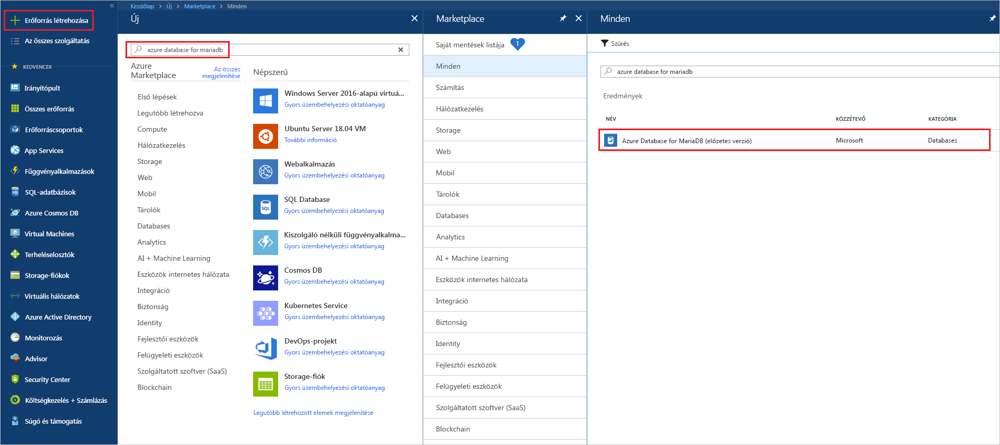
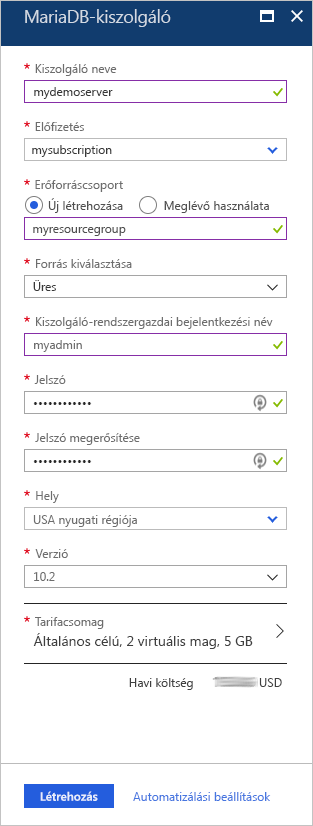
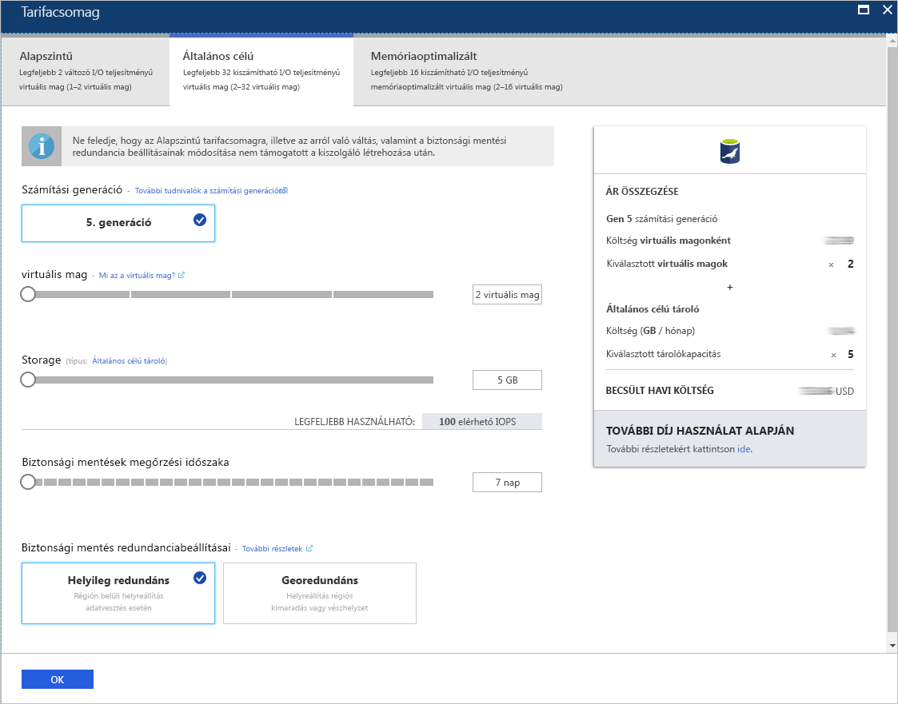

# <a name="quickstart-create-an-azure-database-for-mariadb-server-by-using-the-azure-portal"></a>Gyors útmutató: Azure Database for MariaDB-kiszolgáló létrehozása a Azure Portal használatával

Az Azure Database for MariaDB egy felügyelt szolgáltatás, amellyel a magas rendelkezésre állású MariaDB-adatbázisokat futtathatja, kezelheti és skálázhatja a felhőben. Ez a rövid útmutató bemutatja, hogyan hozhat létre nagyjából öt perc alatt egy Azure Database for MariaDB-kiszolgálót az Azure Portalon.  

Ha nem rendelkezik Azure-előfizetéssel, mindössze néhány perc alatt létrehozhat egy [ingyenes Azure-fiókot](https://azure.microsoft.com/free/) a virtuális gép létrehozásának megkezdése előtt.

## <a name="sign-in-to-the-azure-portal"></a>Jelentkezzen be az Azure Portalra

Nyissa meg a böngészőjében az [Azure Portalt](https://portal.azure.com/). Adja meg a hitelesítő adatait a Portalra való bejelentkezéshez. Az alapértelmezett nézet a szolgáltatási irányítópult.

## <a name="create-an-azure-database-for-mariadb-server"></a>Azure Database for MariaDB-kiszolgáló létrehozása

Az Azure Database for MariaDB-kiszolgálót [számítási és tárolási erőforrások](concepts-pricing-tiers.md) egy meghatározott készletével együtt fogja létrehozni. A kiszolgálót egy [Azure-erőforráscsoporton](../azure-resource-manager/management/overview.md) belül hozza létre.

Azure Database for MariaDB-kiszolgáló létrehozása:

1. A portál bal felső sarkában válassza az **Erőforrás létrehozása** (+) gombot.

2. Válassza az **adatbázisok**  >  **Azure Database for MariaDB** elemet. A **MariaDB** a keresőmezőbe is beírhatja a szolgáltatás megtalálásához.

   

3. Adja meg vagy válassza ki a következő kiszolgálóadatokat:

   

    Beállítás | Ajánlott érték | Leírás
    ---|---|---
    Kiszolgálónév | *egyedi kiszolgálónév* | Válasszon egy egyedi nevet, amely azonosítja az Azure Database for MariaDB-kiszolgálót. Például: **mydemoserver**. A rendszer hozzáfűzi a *.mariadb.database.azure.com* tartománynevet a megadott kiszolgálónévhez. A kiszolgálónév csak kisbetűket, számokat és a kötőjel (-) karaktert tartalmazhatja. A jelszó 3–63 karakterből állhat.
    Előfizetés | *Az Ön előfizetése* | Válassza ki a kiszolgálóhoz használni kívánt Azure-előfizetést. Ha több előfizetéssel is rendelkezik, válassza ki azt az előfizetést, amelynek a keretében az erőforrásért fizet.
    Erőforráscsoport | **myresourcegroup** | Adjon meg egy új erőforráscsoport-nevet, vagy válasszon egy meglévő erőforráscsoportot. 
    Forrás kiválasztása | **Üres** | Válassza az **Üres** lehetőséget egy teljesen új kiszolgáló létrehozásához. (Ha egy meglévő Azure Database for MariaDB-kiszolgáló georedundáns biztonsági mentéséből hoz létre kiszolgálót, válassza a **Biztonsági mentés** lehetőséget).
    Kiszolgáló-rendszergazdai bejelentkezés | **myadmin** | A kiszolgálóhoz való csatlakozáshoz használni kívánt bejelentkezési fiók. A rendszergazdai bejelentkezési név nem lehet **azure_superuser**, **admin**, **administrator**, **root**, **guest** vagy **public**.
    Jelszó | *tetszés szerinti* | Adjon meg a kiszolgálói rendszergazdai fiókhoz egy új jelszót. A jelszó 8–128 karakterből állhat. A jelszónak tartalmaznia kell karaktereket a következő kategóriák közül legalább háromból: angol nagybetűs karakterek, angol kisbetűs karakterek, számjegyek (0–9) és nem alfanumerikus karakterek (!, $, #, % stb.).
    Jelszó megerősítése | *tetszés szerinti*| Erősítse meg a rendszergazdafiók jelszavát.
    Hely | *a felhasználókhoz legközelebb eső régió*| Válassza ki a felhasználókhoz vagy a többi Azure-alkalmazásához legközelebb eső helyet.
    Verzió | *a legújabb verzió*| A legújabb verzió (ha nincsenek olyan egyedi igényei, amelyek miatt egy másikat kell kiválasztania).
    Tarifacsomag | Lásd a leírást. | Az új kiszolgáló számítási, tárolási és biztonsági mentési konfigurációi. Válassza ki az **árképzési szintet**  >  **általános célú**. A következő beállításoknál használja az alapértelmezett értékeket:<br><ul><li>**Számítási generáció** (Gen 5)</li><li>**virtuális mag** (4 virtuális mag)</li><li>**Tárterület** (100 GB)</li><li>**Biztonsági másolatok megőrzési időszaka** (7 nap)</li></ul><br>A kiszolgáló georedundáns tárhelyre való biztonsági mentésének engedélyezéséhez válassza a **Georedundáns** lehetőséget a **Biztonsági másolat redundanciabeállításai** területen. <br><br>A tarifacsomag beállításának mentéséhez válassza az **OK** gombot. A következő képernyőkép ezeket a beállításokat tartalmazza.
  
   > [!NOTE]
   > Érdemes lehet az alapszintű díjszabást használni, ha a számítási feladathoz elegendő a könnyű számítás és az I/O. Vegye figyelembe, hogy az alapszintű díjszabásban létrehozott kiszolgálók később nem méretezhetők át általános célú vagy a memóriára optimalizált értékre. További információért tekintse meg a [díjszabási oldalt](https://azure.microsoft.com/pricing/details/mariadb/) .

   

4. Válassza a **felülvizsgálat + létrehozás** lehetőséget a kiszolgáló kiépítéséhez. Az üzembe helyezés akár 20 percet is igénybe vehet.

5. Az eszköztáron válassza az **Értesítések** elemet (a harang ikont) az üzembehelyezési folyamat nyomon követéséhez.

Alapértelmezés szerint a következő adatbázisok jönnek létre a kiszolgáló alatt: **information_schema**, **mysql**, **performance_schema** és **sys**.

## <a name="configure-a-server-level-firewall-rule"></a><a name="configure-firewall-rule"></a>Kiszolgálószintű tűzfalszabály konfigurálása

Azure Database for MariaDB szolgáltatáshoz készült Azure-adatbázis a kiszolgáló szintjén hoz létre tűzfalat. Ez a tűzfal megakadályozza, hogy külső alkalmazások és eszközök csatlakozzanak a kiszolgálóhoz vagy a kiszolgálón lévő adatbázisokhoz, kivéve, ha olyan tűzfalszabályt hoz létre, amely adott IP-címek számára megnyitja a tűzfalat. 

Kiszolgálószintű tűzfalszabály létrehozása:

1. Az üzembe helyezés végeztével keresse meg a kiszolgálót. Ha szükséges, használja a keresési funkciót. Válassza ki például a bal oldali menüben a **Minden erőforrás** elemet. Ezután adja meg a kiszolgáló nevét. Írja be például a **mydemoserver** nevet az újonnan létrehozott kiszolgáló megkereséséhez. Válassza ki a keresési eredmények listájában a kiszolgálónevet. Megnyílik a kiszolgáló **áttekintési** oldala. Ezen az oldalon további beállításokat is megadhat.

2. A kiszolgáló áttekintőlapján válassza a **Kapcsolatbiztonság** elemet.

3. A **Tűzfalszabályok** szakaszban válassza ki az üres szövegmezőt a **Szabály neve** oszlopban egy új tűzfalszabály létrehozásának a megkezdéséhez. Adja meg a kiszolgálóhoz csatlakozni kívánó ügyfelek pontos IP-címtartományát.

   

4. A **Kapcsolatbiztonság** lap felső eszköztárában kattintson a **Mentés** gombra. A folytatás előtt várjon, amíg meg nem jelenik a frissítés sikeres befejezését jelző értesítés.

   > [!NOTE]
   > Az Azure Database for MariaDB kapcsolatai a 3306-os porton keresztül kommunikálnak. Ha vállalati hálózaton belülről próbál csatlakozni, elképzelhető, hogy nem engedélyezett a kimenő forgalom a 3306-os porton keresztül. Ebben az esetben a kiszolgálóhoz való csatlakozáshoz az informatikai részlegnek meg kell nyitnia a 3306-os portot.

## <a name="get-connection-information"></a>Kapcsolatadatok lekérése

Az adatbázis-kiszolgálóhoz való csatlakozáshoz szüksége van a teljes kiszolgálónévre és a rendszergazdai bejelentkezési hitelesítő adatokra. Előfordulhat, hogy ezeket az értékeket a cikk egy korábbi pontján már feljegyezte. Ha nem jegyezte fel, a kiszolgáló nevét és bejelentkezési adatait megtalálja a kiszolgáló **Áttekintés** vagy **Tulajdonságok** lapján az Azure Portalon:

1. Nyissa meg a kiszolgáló **Áttekintés** lapját. Jegyezze fel a **kiszolgálónevet** és a **kiszolgáló-rendszergazdai bejelentkezési nevet**.

2. Az értékek másolásához vigye az egérmutatót a másolni kívánt mező fölé. Ekkor a szövegtől jobbra megjelenik a másolási ikon. Az értékek másolásához kattintson a másolási ikonra.

A példánkban a kiszolgáló neve **mydemoserver.MariaDB.database.Azure.com** , a kiszolgáló-rendszergazdai bejelentkezési név pedig az **myadmin \@ mydemoserver**.

## <a name="connect-to-azure-database-for-mariadb-by-using-the-mysql-command-line"></a>Csatlakozás az Azure Database for MariaDB-hez a mysql parancssorral

Számos különféle alkalmazással csatlakozhat az Azure Database for MariaDB-kiszolgálóhoz.

Először a [mysql](https://dev.mysql.com/doc/refman/5.7/en/mysql.html) parancssori eszközt fogjuk használni a kiszolgálóhoz való csatlakozás bemutatásához. Egy böngészőt és az Azure Cloud Shellt is használhatja, nem lesz szükség külön szoftver telepítésére. Ha helyileg telepítve van a mysql segédprogram, onnan is csatlakozhat.

1. Indítsa el az Azure Cloud Shellt az Azure Portal jobb felső eszköztárában található terminálikonnal (**>_**).
   

2. Az Azure Cloud Shell megnyílik a böngészőben. A Cloud Shellben bash felületi parancsokat használhat.

   

3. A Cloud Shell parancssorában csatlakozzon az Azure Database for MariaDB-kiszolgálóhoz. Ehhez írja be a mysql parancssort.

    A következő formátumú szintaxissal kapcsolódhat a mysql segédprogrammal egy Azure Database for MariaDB-kiszolgálóhoz:

    ```cmd
    mysql --host <fully qualified server name> --user <server admin login name>@<server name> -p
    ```

    Például a következő paranccsal a példakiszolgálónkhoz csatlakozhat:

    ```cmd
    mysql --host mydemoserver.mariadb.database.azure.com --user myadmin@mydemoserver -p
    ```

    mysql-paraméter |Ajánlott érték|Leírás
    ---|---|---
    --host | *kiszolgáló neve* | Az a kiszolgálónév, amelyet korábban az Azure Database for MariaDB-kiszolgáló létrehozásakor használt. A példakiszolgáló a **mydemoserver.mariadb.database.azure.com**. Használja a teljes tartománynevet (**\* . MariaDB.database.Azure.com**) a példában látható módon. Ha nem emlékszik a kiszolgáló nevére, az előző szakasz lépéseit követve lekérheti a kapcsolati adatokat.
    --user | *kiszolgáló-rendszergazdai bejelentkezési név* |Az a kiszolgáló-rendszergazdai bejelentkezési felhasználónév, amelyet korábban az Azure Database for MariaDB-kiszolgáló létrehozásakor használt. Ha nem emlékszik a felhasználó nevére, a kapcsolati adatok lekéréséhez kövesse az előző szakasz lépéseit. A formátum a *username \@ servername*.
    -p | *a jelszó*<br>(várja meg, amíg a rendszer felszólítja a megadására) |Amikor a rendszer kéri, adja meg a kiszolgáló létrehozásához használt jelszót. A beírt jelszókarakterek nem jelennek meg a Bash parancssorban, amikor beírja őket. A jelszó megadása után nyomja le az Enter billentyűt.

   Miután a mysql segédprogram csatlakozott, megjelenít egy `mysql>` parancssort. A parancsokat ebbe a parancssorba írhatja.

   Egy példa a mysql-kimenetre:

    ```output
    Welcome to the MySQL monitor.  Commands end with ; or \g.
    Your MySQL connection id is 65505
    Server version: 5.6.39.0 MariaDB Server
    
    Copyright (c) 2000, 2017, Oracle and/or its affiliates. All rights reserved.
    
    Oracle is a registered trademark of Oracle Corporation and/or its
    affiliates. Other names may be trademarks of their respective
    owners.

    Type 'help;' or '\h' for help. Type '\c' to clear the current input statement.
    
    mysql>
    ```
    
    > [!TIP]
    > Ha a tűzfal nincs konfigurálva az Azure Cloud Shell IP-címének engedélyezésére, a következő hiba jelenik meg:
    >
    >   HIBA 2003 (28000): A következő IP-címmel rendelkező ügyfél nem rendelkezik hozzáféréssel a kiszolgálóhoz: 123.456.789.0
    >
    > A hiba elhárításához győződjön meg arról, hogy a kiszolgáló konfigurációja megegyezik a cikk [kiszolgálószintű tűzfalszabály konfigurálásával](#configure-firewall-rule) foglalkozó részében található lépésekkel.

4. A kapcsolat ellenőrzéséhez adja meg a **status** kifejezést a `mysql>` parancssorban a kiszolgáló állapotának ellenőrzéséhez.

    ```sql
    status
    ```

   > [!TIP]
   > További parancsokról a [MySQL 5.7 referencia-kézikönyvének 4.5.1 fejezetében](https://dev.mysql.com/doc/refman/5.7/en/mysql.html) tájékozódhat.

5. Hozzon létre egy üres adatbázist úgy, hogy beírja a következő parancsot a `mysql>` parancssorba:

   ```sql
   CREATE DATABASE quickstartdb;
   ```
   A parancs teljesítése néhány percet vehet igénybe. 

   Az Azure Database for MariaDB-kiszolgálón egy vagy több adatbázist is létrehozhat. Dönthet úgy, hogy az erőforrások teljes kihasználása érdekében kiszolgálónként egy adatbázist hoz létre, de azt is megteheti, hogy több adatbázis létrehozásával megosztja az erőforrásokat. A létrehozható adatbázisok száma nincs korlátozva, de több adatbázis fog osztozni ugyanazokon a kiszolgáló-erőforrásokon. 

6. Az adatbázisok listázásához a `mysql>` parancssorba írja be a következő parancsot:

    ```sql
    SHOW DATABASES;
    ```

7. Írja be a **\q** kifejezést, majd nyomja le az ENTER billentyűt a mysql segédprogram bezárásához. Ezután bezárhatja az Azure Cloud Shellt.

Ezzel csatlakozott az Azure Database for MariaDB-kiszolgálóhoz, és létrehozott egy üres felhasználói adatbázist. A következő szakaszban ugyanahhoz a kiszolgálóhoz fog csatlakozni egy másik ismert eszköz, a MySQL Workbench segítségével.

## <a name="connect-to-the-server-by-using-mysql-workbench"></a>Csatlakozás a kiszolgálóhoz a MySQL Workbench használatával

Ahhoz, hogy csatlakozzon a kiszolgálóhoz a MySQL Workbench használatával:

1. Indítsa el a MySQL Workbench eszközt az ügyfélszámítógépen. A MySQL Workbench eszközt [a MySQL Workbench letöltési](https://dev.mysql.com/downloads/workbench/) oldaláról töltheti le és telepítheti.

2. Új kapcsolat létrehozásához válassza a **+** **MySQL-kapcsolatok** fejléc melletti plusz ikont ().

3. A **Setup New Connection** (Új kapcsolat beállítása) párbeszédpanelen adja meg a kiszolgáló kapcsolatadatait a **Parameters** (Paraméterek) lapon. A helyőrző értékek példaként szerepelnek. A **Hostname** (Gazdagépnév), **Username** (Felhasználónév) és **Password** (Jelszó) értékei helyére írja a saját értékeit.

   

    |Beállítás |Ajánlott érték|Mező leírása|
    |---|---|---|
     Kapcsolat neve | **Bemutató-kapcsolatok** | A kapcsolat címkéje. |
    Kapcsolati módszer | **Standard (TCP/IP)** | A Standard (TCP/IP) elégséges. |
    Hostname (Gazdanév) | *kiszolgáló neve* | Az a kiszolgálónév, amelyet korábban az Azure Database for MariaDB-kiszolgáló létrehozásakor használt. A példakiszolgáló a **mydemoserver.mariadb.database.azure.com**. Használja a teljes tartománynevet (**\* . MariaDB.database.Azure.com**) a példában látható módon. Ha nem emlékszik a kiszolgáló nevére, a kapcsolati adatok lekéréséhez kövesse a cikk korábbi szakaszában ismertetett lépéseket.|
     Port | 3306 | Az Azure Database for MariaDB-kiszolgálóhoz való csatlakozáskor használandó port. |
    Felhasználónév |  *kiszolgáló-rendszergazdai bejelentkezési név* | Azok a kiszolgáló-rendszergazdai bejelentkezési adatok, amelyeket korábban az Azure Database for MariaDB-kiszolgáló létrehozásakor használt. A példában szereplő Felhasználónév a **myadmin \@ mydemoserver**. Ha nem emlékszik a felhasználónevére, a kapcsolati adatok lekéréséhez kövesse a cikk korábbi szakaszában ismertetett lépéseket. A formátum a *username \@ servername*.
    Jelszó | *a jelszó* | A jelszó mentéséhez kattintson a **Store in Vault** (Tárolás a tárolóban) gombra. |

4. Válassza a **Test Connection** (Kapcsolat tesztelése) lehetőséget annak teszteléséhez, hogy minden paraméter helyesen lett-e konfigurálva. Ezután a kapcsolat mentéséhez kattintson az **OK** gombra. 

    > [!NOTE]
    > Alapértelmezés szerint a kiszolgáló mindenképpen SSL-t használ, ami a sikeres kapcsolódáshoz további konfigurációt igényel. További információ: [Az SSL-kapcsolatok konfigurálása az alkalmazásban az Azure Database for MariaDB-hez való biztonságos kapcsolódásra](./howto-configure-ssl.md). Ha le szeretné tiltani az SSL használatát a rövid útmutató műveleteihez, az Azure Portal kiszolgálót áttekintő lapján válassza ki a **Kapcsolatbiztonság** elemet a menüben. Az **SSL-kapcsolat kikényszerítésénél** válassza a **Letiltva** lehetőséget.

## <a name="clean-up-resources"></a>Az erőforrások eltávolítása

Kétféleképpen távolíthatja el a rövid útmutatóban létrehozott erőforrásokat. Törölheti a teljes [Azure-erőforráscsoportot](../azure-resource-manager/management/overview.md). Ez a beállítás az erőforráscsoport összes erőforrását törli. Ha a többi erőforrást érintetlenül szeretné hagyni, csak egy kiszolgálói erőforrást töröljön.

> [!TIP]
> A gyűjteményhez tartozó többi rövid útmutató erre a rövid útmutatóra épül. Ha azt tervezi, hogy folytatja az Azure Database for MariaDB-t ismertető rövid útmutatók használatát, akkor ne törölje az itt létrehozott erőforrásokat. Ha nem folytatja a munkát, akkor a következő lépésekkel törölheti a rövid útmutató során létrehozott összes erőforrást.

Ha az újonnan létrehozott kiszolgálót is magában foglaló teljes erőforráscsoportot törölni szeretné:

1. Keresse meg az erőforráscsoportot az Azure Portalon. A bal oldali menüben válassza az **Erőforráscsoportok** elemet, majd válassza ki az erőforráscsoport nevét (ami a példánkban a **myresourcegroup**).

2. Az erőforráscsoport oldalán kattintson a **Törlés** parancsra. Ezután adja meg az erőforráscsoport nevét (a mi példánkban ez **myresourcegroup**) a törlés megerősítéséhez. Válassza a **Törlés** elemet.

Csak az újonnan létrehozott kiszolgáló törlése:

1. Keresse meg a kiszolgálóját az Azure Portalon, ha még nincs megnyitva. A bal oldali menüben válassza ki a **Minden erőforrás** elemet. Ezután keressen rá az Ön által létrehozott kiszolgálóra.

2. Az **Áttekintés** oldalon válassza a **Törlés** elemet.

   

3. Erősítse meg a törölni kívánt kiszolgáló nevét. Jelenítse meg alatta a törlés által érintett összes adatbázist. Írja be a kiszolgáló nevét (a példánkban: **mydemoserver**) a törlés megerősítéséhez. Válassza a **Törlés** elemet.

## <a name="next-steps"></a>Következő lépések

- [Az első Azure Database for MariaDB-adatbázis megtervezése](./tutorial-design-database-using-portal.md)
