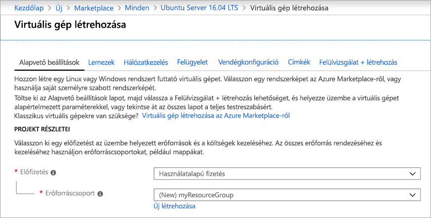

# <a name="quickstart-create-a-linux-virtual-machine-in-the-azure-portal"></a>Rövid útmutató: Linux rendszerű virtuális gép létrehozása az Azure Portalon

Az Azure-beli virtuális gépek (VM-ek) létrehozhatók az Azure Portal segítségével. Az Azure Portal egy böngészőalapú felhasználói felület az Azure-erőforrások létrehozásához. Ez a rövid útmutató bemutatja, hogyan használhatja az Azure Portalon ubuntu 18.04 LTS-t futtató Linux virtuális gép (VM) üzembe helyezéséhez. A virtuális gép működésének megtekintéséhez hozzon létre SSH-kapcsolatot a virtuális géppel, és telepítse az NGINX-webkiszolgálót.

Ha nem rendelkezik Azure-előfizetéssel, hozzon létre egy [ingyenes fiókot,](https://azure.microsoft.com/free/?WT.mc_id=A261C142F) mielőtt elkezdené.

## <a name="create-ssh-key-pair"></a>SSH-kulcspár létrehozása

A rövid útmutató elvégzéséhez egy SSH-kulcspárra lesz szüksége. Ha már rendelkezésére áll egy SSH-kulcspár, kihagyhatja ezt a lépést.

SSH-kulcspár létrehozásához nyissa meg a Bash-felületet, és használja az [ssh-keygen](https://www.ssh.com/ssh/keygen/) eszközt. Ha nincs Bash-felület a helyi számítógépén, használhatja az [Azure Cloud Shellt](https://shell.azure.com/bash) is.


1. Jelentkezzen be az [Azure Portalra](https://portal.azure.com).
1. A lap tetején található menüben válassza `>_` az ikont a Cloud Shell megnyitásához.
1. Győződjön meg róla, hogy a CloudShell azt **mondja, bash** a bal felső sarokban. Ha azt mondja, PowerShell, a legördülő menüben válassza a **Bash,** és válassza **a Megerősítés a** Bash shell módosítása.
1. Írja `ssh-keygen -t rsa -b 2048` be az ssh kulcs létrehozásához. 
1. A program kéri, hogy adjon meg egy fájlt, amelyben menteni szeretné a kulcspárt. Csak nyomja le az **Enter** billentyűt az alapértelmezett helyen való mentéshez, zárójelben. 
1. A rendszer megkéri, hogy adjon meg egy jelszót. Beírhatja az SSH billentyű höz a jelszót, vagy az **Enter** billentyű lenyomásával folytathatja a folytatást jelszó nélkül.
1. A `ssh-keygen` parancs nyilvános és személyes kulcsokat `id_rsa` hoz `~/.ssh directory`létre a alapértelmezett nevével a ban. A parancs visszaadja a nyilvános kulcs teljes útvonalát. A nyilvános kulcs elérési útját használva `cat` a `cat ~/.ssh/id_rsa.pub`tartalom megjelenítéséhez írja be a parancsot.
1. Másolja a parancs kimenetét, és mentse el valahova a cikk későbbi részében használhatóhelyre. Ez a nyilvános kulcs, és szüksége lesz rá, amikor a rendszergazdai fiók konfigurálása a virtuális gépre való bejelentkezéshez.

## <a name="sign-in-to-azure"></a>Bejelentkezés az Azure-ba

Jelentkezzen be az [Azure Portalra,](https://portal.azure.com) ha még nem tette meg.

## <a name="create-virtual-machine"></a>Virtuális gép létrehozása

1. Írja be a **virtuális gépeket** a keresésbe.
1. A **Szolgáltatások csoportban**válassza a **Virtuális gépek**lehetőséget.
1. A **Virtuális gépek** lapon válassza a **Hozzáadás**lehetőséget. Megnyílik **a Virtuálisgép létrehozása** lap.
1. Az **Alapok** fül **Projektadatok** részén győződjön meg arról, hogy a megfelelő előfizetés van kiválasztva, és válassza az **Új létrehozása** lehetőséget az Erőforráscsoport részen. Írja be a *myResourceGroup* nevet.*. 

    

1. A **Példány részletei**mezőbe írja be a *myVM* parancsot a **virtuális gép nevéhez,** válassza az USA *keleti régióját* a **régióhoz,** és válassza az *Ubuntu 18.04 LTS parancsot* a **lemezképhez.** Hagyja meg a többi alapértelmezett értéket.

    

1. A **Rendszergazdafiók**csoportban válassza az **SSH nyilvános kulcsot,** írja be a felhasználónevét, majd illessze be a nyilvános kulcsot. Távolítsa el a kezdő vagy záró szóközöket a nyilvános kulcsból.

    

1. A **Bejövő portszabályok** > **Csoportban A bejövő portok nyilvános legördülő területén**válassza a Kijelölt **portok engedélyezése lehetőséget,** majd válassza az **SSH (22)** és a **HTTP (80)** elemet a legördülő menüből. 

    

1. Hagyja meg a többi alapértelmezett beállítást, és kattintson a **Felülvizsgálat + létrehozás** gombra a lap alján.

1. A **Virtuális gép létrehozása** lapon láthatja a létrehozandó virtuális gép részleteit. Ha készen áll, kattintson a **Létrehozás** gombra.

A virtuális gép üzembe helyezése eltarthat néhány percig. Az üzembe helyezés végeztével lépjen tovább a következő szakaszra.

    
## <a name="connect-to-virtual-machine"></a>Csatlakozás virtuális géphez

Hozzon léte egy SSH-kapcsolatot a virtuális géppel.

1. A virtuális gép áttekintő oldalán kattintson a **Csatlakozás** gombra. 

    

2. A **Csatlakozás a virtuális géphez** oldalon tartsa meg az alapértelmezett beállításokat az IP-címmel való csatlakozáshoz a 22-es porton keresztül. A **Bejelentkezés a virtuális gép helyi fiókjával** területen egy csatlakozási parancs jelenik meg. A parancs másolásához válassza a gombot. Az SSH-kapcsolat parancsa az alábbi példához hasonlóan néz ki:

    ```bash
    ssh azureuser@10.111.12.123
    ```

3. Ugyanazzal a bash shell használatával, amelyet az SSH kulcspár létrehozásához használt (újra megnyithatja a Cloud Shell-t, ha újra kiválasztja `>_` vagy megnyitja), `https://shell.azure.com/bash`illessze be az SSH-kapcsolat parancsot a rendszerhéjba egy SSH munkamenet létrehozásához.

## <a name="install-web-server"></a>A webkiszolgáló telepítése

A virtuális gép működésének ellenőrzéséhez telepítse az NGINX-webkiszolgálót. Frissítse a csomag forrásait, majd telepítse a legújabb NGINX-csomagot az SSH-munkamenetből.

```bash
sudo apt-get -y update
sudo apt-get -y install nginx
```

Ha elkészült, az SSH-munkamenetből való kilépéshez írja be: `exit`.


## <a name="view-the-web-server-in-action"></a>A webkiszolgáló működésének ellenőrzése

Egy tetszőleges webböngészővel tekintse meg az alapértelmezett NGINX-kezdőlapot. Írja be a virtuális gép nyilvános IP-címét webcímként. A nyilvános IP-cím a virtuális gép áttekintő oldalán található, vagy a korábban használt SSH-kapcsolati sztring részeként.


## <a name="clean-up-resources"></a>Az erőforrások eltávolítása

Ha már nincs rájuk szükség, törölheti az erőforráscsoportot, a virtuális gépet és az összes kapcsolódó erőforrást. Ehhez válassza ki a virtuális gép erőforráscsoportját, kattintson a **Törlés** elemre, majd erősítse meg a törölni kívánt erőforráscsoport nevét.

## <a name="next-steps"></a>További lépések

Ebben a rövid útmutatóban üzembe helyezett egy egyszerű virtuális gépet, létrehozott egy hálózati biztonsági csoportot és szabályt, valamint telepített egy alapszintű webkiszolgálót. Ha bővebb információra van szüksége az Azure-beli virtuális gépekkel kapcsolatban, lépjen tovább a Linux rendszerű virtuális gépekről szóló oktatóanyagra.

> [!div class="nextstepaction"]
> [Azure-beli Linux rendszerű virtuális gépek – oktatóanyag](./tutorial-manage-vm.md)
