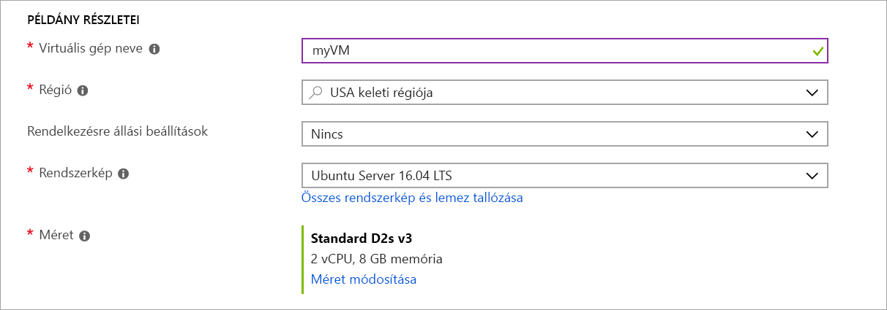
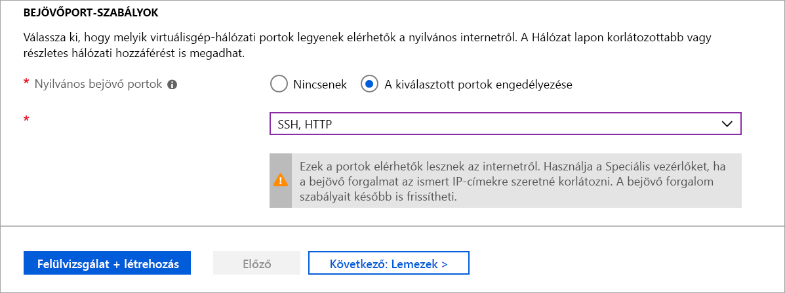

# <a name="quickstart-create-a-linux-virtual-machine-in-the-azure-portal"></a>Rövid útmutató: Linux rendszerű virtuális gép létrehozása az Azure Portalon

Az Azure-beli virtuális gépek (VM-ek) létrehozhatók az Azure Portal segítségével. Az Azure Portal egy böngészőalapú felhasználói felület az Azure-erőforrások létrehozásához. Ez a rövid útmutató azt ismerteti, hogyan használható a Azure Portal az Ubuntu 18,04 LTS-t futtató linuxos virtuális gép (VM) üzembe helyezéséhez. A virtuális gép működésének megtekintéséhez hozzon létre SSH-kapcsolatot a virtuális géppel, és telepítse az NGINX-webkiszolgálót.

Ha még nincs Azure-előfizetése, kezdés előtt hozzon létre egy [ingyenes fiókot](https://azure.microsoft.com/free/?WT.mc_id=A261C142F).

## <a name="sign-in-to-azure"></a>Bejelentkezés az Azure-ba

Ha még nem tette meg, jelentkezzen be a [Azure Portalba](https://portal.azure.com) .

## <a name="create-virtual-machine"></a>Virtuális gép létrehozása

1. Írja be a **virtuális gépeket** a keresésbe.
1. A **szolgáltatások** területen válassza a **virtuális gépek** lehetőséget.
1. A **virtuális gépek** lapon válassza a **Hozzáadás** lehetőséget. Megnyílik a **virtuális gép létrehozása** lap.
1. Az **Alapok** fül **Projektadatok** részén győződjön meg arról, hogy a megfelelő előfizetés van kiválasztva, és válassza az **Új létrehozása** lehetőséget az Erőforráscsoport részen. A név mezőbe írja be a következőt: *myResourceGroup* . *. 

    

1. A **példány részletei** területen írja  be a myVM **nevet a virtuális gép neveként**, válassza az *USA keleti* **régiója** lehetőséget, és válassza az *Ubuntu 18,04 LTS* lehetőséget a **rendszerképhez**. Hagyja meg a többi alapértelmezett értéket.

    

1. A **rendszergazdai fiók** területen válassza az **SSH nyilvános kulcs** lehetőséget.

1. A **Felhasználónév** mezőbe írja be a következőt: *azureuser*.

1. Az **SSH nyilvános kulcs forrása** beállításnál hagyja meg az alapértelmezett **új kulcspár létrehozását**, majd írja be a *myKey* **nevet a kulcspár neveként**.

    

1. A **bejövő port szabályai**  >  **nyilvános bejövő portok** területen válassza a **kiválasztott portok engedélyezése** lehetőséget, majd válassza az **SSH (22)** és a **http (80)** lehetőséget a legördülő menüből. 

    

1. Hagyja meg a többi alapértelmezett beállítást, és kattintson a **Felülvizsgálat + létrehozás** gombra a lap alján.

1. A **Virtuális gép létrehozása** lapon láthatja a létrehozandó virtuális gép részleteit. Ha készen áll, kattintson a **Létrehozás** gombra.

1. Amikor megnyílik az **új kulcspár létrehozása** ablak, válassza a **titkos kulcs letöltése és az erőforrás létrehozása** lehetőséget. A kulcsfájl a **myKey. PEM** fájlként lesz letöltve. Győződjön meg arról, hogy tudja `.pem` , hol töltötte le a fájlt, a következő lépésben szüksége lesz rá az elérési útra.

1. Ha a telepítés befejeződött, válassza az **Ugrás az erőforráshoz** lehetőséget.

1. Az új virtuális gép lapján válassza ki a nyilvános IP-címet, és másolja a vágólapra.


    

## <a name="connect-to-virtual-machine"></a>Csatlakozás virtuális géphez

Hozzon léte egy SSH-kapcsolatot a virtuális géppel.

1. Mac vagy Linux rendszerű gépen nyisson meg egy bash-parancssort. Ha Windows rendszerű gépen van, nyisson meg egy PowerShell-parancssort. 

1. A parancssorban nyisson meg egy SSH-kapcsolódást a virtuális géphez. Cserélje le az IP-címet a virtuális gépről az egyikre, és cserélje le az elérési utat arra a helyére, `.pem` ahová a kulcsfájl le lett töltve.

```console
ssh -i .\Downloads\myKey1.pem azureuser@10.111.12.123
```

> [!TIP]
> A létrehozott SSH-kulcs az Azure-beli virtuális gép következő létrehozásakor használható. Ha legközelebb létrehoz egy virtuális gépet, válassza az Azure-ban az **SSH nyilvános kulcs forrásaként** **tárolt kulcs használata** lehetőséget. Már rendelkezik a titkos kulccsal a számítógépen, így nem kell semmit letöltenie.

## <a name="install-web-server"></a>A webkiszolgáló telepítése

A virtuális gép működésének ellenőrzéséhez telepítse az NGINX-webkiszolgálót. Frissítse a csomag forrásait, majd telepítse a legújabb NGINX-csomagot az SSH-munkamenetből.

```bash
sudo apt-get -y update
sudo apt-get -y install nginx
```

Ha elkészült, az SSH-munkamenetből való kilépéshez írja be: `exit`.


## <a name="view-the-web-server-in-action"></a>A webkiszolgáló működésének ellenőrzése

Egy tetszőleges webböngészővel tekintse meg az alapértelmezett NGINX-kezdőlapot. Adja meg a virtuális gép nyilvános IP-címét a webes címként. A nyilvános IP-cím a virtuális gép áttekintő oldalán található, vagy a korábban használt SSH-kapcsolati sztring részeként.


## <a name="clean-up-resources"></a>Az erőforrások eltávolítása

Ha már nincs rájuk szükség, törölheti az erőforráscsoportot, a virtuális gépet és az összes kapcsolódó erőforrást. Ehhez válassza ki a virtuális gép erőforráscsoportját, kattintson a **Törlés** elemre, majd erősítse meg a törölni kívánt erőforráscsoport nevét.

## <a name="next-steps"></a>Következő lépések

Ebben a rövid útmutatóban üzembe helyezett egy egyszerű virtuális gépet, létrehozott egy hálózati biztonsági csoportot és szabályt, valamint telepített egy alapszintű webkiszolgálót. Ha bővebb információra van szüksége az Azure-beli virtuális gépekkel kapcsolatban, lépjen tovább a Linux rendszerű virtuális gépekről szóló oktatóanyagra.

> [!div class="nextstepaction"]
> [Azure-beli Linux rendszerű virtuális gépek – oktatóanyag](./tutorial-manage-vm.md)
