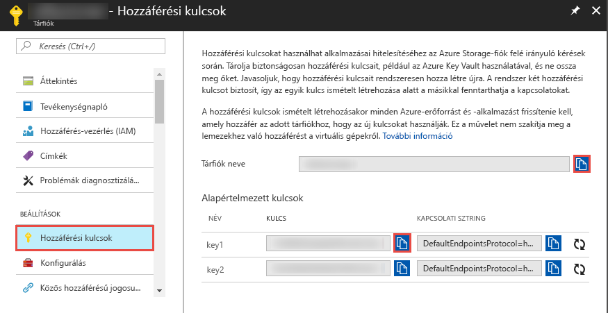

## <a name="prerequisites"></a>Előfeltételek

### <a name="azure-subscription"></a>Azure-előfizetés
Ha nem rendelkezik Azure-előfizetéssel, mindössze néhány perc alatt létrehozhat egy [ingyenes fiókot](https://azure.microsoft.com/free/) a virtuális gép létrehozásának megkezdése előtt.

### <a name="azure-roles"></a>Azure-szerepkörök
Data Factory-példányok létrehozásához az Azure-ba történő bejelentkezéshez használt felhasználói fióknak a *közreműködő* vagy *tulajdonos* szerepkör tagjának, vagy az Azure-előfizetés *rendszergazdájának* kell lennie. Az előfizetésben található engedélyek megtekintéséhez a Microsoft Azure Portalon kattintson a felhasználónevére a jobb felső sarokban, majd válassza az **Engedélyek** elemet. Ha több előfizetéshez is rendelkezik hozzáféréssel, válassza ki a megfelelő előfizetést. 

A Data Factory gyermekerőforrásai – beleértve az adatkészletek, társított szolgáltatások, folyamatok, eseményindítók és integrációs modulok – létrehozására és kezelésére az alábbi követelmények vonatkoznak:
- A gyermekerőforrások Microsoft Azure Portalon való létrehozásához és kezeléséhez a **Data Factory közreműködője** szerepkörhöz kell tartoznia az erőforráscsoport szintjén vagy felette.
- A gyermekerőforrások PowerShell-lel vagy az SDK-val való létrehozásához és kezeléséhez a **közreműködő** szerepkör is elegendő az erőforráscsoport szintjén vagy felette.

Ha szeretne példautasításokat látni arra, hogyan kell egy felhasználót a szerepkörhöz adni, olvassa el a [Szerepkörök hozzáadása](../articles/billing/billing-add-change-azure-subscription-administrator.md) című cikket.

További információkért tekintse meg a következő cikkeket:
- [Data Factory közreműködője szerepkör](../articles/role-based-access-control/built-in-roles.md#data-factory-contributor)
- [Szerepkörök és engedélyek az Azure Data Factoryhoz](../articles/data-factory/concepts-roles-permissions.md)

### <a name="azure-storage-account"></a>Azure Storage-fiók
Ebben a rövid útmutatóban egy általános célú Azure Storage-fiókot (ebben az esetben blobtárolót) használunk *forrás-* és *céladattárként*. Ha még nem rendelkezik általános célú Azure Storage-fiókkal, a létrehozáshoz tekintse meg a [tárfiók létrehozását](../articles/storage/common/storage-quickstart-create-account.md) ismertető cikket. 

#### <a name="get-the-storage-account-name-and-account-key"></a>Tárfióknév és fiókkulcs beszerzése
Ebben a rövid útmutatóban az Azure Storage-fiók nevét és kulcsát használjuk. Az alábbi feladat bemutatja a tárfióknév és -kulcs beszerzéséhez szükséges lépéseket: 

1. Nyissa meg böngészőjében az [Azure Portalt](https://portal.azure.com). Jelentkezzen be Azure-felhasználónevével és -jelszavával. 
2. Kattintson **Az összes szolgáltatás** elemre a bal oldali menüben, állítson be egy szűrőt a **Tárfiók** kulcsszóval, majd válassza a **Tárfiókok** lehetőséget.

   
3. A tárfiókok listájában állítson be szűrőt a tárfiók nevéhez (ha szükséges), majd válassza ki a tárfiókját. 
4. A **Tárfiók** lapon a menüben válassza a **Hozzáférési kulcsok** elemet.

   
5. Másolja a **Tárfiók neve** és az **1. kulcs** mező értékét a vágólapra. Illessze be őket a Jegyzettömbbe, vagy bármely más szerkesztőbe, majd mentse a fájlt. A rövid útmutató későbbi szakaszában fogja használni őket.   

#### <a name="create-the-input-folder-and-files"></a>Bemeneti mappa és fájlok létrehozása
Ebben a szakaszban egy **adftutorial** nevű blobtárolót hoz létre az Azure Blob Storage-ban. Létrehoz egy **input** nevű mappát a tárolóban, majd feltölt egy mintafájlt a bemeneti mappába. 

1. A **Tárfiók** lapon váltson az **Áttekintés** ablaktáblára, majd kattintson a **Blobok** elemre. 

   
2. A **Blob service** lapon kattintson az eszköztár **+ Tároló** elemére. 

       
3. Az **Új tároló** párbeszédablakban adja meg az **adftutorial** nevet, és kattintson az **OK** gombra. 

   
4. A tárolók listájában kattintson az **adftutorial**  elemre. 

   
5. A **Tároló** lapon kattintson az eszköztár **Feltöltés** elemére.  

   
6. A **Blob feltöltése** lapon kattintson a **Speciális** elemre.

   
7. Indítsa el a **Jegyzettömböt**, és hozzon létre egy **emp.txt** nevű fájlt az alábbi tartalommal. Mentse a fájlt a **c:\ADFv2QuickStartPSH** mappába. Ha még nem létezik, hozza létre az **ADFv2QuickStartPSH** mappát.
    
   ```
   John, Doe
   Jane, Doe
   ```    
8. Az Azure Portal **Blob feltöltése** lapján keresse meg és válassza ki az **emp.txt** fájlt a **Fájlok** mezőben. 
9. Adja meg az **input** értéket a **Feltöltés mappába** mezőben. 

        
10. Győződjön meg arról, hogy a mappa az **input** mappa, a fájl pedig az **emp.txt** fájl, majd kattintson a **Feltöltés** elemre.
    
    A listában meg kell jelennie az **emp.txt** fájlnak és a feltöltés állapotának. 
12. A sarokban található **X** gombra kattintva zárja be a **Blob feltöltése** lapot. 

    
1. Ne zárja be a **Tároló** lapot. A segítségével ellenőrizheti ennek a rövid útmutatónak az eredményét.